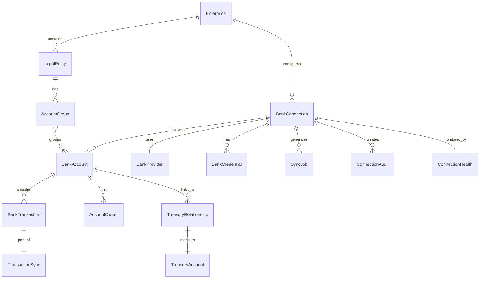

# Banking Domain Model

## Core Entities

### BankProvider
A banking connectivity provider (e.g., Plaid, Lean, TrueLayer).
- `kind`: Unique identifier
- `regions`: Supported geographic regions
- `capabilities`: Feature set (balances, transactions, payments, etc.)
- `protocols`: Auth methods (OAuth2, API Key, Open Banking, etc.)
- `rateLimit`: API throttling configuration

### BankInstitution
A financial institution (e.g., Emirates NBD, Chase).
- `provider`: Which provider discovers this bank
- `country` / `region`: Geographic location
- `supportsOAuth` / `supportsCredentials` / `supportsFileImport`: Connection methods
- `supportedRails`: Available payment rails

### BankConnection
An authenticated connection to a bank.
- `status`: PENDING → CONNECTING → CONNECTED | ERROR | EXPIRED
- `protocol`: How the connection was established
- `credentialId`: Reference to encrypted credentials
- `syncFrequencyMinutes`: How often to sync
- `version`: Optimistic concurrency control

### BankCredential
Encrypted credentials for a connection.
- `vaultStrategy`: AES-256-GCM, HashiCorp Vault, AWS KMS, etc.
- `rotationPolicyDays`: Auto-rotation interval
- `encryptedPayload`: AES-256-GCM encrypted credentials

### BankAccount
A discovered bank account from a connection.
- `connectionId`: Reference to parent connection
- `legalEntityId`: Optional ownership mapping
- `type`: CHECKING, SAVINGS, CREDIT_CARD, TREASURY, etc.
- `balance`: Current balance snapshot with staleness indicator
- `isLinkedToTreasury`: Mapped to internal treasury account

### AccountOwner
An owner of a bank account.
- `type`: INDIVIDUAL, COMPANY, JOINT, TRUST, etc.
- `isPrimary`: Primary owner flag

### LegalEntity
A legal entity within the enterprise.
- `parentId`: Optional parent for hierarchy
- `hierarchyLevel`: Depth in org tree
- `isHeadOffice`: Corporate HQ flag

### AccountGroup
A logical grouping of accounts.
- `type`: BANK, REGION, ENTITY, CURRENCY, PURPOSE, CASH_POOL
- `accountIds`: Member account references

### TreasuryRelationship
Links an external bank account to an internal treasury account.
- `syncDirection`: IMPORT, EXPORT, BIDIRECTIONAL
- `mappingRules`: Optional field-level transforms

### BankTransaction
A financial transaction from an external source.
- `transactionType`: DEBIT, CREDIT, TRANSFER, PAYMENT, FX, etc.
- `direction`: INFLOW, OUTFLOW
- `status`: PENDING, POSTED, REVERSED, RETURNED, CANCELLED
- `paymentRail`: How the transaction was processed
- `isReconciled`: Linked to internal ledger transaction

### ConnectionHealth
Real-time health status of a connection.
- `status`: HEALTHY, DEGRADED, UNHEALTHY, DOWN
- `successRate30d`: Rolling 30-day sync success rate
- `rateLimitRemaining`: Remaining API quota
- `score`: 0-100 composite health score

### BankEvent
Every significant banking action emits an event.
- 33 event types across connections, accounts, transactions, sync, credentials, payments, and health
- Filterable by type, connection, company, provider, severity

## Relationships



## State Machines

### Connection Status
```
PENDING → CONNECTING → CONNECTED → DISCONNECTED
                         ↓              ↓
                       ERROR          EXPIRED
                         ↓
                       REVOKED
```

### Sync Status
```
IDLE → RUNNING → COMPLETED
   ↑      ↓         ↓
   └── SCHEDULED  FAILED → PARTIAL
   ↕
 CANCELLED
```

### Payment Status
```
DRAFT → PENDING_APPROVAL → APPROVED → SUBMITTED → PROCESSING → SETTLED
            ↓                                                    ↓
         CANCELLED                                            FAILED
                                                                ↓
                                                            REJECTED
                                                                ↓
                                                            RETURNED
                                                                ↓
                                                            REVERSED
```