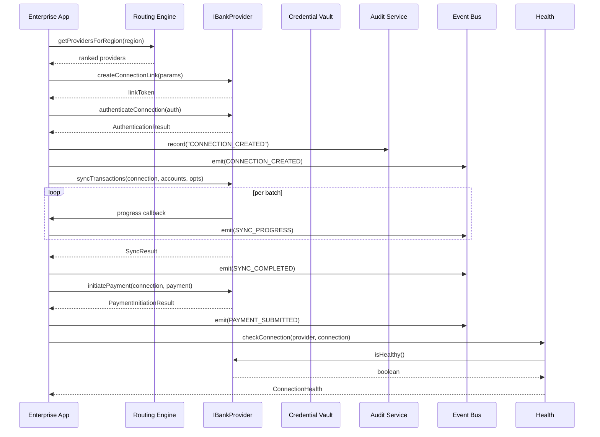
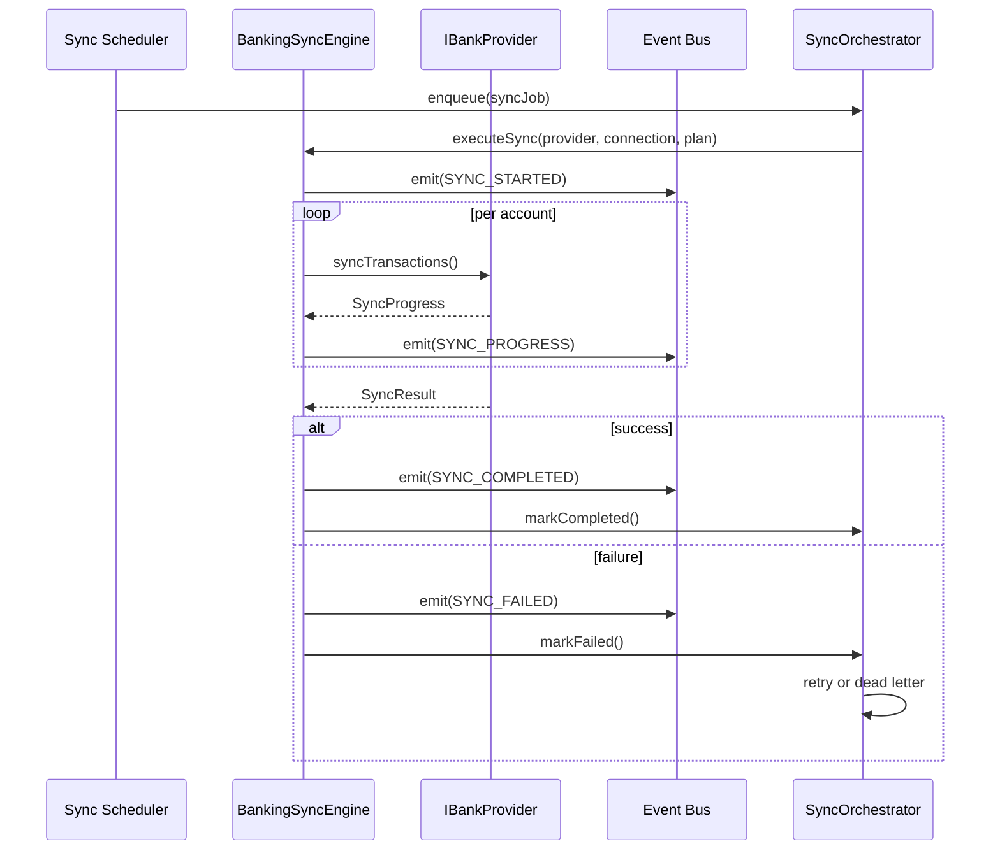

# Enterprise Banking Architecture

## Overview

The Enterprise Banking Platform provides a provider-agnostic banking infrastructure capable of supporting financial institutions worldwide. The architecture scales across multiple regions, providers, connection methods, and banking standards without architectural changes.

## Architecture Diagram

```
┌─────────────────────────────────────────────────────────────────┐
│                      Enterprise Banking Platform                 │
├─────────────────────────────────────────────────────────────────┤
│                                                                  │
│  ┌────────────────────────────────────────────────────────┐     │
│  │           Regional Routing Engine                       │     │
│  │  Tenant Region → Provider Ranking → Selection → Auth   │     │
│  └────────────────────────────────────────────────────────┘     │
│                        │                                          │
│                        ▼                                          │
│  ┌────────────────────────────────────────────────────────┐     │
│  │              Provider Abstraction Layer                 │     │
│  │  ┌──────┐  ┌──────┐  ┌──────┐  ┌──────┐  ┌──────┐    │     │
│  │  │Plaid │  │ Lean │  │Tarabut│  │True  │  │Tink  │... │     │
│  │  │      │  │      │  │      │  │Layer │  │      │    │     │
│  │  └──────┘  └──────┘  └──────┘  └──────┘  └──────┘    │     │
│  └────────────────────────────────────────────────────────┘     │
│                        │                                          │
│                        ▼                                          │
│  ┌────────────────────────────────────────────────────────┐     │
│  │              Connection Management                      │     │
│  │  OAuth2 │ Open Banking │ API Keys │ mTLS │ Cert Auth  │     │
│  └────────────────────────────────────────────────────────┘     │
│                        │                                          │
│                        ▼                                          │
│  ┌────────────────────────────────────────────────────────┐     │
│  │              Account Hierarchy                          │     │
│  │  Enterprise → Legal Entity → Business Unit → Bank →    │     │
│  │  Connection → Account → Currency → Transactions        │     │
│  └────────────────────────────────────────────────────────┘     │
│                        │                                          │
│                        ▼                                          │
│  ┌──────────────────┐  ┌──────────────────┐  ┌──────────────────┐ │
│  │   Sync Engine    │  │  Payment Rails   │  │  Treasury Layer  │ │
│  │  Full/Incremen-  │  │  ACH / SWIFT /   │  │  Cash Pooling    │ │
│  │  tal/Historical  │  │  SEPA / RTP /    │  │  Consolidation   │ │
│  │  Real-time       │  │  FedNow / Cross  │  │  Entity Mgmt     │ │
│  └──────────────────┘  └──────────────────┘  └──────────────────┘ │
│                        │                                          │
│                        ▼                                          │
│  ┌────────────────────────────────────────────────────────┐     │
│  │              Health Monitoring                          │     │
│  │  Connection Health │ Provider Latency │ Rate Limits    │     │
│  │  Webhook Status │ Credential Expiry │ API Version     │     │
│  └────────────────────────────────────────────────────────┘     │
│                        │                                          │
│                        ▼                                          │
│  ┌────────────────────────────────────────────────────────┐     │
│  │              Security & Compliance                      │     │
│  │  Credential Vault │ Audit Trail │ Permission Scopes    │     │
│  │  Least Privilege │ Tenant Isolation │ Compliance Rules │     │
│  └────────────────────────────────────────────────────────┘     │
│                        │                                          │
│                        ▼                                          │
│  ┌────────────────────────────────────────────────────────┐     │
│  │              Event System                               │     │
│  │  Connection Events │ Sync Events │ Payment Events      │     │
│  │  Credential Events │ Health Events │ Compliance Events │     │
│  └────────────────────────────────────────────────────────┘     │
│                                                                  │
└─────────────────────────────────────────────────────────────────┘
```

## Core Design Principles

### 1. Provider Agnosticism
All banking providers implement the `IBankProvider` interface. The system never depends on provider-specific SDKs at the architecture layer. Provider implementations are fully swappable.

### 2. Regional Awareness
The routing engine maps tenant region to available providers, ranked by recommendation. Each region has fallback providers for redundancy. Provider discovery is fully declarative.

### 3. Protocol Independence
The architecture supports OAuth2, Open Banking, API Keys, Mutual TLS, Certificate Authentication, and File-based imports (CSV, OFX, MT940, CAMT.053, BAI2) — all through the same unified interface.

### 4. Hierarchical Account Model
Accounts are organized in a tree: Enterprise → Legal Entities → Business Units → Banks → Connections → Accounts → Currencies → Transactions. Supports multi-entity, multi-currency enterprises.

### 5. Security-First
Credentials stored in a vault with encryption, rotation policies, expiry tracking. Full audit trail for every banking action. Tenant isolation enforced at every layer.

## Module Architecture

### `src/server/banking/architecture/`
- `routing-engine.ts` — Tenant region → available providers → rank → recommend
- `region-registry.ts` — Declarative mapping of regions to providers with capabilities

### `src/server/banking/providers/`
- `interface.ts` — `IBankProvider` contract (initialize, authenticate, sync, payments, health)
- `registry.ts` — Factory pattern registry for provider kinds

### `src/server/banking/connections/`
- `connection-manager.ts` — Connection lifecycle, protocol validation, health scoring
- `authentication-service.ts` — Link token generation, auth flow, revocation

### `src/server/banking/accounts/`
- `account-hierarchy.ts` — Enterprise → Entity → Account tree builder
- `account-service.ts` — CRUD, linking/unlinking, balance updates, ownership

### `src/server/banking/transactions/`
- Domain types for import/export (re-exports from domain/types)

### `src/server/banking/payments/`
- `payment-service.ts` — Payment order creation, validation, submission, tracking

### `src/server/banking/treasury/`
- `treasury-banking-service.ts` — Consolidation views, cash pool management, multi-currency aggregation

### `src/server/banking/sync/`
- `sync-engine.ts` — Generic sync execution with progress and event emission
- `sync-orchestrator.ts` — Queue management, retry policy, dead letter queue

### `src/server/banking/compliance/`
- `compliance-service.ts` — Rule-based compliance checking, violation tracking

### `src/server/banking/events/`
- `event-bus.ts` — Typed pub/sub event system with filters and history

### `src/server/banking/health/`
- `health-monitor.ts` — Connection health checks, latency tracking, success rate computation

### `src/server/banking/security/`
- `credential-vault.ts` — Encrypted credential storage with rotation policies
- `audit-service.ts` — Full audit trail for all banking operations

## Domain Model (ER)

```
Enterprise 1──* LegalEntity 1──* AccountGroup
    │                              │
    │                              │ contains
    │                              ▼
    └──* BankConnection 1──* BankAccount 1──* BankTransaction
              │                    │
              │                    ├── AccountOwner
              │                    │
              │                    └── TreasuryRelationship
              │
              ├── BankCredential
              ├── SyncJob
              └── ConnectionAudit
```

## Provider Lifecycle



## Sync Lifecycle



## Future Extension Points

The architecture supports adding new providers without changes to the core:

1. **Create a provider class** implementing `IBankProvider`
2. **Register the kind** in `bankProviderRegistry.registerKind(kind, factory)`
3. **Add region mapping** in `region-registry.ts`

No changes needed to routing, sync, event, health, or security layers for new provider support.