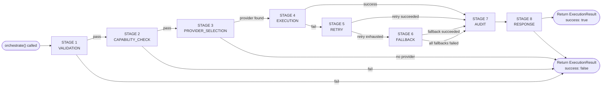
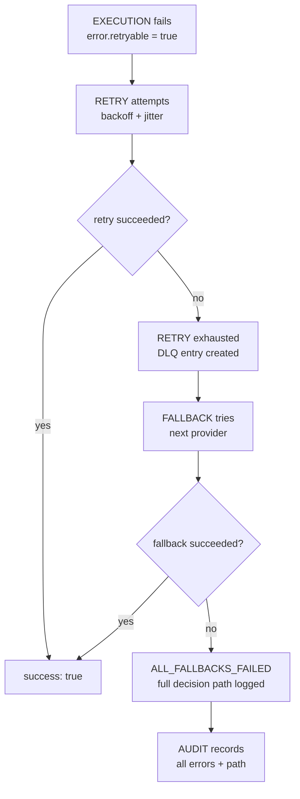

# Execution Pipeline

## Overview

The `ExecutionPipeline` class in `src/server/banking/orchestrator/pipeline/engine.ts` is a sequential stage processor. Every banking orchestration request passes through a fixed set of stages in order. Each stage either returns a successful result (proceed to next stage) or a failure result (short-circuit to response).

## Pipeline Stages



## `PipelineStage` Enum

Defined in `src/server/banking/orchestrator/types.ts`:

```typescript
enum PipelineStage {
  VALIDATION = "VALIDATION",
  CAPABILITY_CHECK = "CAPABILITY_CHECK",
  PROVIDER_SELECTION = "PROVIDER_SELECTION",
  EXECUTION = "EXECUTION",
  RETRY = "RETRY",
  FALLBACK = "FALLBACK",
  AUDIT = "AUDIT",
  RESPONSE = "RESPONSE",
}
```

## Stage Details

### 1. VALIDATION

**Method**: `ExecutionPipeline.runValidationStage()`

Validates that the command's required inputs are present by calling `command.validate(context)`. Each command defines its own validation rules.

```typescript
// From ConnectBankCommand
async validate(context: ExecutionContext): Promise<string[]> {
  const errors: string[] = [];
  const input = context.metadata?.input as ConnectBankInput;
  if (!input?.institutionId) errors.push("institutionId is required");
  if (!input?.institutionName) errors.push("institutionName is required");
  if (!input?.protocol) errors.push("protocol is required");
  return errors;
}
```

- Returns `{ success: true }` if validation passes
- Returns `{ success: false, error: { code: "VALIDATION_ERROR", retryable: false } }` if validation fails
- Validation errors are **never retryable** — they indicate a caller bug

### 2. CAPABILITY_CHECK

**Method**: `ExecutionPipeline.runCapabilityCheckStage()`

Verifies that the selected provider supports all capabilities required by the command. If `enableCapabilityNegotiation` is `true` (default) and a capability is missing, the pipeline searches for alternative providers.

```typescript
// Check: does the current provider support all required capabilities?
const def = await getProviderDefinition(provider);
const missing = required.filter(cap => !def.capabilities.includes(cap));

// If missing, find alternatives
const alternatives = await getProvidersByCapability(missing[0]);
context.currentProvider = alternatives[0].kind;
```

- Emits `"CapabilityMismatch"` when a provider lacks a capability
- Emits `"CapabilityMatched"` when an alternative is found
- If no alternative exists, the pipeline continues — the execution stage will fail with a provider error
- Commands that require no capabilities (`getRequiredCapabilities()` returns `[]`) skip this stage

### 3. PROVIDER_SELECTION

**Method**: `ExecutionPipeline.runProviderSelectionStage()`

If no `currentProvider` is set on the context (caller did not specify a provider), the pipeline asks the `OrchestratorRouter` to select one.

```typescript
const selection = await orchestratorRouter.selectProvider(context);
context.currentProvider = selection.provider;
```

The router delegates to `ProviderSelector.select()` which considers:
- Region (`BankingRegion`)
- Country code
- Required capabilities
- Preferred protocol
- Currency
- Tenant

- Emits `"ProviderSelected"` with the chosen provider and reasoning
- Returns `"NO_PROVIDER_AVAILABLE"` error if no provider can satisfy the requirements — this is a hard failure

### 4. EXECUTION

**Method**: `ExecutionPipeline.runExecutionStage()`

Delegates to `ExecutionEngine.execute(command, context)`. The execution engine runs registered hooks (before/after/onError) and calls `command.execute(context)`.

```typescript
class ExecutionEngine {
  async execute(command: OrchestratorCommand, context: ExecutionContext) {
    for (const hook of this.hooks) {
      await hook.beforeExecute?.(context);
    }
    const result = await command.execute(context);
    for (const hook of this.hooks) {
      await hook.afterExecute?.(context, result);
    }
    return result;
  }
}
```

- Hooks are optional — by default none are registered
- Execution errors are always marked `retryable: true` unless the command explicitly sets otherwise
- Successful results advance to the AUDIT stage
- Failed results advance to the RETRY stage

### 5. RETRY

**Method**: `ExecutionPipeline.runRetryStage()`

Only triggers if the execution error has `retryable: true`. Delegates to `RetryEngine.executeWithRetry()`.

```typescript
if (!previousResult.error?.retryable) return previousResult;
const retryResult = await retryEngine.executeWithRetry(context, command, maxRetries);
```

See [Retry Strategy](./retry-strategy.md) for full details.

- Emits `"RetryStarted"` and `"RetrySucceeded"` on success
- On exhaustion, the pipeline advances to FALLBACK (does not fail immediately)

### 6. FALLBACK

**Method**: `ExecutionPipeline.runFallbackStage()`

Only reaches this stage if retry was exhausted. Delegates to `FailoverEngine.failover()`.

```typescript
orchestrationEventBus.publish("ProviderFailed", { ... });
const failoverResult = await failoverEngine.failover(context, command, maxFallbacks);
```

See [Provider Failover](./provider-failover.md) for full details.

- Emits `"FallbackActivated"` for each failover attempt
- Emits `"AllFallbacksFailed"` if every candidate failed
- Always advances to AUDIT regardless of outcome — failover decisions must be recorded

### 7. AUDIT

**Method**: `ExecutionPipeline.runAuditStage()`

Records the full execution outcome to `OrchestrationAudit`.

```typescript
orchestrationAudit.record({
  correlationId, commandKind, tenantId, userId, region,
  providerUsed, success, durationMs, retryCount, fallbackCount,
  errors: errors.map(e => ({ message, code, stage })),
  timestamp,
});
```

Every execution — successful or failed — is recorded. The audit service maintains a 50,000 entry buffer.

### 8. RESPONSE

Handled by the `execute()` method's final block in `ExecutionPipeline`:

```typescript
const finalResult = { ...result, durationMs: Date.now() - startTime };
orchestrationEventBus.publish(
  finalResult.success ? "ExecutionCompleted" : "ExecutionFailed",
  { correlationId, commandKind, providerUsed, durationMs, retryCount, fallbackCount, success },
);
return finalResult;
```

## `ExecutionPipeline` Class

```typescript
class ExecutionPipeline {
  constructor(config: Partial<PipelineConfig>);

  async execute(context: ExecutionContext): Promise<ExecutionResult>;

  setConfig(config: Partial<PipelineConfig>): void;
}
```

### `PipelineConfig`

```typescript
interface PipelineConfig {
  maxRetries: number;            // Default: 3
  maxFallbacks: number;          // Default: 3
  enableCapabilityNegotiation: boolean;  // Default: true
}
```

### `PipelineState`

The pipeline maintains its state implicitly through the sequential call chain, but the type is defined:

```typescript
interface PipelineState {
  currentStage: PipelineStage;
  context: ExecutionContext;
  result: ExecutionResult | null;
  errors: PipelineError[];
  fallbackAttempted: boolean;
  retryCount: number;
  startedAt: string;
}
```

### `PipelineError`

```typescript
interface PipelineError {
  stage: PipelineStage;
  message: string;
  code: string;
  provider?: BankProviderKind;
  retryable: boolean;
  timestamp: string;
}
```

## Error Propagation

Errors flow through the pipeline as follows:

1. Each stage returns an `ExecutionResult` with an optional `error: PipelineError`
2. Non-retryable errors (validation, no provider available) short-circuit immediately to AUDIT → RESPONSE
3. Retryable execution errors flow to RETRY stage
4. If retry is exhausted, the same error plus the final retry result flows to FALLBACK
5. The FALLBACK result (success or failure) flows to AUDIT — the full error chain is attached to the audit entry
6. All accumulated errors (per-stage `PipelineError[]`) are passed to the audit stage
7. Final `ExecutionResult` contains the `retryCount` and `fallbackCount` so callers can inspect the resilience path


