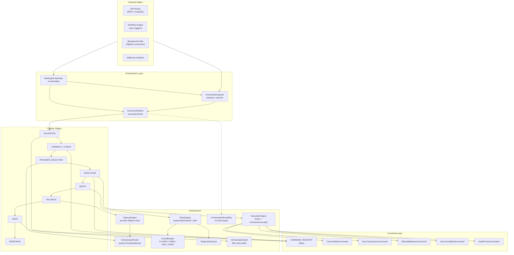
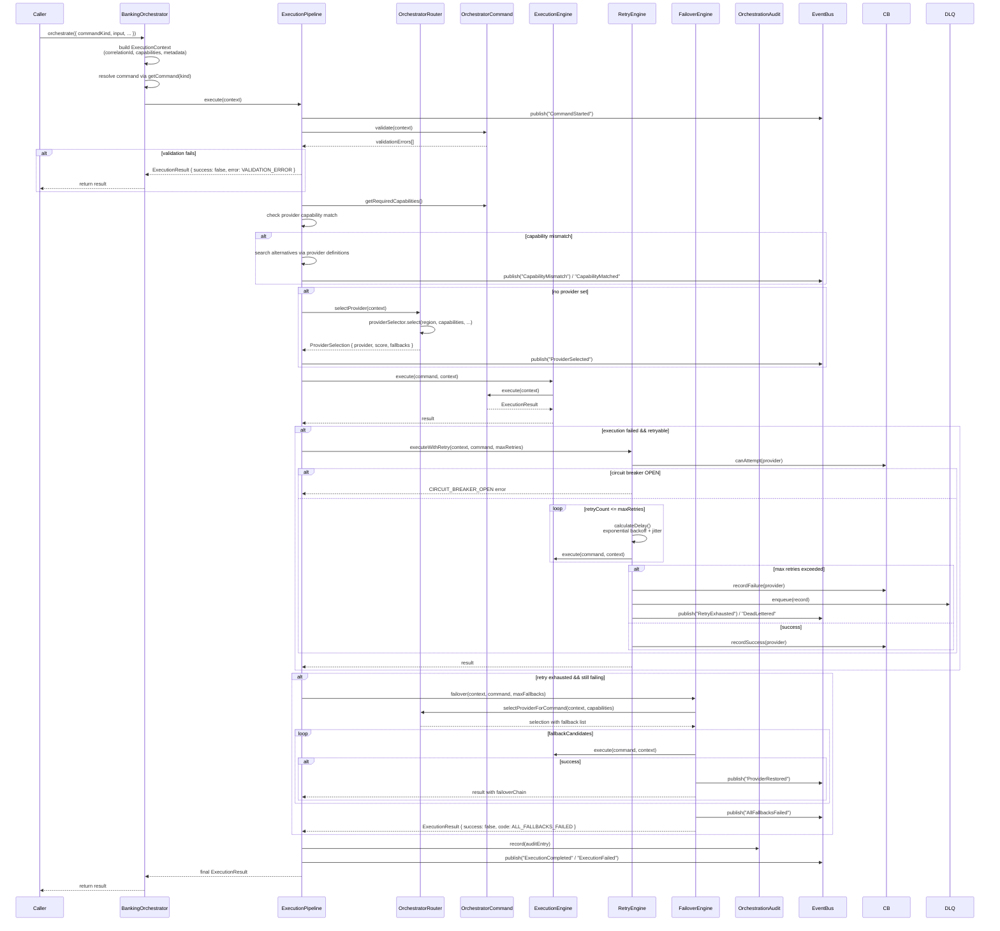
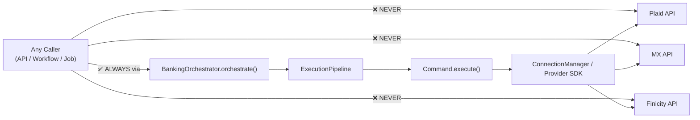

# Banking Orchestration Layer

## Purpose

The orchestration layer is the single entry point for all banking operations. It enforces a strict separation of concerns: no component (API route, service, workflow step) ever communicates directly with a banking provider like Plaid, MX, or Finicity. Every banking operation — connecting a bank, syncing transactions, refreshing balances, rotating credentials — flows **through** the orchestrator.

This provides:

- **Unified error handling** — all provider errors pass through retry, circuit breaker, and failover logic
- **Audit trail** — every operation is recorded by the audit system regardless of outcome
- **Provider abstraction** — callers specify *what* they need (capabilities), not *which* provider
- **Resilience** — retries, circuit breakers, failover chains, and dead-letter queues are automatic
- **Future hooks** — AI-assisted provider selection, cost-aware routing, and latency-based optimization can be plugged in at the pipeline or router level without changing callers

## Architecture Overview



## Command Flow



## `BankingOrchestrator` Class

Defined in `src/server/banking/orchestrator/orchestrator.ts`.

### `orchestrate(options)`

```typescript
class BankingOrchestrator {
  async orchestrate(options: OrchestrateOptions): Promise<ExecutionResult>
}
```

The single public method. It:

1. Generates a `correlationId` via `crypto.randomUUID()`
2. Builds an `ExecutionContext` from the input — this context flows through every stage and is the single source of truth for the operation
3. Resolves the command via `getCommand(options.commandKind)` from the command registry
4. Overwrites `requestedCapabilities` with the command's declared requirements
5. If `options.queue` is `true`, enqueues the context to `OrchestrationQueue` and returns immediately with a queue item ID
6. Otherwise, delegates to `ExecutionPipeline.execute(context)` which runs all stages synchronously

### `batch(commands)`

Runs multiple `orchestrate()` calls in parallel via `Promise.all`. Useful for bulk sync operations where each connection has its own context.

### Diagnostic Methods

| Method | Purpose |
|---|---|
| `getContextSummary(correlationId)` | Returns status by querying audit entries |
| `getCircuitBreakerStatuses()` | Returns all circuit breaker states |
| `getDeadLetterQueueItems()` | Returns recent DLQ entries |
| `clearCircuitBreaker(provider?)` | Resets circuit breaker for a provider or all |

### `OrchestrateOptions`

```typescript
interface OrchestrateOptions {
  commandKind: CommandKind;
  input: CommandInput;
  provider?: string;             // Optional — if omitted, router auto-selects
  metadata?: Record<string, unknown>;
  queue?: boolean;               // If true, enqueue instead of executing inline
  priority?: "high" | "normal" | "low";
}
```

## Execution Context Lifecycle

Defined in `src/server/banking/orchestrator/types.ts`.

```typescript
interface ExecutionContext {
  correlationId: string;
  commandKind: CommandKind;
  tenantId: string;
  legalEntityId?: string;
  region: BankingRegion;
  countryCode?: string;
  requestedCapabilities: ProviderCapability[];
  currentProvider?: BankProviderKind;
  preferredProtocol?: ConnectionProtocol;
  currency?: string;
  userId: string;
  sessionId?: string;
  auditId?: string;
  connectionId?: string;
  accountId?: string;
  metadata: Record<string, unknown>;
  startedAt: string;
}
```

The context is:

1. **Created** in `orchestrate()` — populated from `OrchestrateOptions` and command capabilities
2. **Mutated** as it flows through pipeline stages — `currentProvider` is set by the router, overwritten during capability negotiation, and changed on each failover attempt
3. **Passed** to every stage, command, engine, and hook
4. **Audited** — serialised into `OrchestrationAuditEntry` at the end
5. **Dead-lettered** — if max retries are exceeded, the full context is stored in `DeadLetterEntry`

## No Direct Provider Communication

This is a hard architectural rule:



No route handler, service class, or workflow step may import a provider SDK directly. All banking provider communication happens inside command implementations, which are invoked exclusively through the orchestration pipeline.

## Future Compatibility Hooks

The orchestration layer is designed for extension without refactoring:

| Hook Point | Future Use | Mechanism |
|---|---|---|
| `ExecutionPipeline` constructor | AI-assisted stage skipping | `PipelineConfig` already accepts partial config injection |
| `OrchestratorRouter.selectProvider()` | Cost-aware provider selection | The router already delegates to `ProviderSelector` — a new scoring function can be swapped in |
| `ExecutionEngine.registerHook()` | Latency tracing, SLA monitoring, compliance checks | `ExecutionHook` interface with `beforeExecute`/`afterExecute`/`onError` — multiple hooks can be registered |
| `OrchestrationEventBus.subscribe()` | Real-time dashboards, alerting, revenue forecasting | 22 typed event types, 5K event history buffer, pub/sub pattern |
| `FailoverEngine.failover()` | Dynamic fallback ordering based on success rate | `FailoverDecision` already carries `score` — the fallback chain can be re-sorted dynamically |
| `RetryEngine.calculateDelay()` | Provider-specific retry policies | `RetryStrategy` interface already supports per-provider overrides via `retryableErrorCodes` |
| `CommandKind` union | New commands don't change the pipeline | Adding a command = new class + registry entry + type union — no pipeline changes |
