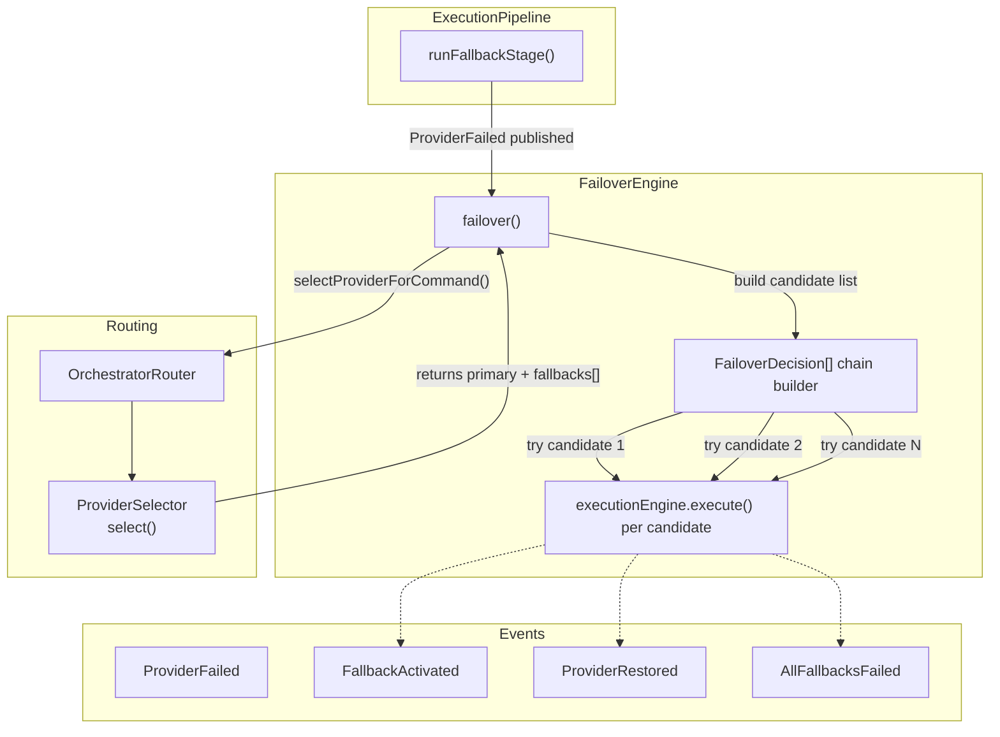

# Provider Failover

## FailoverEngine Architecture

Defined in `src/server/banking/orchestrator/failover/engine.ts`:

```typescript
class FailoverEngine {
  async failover(
    context: ExecutionContext,
    command: OrchestratorCommand,
    maxFallbacks: number,
  ): Promise<ExecutionResult>
}
```

The `FailoverEngine` is invoked by the pipeline only after retry is exhausted. It tries alternative providers in order, tracking the full decision path so operators can audit exactly what was attempted and why.



## When Failover Triggers

Failover is reached through this chain:

```
VALIDATION → CAPABILITY_CHECK → PROVIDER_SELECTION → EXECUTION → RETRY → FALLBACK
```

Specifically:

1. Execution stage returns `success: false` with a retryable error
2. Retry stage runs `RetryEngine.executeWithRetry()` up to `maxRetries` times
3. If all retries fail (all attempts exhausted, circuit breaker stays OPEN, or error is non-transient), the result is passed to `runFallbackStage()`
4. `runFallbackStage()` publishes `"ProviderFailed"` then calls `FailoverEngine.failover()`

## How FailoverEngine Uses the ProviderSelector

The `FailoverEngine` does **not** hardcode fallback order. It delegates to `OrchestratorRouter.selectProviderForCommand()`, which calls `ProviderSelector.select()` with the same capabilities but without specifying a preferred provider.

```typescript
// FailoverEngine.failover()
const requiredCapabilities = command.getRequiredCapabilities();
const selection = await orchestratorRouter.selectProviderForCommand(
  context,
  requiredCapabilities,
);

// selection.fallbacks is the ordered candidate list from ProviderSelector
const fallbackCandidates = selection.fallbacks.slice(0, maxFallbacks);
```

The `ProviderSelector` (from Phase 9A.2) considers:
- **Region** — only providers available in the tenant's region
- **Capabilities** — only providers that support the required capabilities
- **Preference scoring** — internal scoring based on latency, reliability, cost
- **Fallback ordering** — `selection.fallbacks` is ordered by score descending

This means **failover order is dynamic** — it adapts as provider health and availability change.

## Failover Decision Chain

For each attempt, a `FailoverDecision` is recorded:

```typescript
interface FailoverDecision {
  fromProvider: string;    // The provider we're failing away from
  toProvider: string;      // The provider we're failing over to
  reason: string;          // e.g., "Failover attempt 2"
  score: number;           // ProviderSelector's confidence score (100 - attemptIndex * 10)
}
```

The full decision path is included in the successful `ExecutionResult.data.failoverDecisionPath`:

```typescript
failoverDecisionPath: [
  { from: "plaid",   to: "mx",      reason: "Failover attempt 1" },
  { from: "mx",      to: "finicity", reason: "Failover attempt 2" },
  { from: "finicity", to: "manual_import", reason: "Failover attempt 3" },
]
```

## Full Sequence: Plaid → MX → Finicity → Manual Import

```mermaid
sequenceDiagram
    participant P as ExecutionPipeline
    participant FE as FailoverEngine
    participant R as OrchestratorRouter
    participant EE as ExecutionEngine
    participant EB as EventBus

    P->>FE: failover(context, command, maxFallbacks=3)

    FE->>R: selectProviderForCommand(context, capabilities)
    R->>R: providerSelector.select(...)
    R-->>FE: { primary: "plaid", fallbacks: ["mx", "finicity", "manual_import"] }

    Note over FE: Candidate list: [mx, finicity, manual_import]<br/>(plaid was the primary that already failed)

    FE->>EB: publish("ProviderFailed", { provider: "plaid" })

    rect rgb(40, 40, 50)
        Note right of FE: Attempt 1 — MX
        FE->>FE: context.currentProvider = "mx"
        FE->>EE: execute(command, context)
        EE-->>FE: ExecutionResult { success: false }
        FE->>EB: publish("FallbackActivated", { from: "plaid", to: "mx" })
    end

    rect rgb(40, 40, 50)
        Note right of FE: Attempt 2 — Finicity
        FE->>FE: context.currentProvider = "finicity"
        FE->>EE: execute(command, context)
        EE-->>FE: ExecutionResult { success: false }
        FE->>EB: publish("FallbackActivated", { from: "mx", to: "finicity" })
    end

    rect rgb(40, 40, 50)
        Note right of FE: Attempt 3 — Manual Import
        FE->>FE: context.currentProvider = "manual_import"
        FE->>EE: execute(command, context)
        EE-->>FE: ExecutionResult { success: true, data: {...} }
        FE->>EB: publish("ProviderRestored", { provider: "manual_import", via: "failover" })
    end

    FE-->>P: ExecutionResult {<br/>  success: true,<br/>  providerUsed: "manual_import",<br/>  fallbackCount: 3,<br/>  data: {<br/>    failoverChain: [...],<br/>    failoverDecisionPath: [...]<br/>  }<br/>}
```



## "All Fallbacks Failed" Handling

When every candidate in the fallback chain fails, the `FailoverEngine` returns:

```typescript
{
  success: false,
  error: {
    stage: "FALLBACK",
    message: `All fallback providers failed. Last error: ${lastResult}`,
    code: "ALL_FALLBACKS_FAILED",
    retryable: false,    // ← NOT retryable — every option was tried
  },
  providerUsed: originalProvider,      // Reset to original for audit clarity
  fallbackCount: totalAttempted,       // Total number of fallback attempts
}
```

The pipeline still advances to the AUDIT stage (not short-circuited), ensuring the full failover chain is recorded. The event `"AllFallbacksFailed"` is published.

After this, the `BankingOrchestrator` returns the `ALL_FALLBACKS_FAILED` result to the caller. The caller can:
- Surface the error to the user with the full `failoverDecisionPath`
- Enqueue a manual review task
- Alert operations via the event bus subscriber

## ProviderRestored Event

When a failover attempt succeeds, `FailoverEngine` publishes `"ProviderRestored"` with:

```typescript
orchestrationEventBus.publish("ProviderRestored", {
  correlationId: context.correlationId,
  provider: fallbackProvider,
  via: "failover",
});
```

This event can be consumed by:
- **CircuitBreaker** — to record a success for that provider (the circuit breaker is called by `RetryEngine`, not `FailoverEngine`; the failover path uses `ExecutionEngine` directly, so the circuit breaker is bypassed for fallback providers)
- **Monitoring dashboards** — to show real-time failover rates
- **Provider health scoring** — to adjust future provider selection scores

## Logging: Full Decision Path

The `FailoverDecision[]` chain is included in both:

1. **Success path** — embedded in `ExecutionResult.data.failoverDecisionPath`
2. **Failure path** — recorded in the `OrchestrationAuditEntry` via the errors array

This means every failover event is fully traceable:

```typescript
// From OrchestrationAuditEntry
{
  correlationId: "abc-123",
  commandKind: "SyncTransactions",
  errors: [
    { message: "Plaid timeout",           code: "TIMEOUT",               stage: "EXECUTION" },
    { message: "MX rate limit exceeded",  code: "RATE_LIMIT_EXCEEDED",  stage: "RETRY" },
    { message: "Finicity auth failure",   code: "AUTH_ERROR",           stage: "FALLBACK" },
    { message: "All fallback providers failed", code: "ALL_FALLBACKS_FAILED", stage: "FALLBACK" },
  ],
  retryCount: 3,
  fallbackCount: 3,
}
```

## `FailoverDecision` Interface

```typescript
interface FailoverDecision {
  fromProvider: string;   // Provider being failed away from
  toProvider: string;     // Provider being failed over to
  reason: string;         // Human-readable reason
  score: number;          // Confidence score from ProviderSelector
}
```
