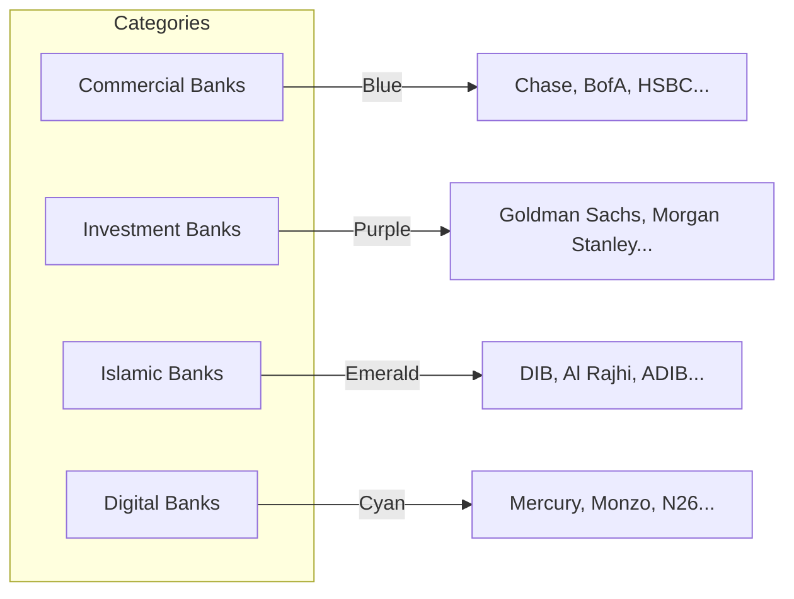

# Provider Selection UX

## Overview

The provider selection UX enables enterprise users to discover, compare, and select banking data providers across 6 global regions. The flow progresses from broad regional filtering to granular institution discovery, culminating in authentication and permission grant.

The experience is built from three cooperating components: `RegionSelector` → `CountrySelector` → `ProviderSelector` (with `ProviderComparisonCard`) → `InstitutionSelector` → `AuthenticationFlow` → `PermissionReview`.

## Provider Landscape

The system includes 12 providers (`data.ts:PROMOTOS`), each with defined regional coverage:

```mermaid
graph TD
    subgraph North_America[North America]
        Plaid --> NA[US, CA]
        MX --> NA2[US, CA]
        Finicity --> NA3[US]
        Akoya --> NA4[US]
        Yodlee --> NA5[US, CA]
        SaltEdge --> NA6[US, CA, MX]
    end

    subgraph Europe[Europe + UK]
        TrueLayer --> EU[UK, EU 20]
        Tink --> EU2[EU 18]
        GoCardless --> EU3[EU, UK]
        SaltEdge --> EU4[EU 20+]
    end

    subgraph Middle_East[Middle East]
        Lean --> ME[SA, AE, KW, OM, BH, QA]
        Tarabut --> ME2[BH, QA, AE, SA]
        SaltEdge --> ME3[ME 9]
    end

    subgraph Africa[Africa]
        SaltEdge --> AF[NG, ZA, KE, GH+]
    end

    subgraph Asia_Pacific[Asia Pacific]
        Plaid --> AP[AU, NZ]
        Yodlee --> AP2[JP, HK, SG, IN+]
        SaltEdge --> AP3[APAC 14+]
    end
```



## Region-to-Provider Mapping

| Region | Available Providers |
|---|---|
| North America | Plaid, MX Technologies, Finicity, Akoya, Yodlee, Salt Edge |
| Europe | TrueLayer, Tink, GoCardless, Salt Edge |
| United Kingdom | TrueLayer, Tink, GoCardless, Salt Edge |
| Middle East | Lean Technologies, Tarabut Gateway, Salt Edge |
| Africa | Salt Edge |
| Asia Pacific | Plaid, Yodlee, Salt Edge |

## Country Filtering Within Regions

**Component**: `CountrySelector` (`src/components/banking/country-selector.tsx`)

After selecting a region, the user is presented with a searchable list of countries within that region. The data is sourced from `data.ts:COUNTRIES` (25 countries total).

The search input (`aria-label="Search countries"`) provides real-time filtering with case-insensitive matching. Each country button uses:

- `aria-pressed` for selection state
- `aria-label={country.name}` for screen reader identification
- Flag emoji as a visual identifier

Empty state: "No countries match your search" when filter yields zero results.

Provider availability is determined by region membership. The `ProviderSelector` filters `PROMOTOS` by checking `provider.regions.includes(country.region)`.

## Provider Comparison

**Component**: `ProviderComparisonCard` (`src/components/banking/provider-comparison-card.tsx`)

Rendered within or alongside the `ProviderSelector`, this component displays a side-by-side comparison table for up to 4 providers.

### Comparison Dimensions

| Dimension | How It's Displayed |
|---|---|
| **Capabilities** | Checkmark (green) / X (gray) for each of 9 features |
| **Enterprise Rating** | Numeric /5 with zap icon, color-coded by latency |
| **Institution Coverage** | Numeric count with "inst." label |
| **Recommendation** | Gold "Best" badge on recommended provider headers |

### Comparison Features

1. **Balances** — Real-time and historical balance data
2. **Transactions** — Transaction history with categorization
3. **Payments** — Payment initiation capabilities
4. **Identity** — Account holder identity verification
5. **Historical Sync** — Backfill of historical transaction data
6. **Real-time** — Webhook-based live data streaming
7. **Webhooks** — Event-driven data update notifications
8. **Account Discovery** — Automated account listing
9. **Statements** — Statement retrieval and parsing

### Rating Interpretation

| Latency | Color | Meaning |
|---|---|---|
| Low | `text-emerald-400` | Sub-second response, suitable for real-time |
| Medium | `text-amber-400` | 1-5 second response, suitable for sync |
| High | `text-red-400` | >5 second response, batch processing only |

## Institution Discovery

**Component**: `InstitutionSelector` (`src/components/banking/institution-selector.tsx`)

Institutions are discovered by country code (`data.ts:getInstitutionsByCountry`) and presented in categorized groups.

### Institution Categories



Each category header shows an icon, uppercase label, and institution count. Institutions are rendered as tappable buttons in a 2-column grid. Unsupported institutions (`supported: false`) are displayed at 40% opacity with an "Unavailable" label and `disabled` attribute.

45 institutions are defined across 16 countries. Supported status is per-institution, not per-country.

## Authentication Flow

**Component**: `AuthenticationFlow` (`src/components/banking/authentication-flow.tsx`)

### Supported Auth Types

| Auth Type | Providers Using It |
|---|---|
| OAuth 2.0 | Plaid, MX, Finicity, Akoya, TrueLayer, Tink, Lean, GoCardless, Salt Edge, Yodlee |
| Open Banking | TrueLayer, Tink, Tarabut Gateway |
| FAPI | Akoya |
| API Key | MX, Finicity, Lean, GoCardless, Salt Edge, Yodlee |

### Mock OAuth Flow

Current implementation uses a simulated 2-second loading then success:

1. User clicks "Connect with {Provider}" button
2. Button transitions to loading state (`Loader2` spinner, "Connecting..." text, reduced opacity)
3. After 2 seconds, the UI transitions to the connected state
4. Connected state shows: green checkmark in emerald circle, "Connection Verified" heading, provider + institution name, "Continue to Account Selection" button

### Error Handling

An error state is triggered if `handleConnect` fails, displaying a red alert banner:

```tsx
<div className="rounded-lg border border-red-500/20 bg-red-500/5 p-3 text-sm text-red-400" role="alert">
  {error}
</div>
```

### Security Assurances

Displayed during authentication:
- End-to-end encrypted connection
- Read-only access (unless payments are enabled)
- No credentials stored on our servers

## Permission Review and Grant Flow

**Component**: `PermissionReview` (`src/components/banking/permission-review.tsx`)

### Permission Model

| Permission | ID | Required | Default | Description |
|---|---|---|---|---|
| Read Balances | `read_balance` | Yes | Granted | Access account balance information |
| Read Transactions | `read_transactions` | Yes | Granted | View transaction history and details |
| Read Accounts | `read_accounts` | Yes | Granted | Discover and view account details |
| Initiate Payments | `initiate_payments` | No | Not granted | Send ACH, wire, and internal transfers |
| Read Credit Details | `read_credit` | No | Not granted | Access credit card and loan information |
| Background Sync | `sync_data` | Yes | Granted | Automatically sync data in the background |

### Interaction Model

Each permission is rendered as a list item with:

1. Checkbox-style toggle button (left) with check/x icon
2. Permission icon + name + "Required" badge (if required)
3. Description text

The toggle button:
- Uses `aria-pressed` for state
- Uses `aria-label="{Permission name}: Granted/Not granted (required)"` 
- Is `disabled` for required permissions (non-toggleable)
- Has reduced opacity when not granted

Required permissions display an amber "Required" badge and a disabled cursor.

### Grant Flow Timeline

```
Provider Selection → Institution Selection
         ↓
   [Authentication]
         ↓
   Permission Grant ←── displayed at review step
         ↓
   Account Selection
         ↓
   Connection Summary ──→ shows granted permissions summary
         ↓
   Connection Complete
```

The granted permission set is summarized in the `ConnectionSummary` component as "Read accounts, balances, transactions" and displayed in the `ConnectionComplete` capabilities banner.

### Enterprise Considerations

- Permission grants are per-connection, not per-user
- The `PermissionReview` component is designed to be embedded in both the wizard flow and a standalone connection management page
- Revoked permissions trigger alerts in the `ConnectionHealthCard` (`permissionStatus: "expired" | "revoked"`)
- The `ConnectionHistory` logs permission changes as auditable events
