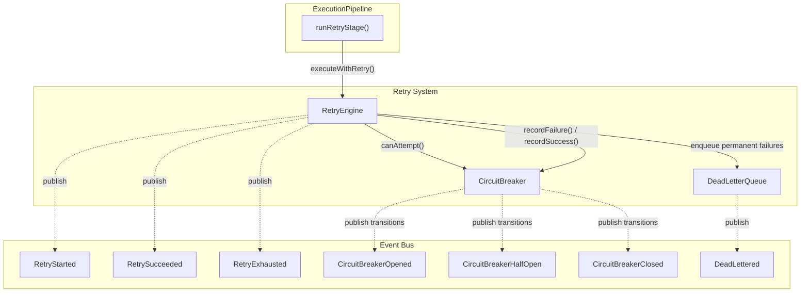
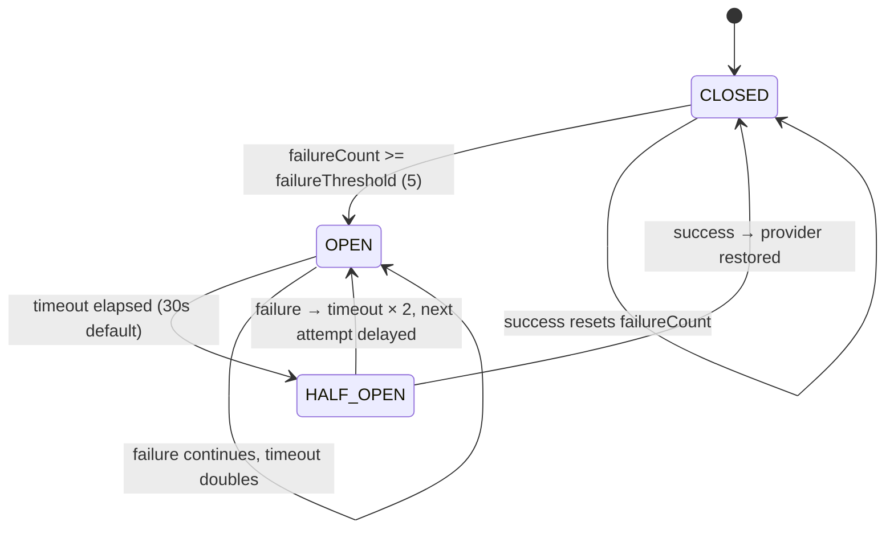
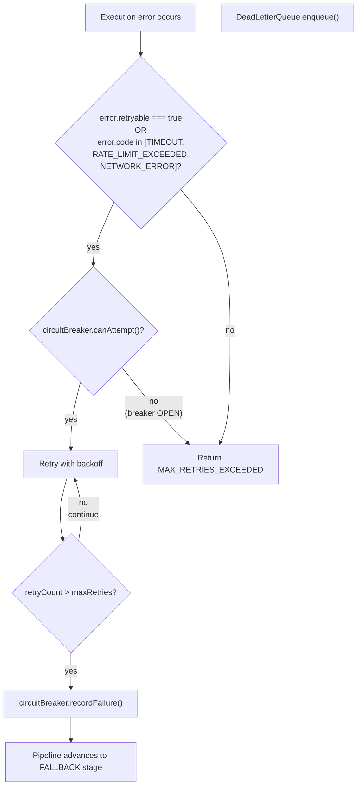

# Retry Strategy

## Architecture

The retry system has three components, all in `src/server/banking/orchestrator/retry/`:

| Component | File | Responsibility |
|---|---|---|
| `RetryEngine` | `engine.ts` | Executes commands with exponential backoff + jitter, interacts with circuit breaker |
| `CircuitBreaker` | `circuit-breaker.ts` | Tracks provider health; stops requests when failure threshold is exceeded |
| `DeadLetterQueue` | `dead-letter.ts` | Stores permanently failed operations for manual inspection and requeueing |



## Retry Engine

Defined in `src/server/banking/orchestrator/retry/engine.ts`:

```typescript
class RetryEngine {
  async executeWithRetry(
    context: ExecutionContext,
    command: OrchestratorCommand,
    maxRetries: number,
  ): Promise<ExecutionResult>
}
```

### Flow

1. Check `circuitBreaker.canAttempt(provider)` — if the circuit breaker is OPEN, return immediately with `CIRCUIT_BREAKER_OPEN`
2. Loop with `retryCount` from `0` to `maxRetries` (inclusive, so at most `maxRetries + 1` total attempts):
   - On first attempt (`retryCount === 0`), execute immediately (no delay)
   - On subsequent attempts, wait for `calculateDelay(retryCount)` milliseconds
   - Execute `command.execute(context)` via `ExecutionEngine`
   - If successful: `circuitBreaker.recordSuccess(provider)`, return result with actual `retryCount`
   - If failed: check if error is retryable or transient
3. If loop ends without success: `circuitBreaker.recordFailure(provider)`, return `MAX_RETRIES_EXCEEDED` error

### Exponential Backoff with Jitter

```typescript
private calculateDelay(retryCount: number): number {
  const baseDelay = 1000;
  const maxDelay = 30000;
  const delay = Math.min(baseDelay * Math.pow(2, retryCount - 1), maxDelay);
  const jitter = delay * 0.1 * Math.random();
  return Math.round(delay + jitter);
}
```

| Attempt | Base Delay (ms) | With Jitter (approx) |
|---|---|---|
| 1 | 0 (immediate) | 0 |
| 2 | 1,000 | 1,000–1,100 |
| 3 | 2,000 | 2,000–2,200 |
| 4 | 4,000 | 4,000–4,400 |
| 5 | 8,000 | 8,000–8,800 |
| 6 | 16,000 | 16,000–17,600 |
| 7+ | 30,000 (capped) | 30,000–33,000 |

10% jitter prevents thundering herd when many requests fail simultaneously.

### Retryable Error Codes

From `src/server/banking/orchestrator/retry/types.ts`:

```typescript
export const DEFAULT_RETRY_POLICY: RetryStrategy = {
  maxRetries: 3,
  baseDelayMs: 1000,
  maxDelayMs: 30000,
  backoffFactor: 2,
  retryableErrorCodes: [
    "EXECUTION_ERROR",
    "TIMEOUT",
    "RATE_LIMIT_EXCEEDED",
    "NETWORK_ERROR",
    "PROVIDER_UNAVAILABLE",
  ],
};
```

The `RetryEngine` also checks transient codes inline:

```typescript
const isTransient =
  result.error?.code === "RATE_LIMIT_EXCEEDED" ||
  result.error?.code === "TIMEOUT" ||
  result.error?.code === "NETWORK_ERROR";
```

Errors that are neither `retryable` nor transient cause immediate stop + `circuitBreaker.recordFailure()`.

## Circuit Breaker

Defined in `src/server/banking/orchestrator/retry/circuit-breaker.ts`.

### States



### Class Methods

```typescript
class CircuitBreaker {
  recordFailure(provider: BankProviderKind): void;
  recordSuccess(provider: BankProviderKind): void;
  isOpen(provider: BankProviderKind): boolean;
  canAttempt(provider: BankProviderKind): boolean;
  getStatus(provider: BankProviderKind): BreakerEntry | null;
  getAllStatuses(): Map<string, BreakerEntry>;
  reset(provider?: BankProviderKind): void;
}
```

### Configuration (per-provider defaults)

| Property | Default | Description |
|---|---|---|
| `failureThreshold` | 5 | Consecutive failures before CLOSED → OPEN |
| `halfOpenMaxRequests` | 3 | Max probe requests when HALF_OPEN |
| `defaultTimeoutMs` | 30,000 | How long the breaker stays OPEN before HALF_OPEN |

### State Transitions

**CLOSED → OPEN**: When `failureCount >= failureThreshold` (5 consecutive failures). The breaker stays OPEN for `defaultTimeoutMs` (30s). Emits `"CircuitBreakerOpened"` with the provider and failure count.

**OPEN → HALF_OPEN**: Time-based. When `isOpen()` is called and `nextAttemptAt <= now`, the breaker transitions to HALF_OPEN and returns `false` (not open). Emits `"CircuitBreakerHalfOpen"`.

**HALF_OPEN → CLOSED**: A single success via `recordSuccess()` resets all counters and transitions to CLOSED. Emits `"CircuitBreakerClosed"`.

**HALF_OPEN → OPEN**: A failure in half-open state doubles the timeout (`lastTimeoutMs *= 2`) and transitions back to OPEN. Prevents rapid oscillation.

### `canAttempt()` Logic

```typescript
canAttempt(provider): boolean {
  const entry = this.breakers.get(provider);
  if (!entry) return true;                        // No history = allowed
  if (entry.state === "CLOSED") return true;      // Normal operation
  if (entry.state === "OPEN") {
    if (nextAttemptAt <= now) {
      entry.state = "HALF_OPEN";                  // Time-based recovery
      return true;
    }
    return false;                                  // Still in timeout
  }
  if (entry.state === "HALF_OPEN") {
    entry.halfOpenRequests++;
    return entry.halfOpenRequests <= entry.halfOpenMaxRequests;  // Rate-limited probes
  }
}
```

## Dead Letter Queue

Defined in `src/server/banking/orchestrator/retry/dead-letter.ts`.

When `RetryEngine` exhausts all retries, the pipeline calls `FailoverEngine`. If failover also fails, the operation is **not** immediately dead-lettered — the dead letter queue is a separate concern managed through the `DeadLetterQueue` singleton, accessible via `BankingOrchestrator.getDeadLetterQueueItems()`.

```typescript
interface DeadLetterRecord {
  id: string;
  correlationId: string;
  commandKind: CommandKind;
  tenantId: string;
  provider: string;
  error: string;
  errorCode: string;
  context: ExecutionContext;     // Full context preserved for replay
  failedAt: string;
  retryCount: number;
  lastAttemptAt: string;
}
```

| Method | Purpose |
|---|---|
| `enqueue(record)` | Add a permanently failed operation (max 10,000 entries) |
| `getByCorrelationId(id)` | Find by correlation ID |
| `getByProvider(provider)` | Find all DLQ entries for a provider |
| `getByTenant(tenantId)` | Find all DLQ entries for a tenant |
| `requeue(id)` | Remove from DLQ and return the record for manual replay |
| `clear()` | Empty the DLQ |
| `recent` | Return last 50 entries |

## When Errors Trigger Retry


