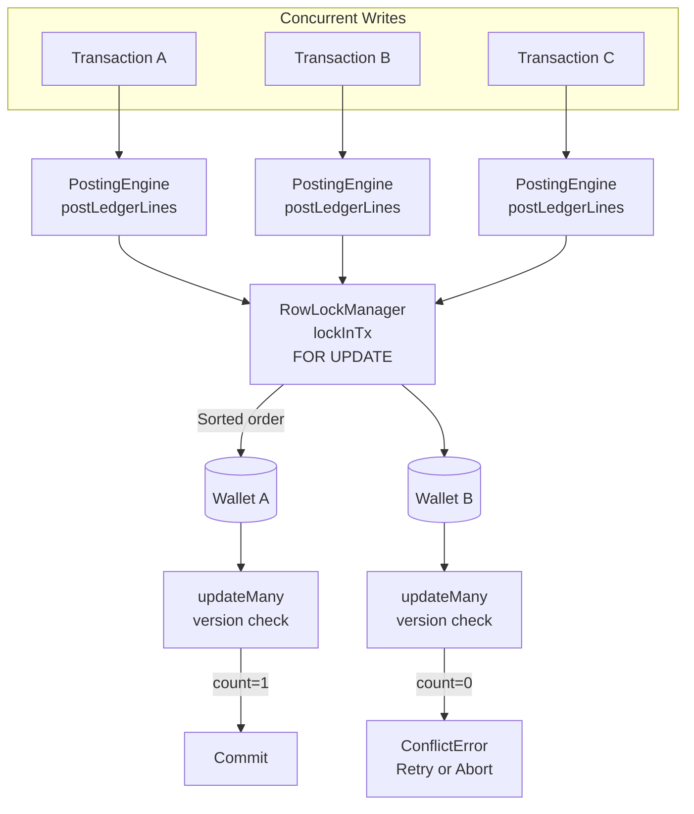
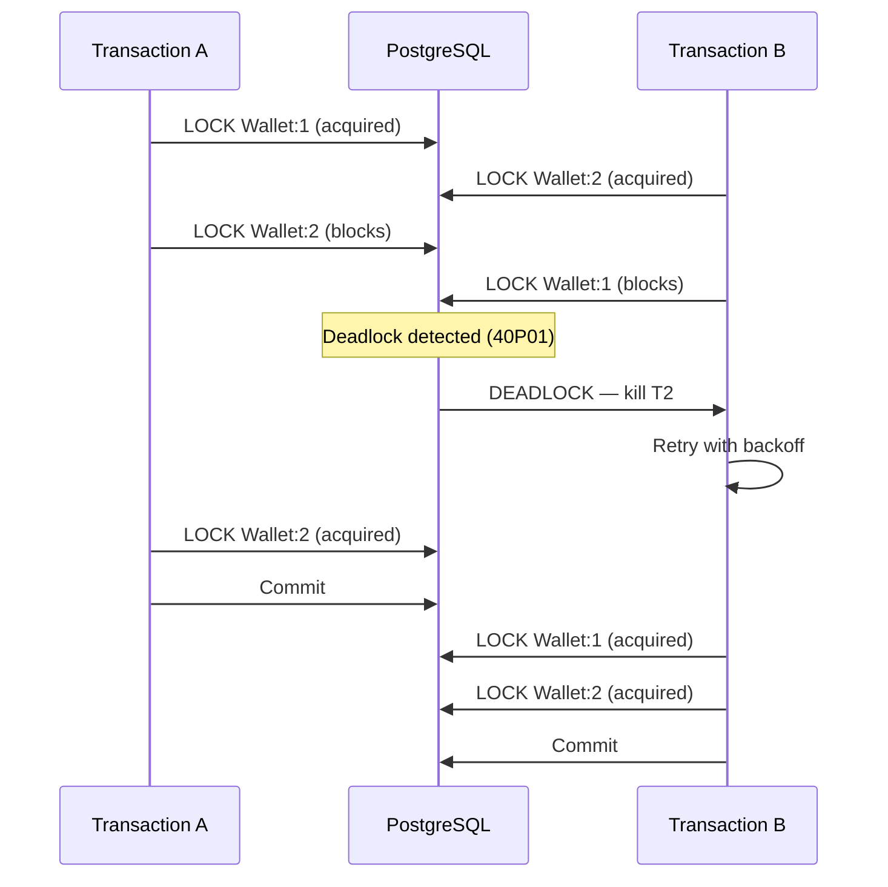
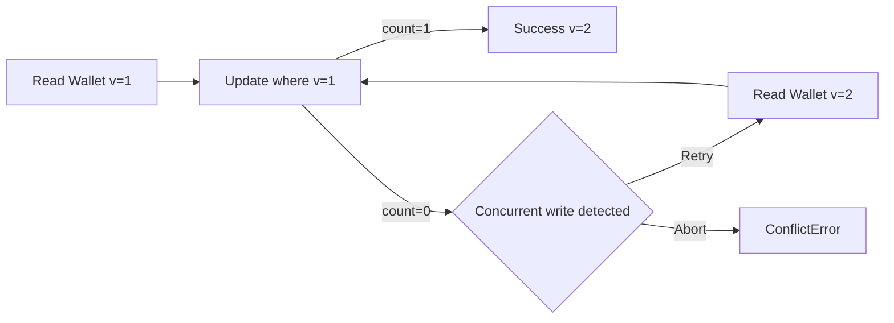

# Concurrency Model

## Overview

The system uses a **hybrid concurrency model**: pessimistic row locking (FOR UPDATE) for hot-path wallet/account writes, combined with optimistic version checks for conflict detection.



## When Each Strategy Applies

| Scenario | Pessimistic | Optimistic | Rationale |
|----------|------------|------------|-----------|
| Wallet posting (debit/credit) | FOR UPDATE | version check | Prevent overdrafts, detect race |
| Treasury transfer | FOR UPDATE WAIT | N/A | Single writer per pair; no version on TreasuryAccount |
| Approval completion | FOR UPDATE | version check | Same as wallet posting |
| Config entity update | N/A | version check | Low contention; retry is cheap |
| Plaid balance sync | FOR UPDATE WAIT | N/A | External data overwrite; no version |
| Concurrent reconciliation | N/A | UNIQUE constraint | Prevent duplicate matches |

## Isolation Matrix

| Operation | Isolation Level | maxWait | timeout | Retry | Rationale |
|-----------|----------------|---------|---------|-------|-----------|
| Financial writes | `RepeatableRead` | 10s | 30s | 3 retries | Consistent balance reads |
| Treasury deposit | `ReadCommitted` (by `withLocks`) | 10s | 30s | 3 retries | Row lock is sufficient |
| Treasury transfer | `ReadCommitted` (by `withLocks`) | 10s | 30s | 3 retries | Row lock is sufficient |
| Business reads | `RepeatableRead` | 5s | 15s | None | Consistent reporting snapshots |
| Admin config | `ReadCommitted` | 5s | 15s | None | No phantom read concern |
| Read-only queries | `ReadCommitted` | 5s | 15s | None | Default, minimal overhead |
| Plaid sync | `ReadCommitted` | 10s | 30s | 3 retries | External overwrite |
| SERIALIZABLE tests | `Serializable` | 2s | 10s | 3 retries | Force serialization conflicts |

## Deadlock Handling



### Prevention: Sorted Lock Ordering

Without sorting:
```
Transaction A: lock(Wallet:B) → lock(Wallet:A)  → DEADLOCK
Transaction B: lock(Wallet:A) → lock(Wallet:B)
```

With `RowLockManager.orderLockTargets()`:
```
Transaction A: lock(Wallet:A) → lock(Wallet:B)  → one waits, one proceeds
Transaction B: lock(Wallet:A) → lock(Wallet:B)
```

### Prevention: Connection Pool Management

The `notificationService.broadcast()` call was moved **outside** the `RowLockManager.withLocks()` callback in `TreasuryService.transfer()` to prevent connection pool deadlocks:

- **Before**: Broadcast inside lock → needs separate pool connection → pool exhausted by locked transactions → deadlock
- **After**: Financial writes inside lock → release lock → broadcast outside

All financial writes follow: **hold locks for the minimum time necessary**.

## Serialization Failure Recovery

When `SERIALIZABLE` isolation is used, serialization failures (`P2034`) trigger automatic retry:

```typescript
const DEFAULT_RETRY = { maxRetries: 3, baseDelayMs: 100, maxDelayMs: 3000 };
```

```
Attempt 0 → Fail (P2034) → backoff(100ms)
Attempt 1 → Fail (P2034) → backoff(200ms)
Attempt 2 → Success → commit
```

## Retry Strategy

### Lock Acquisition Retry (shouldRetryLock)

Retries on these errors:
| Error | Postgres Code | Prisma Code | Matched By |
|-------|---------------|-------------|-----------|
| Deadlock detected | `40P01` | — | `isDeadlockError()` |
| Serialization failure | — | `P2034` | `isSerializationError()` |
| Lock not available (NOWAIT) | `55P03` | — | `isLockTimeoutError()` |
| Lock timeout | — | — | `isLockTimeoutError()` |
| Could not obtain lock | — | — | `isLockTimeoutError()` |

Backoff formula:
```
delay = baseDelayMs * 2^attempt * jitter(0.75-1.25)
```

### Version Conflict Retry

When `updateMany` returns `count === 0`, the application throws `ConflictError`. The caller chooses to retry or abort.



## Concurrent Test Suite

The test suite (`test/concurrency.test.ts`) validates all concurrency guarantees:

| Test | Count | Operations | Verification |
|------|-------|-----------|-------------|
| 100 wallet debits | 100 | Concurrent postBatch to same source | No double-spend, balance = 15k - 100*100 |
| Treasury transfers | 50 | Concurrent transfers between 2 accounts | Total balance unchanged (50k) |
| Concurrent reconciliation | 2 | Duplicate match calls | ≥1 match, ≤2 matches |
| Concurrent approvals | 2 | Simultaneous completeTransaction | Only one succeeds, 2 ledger entries |
| Optimistic locking | 2 | Concurrent config updates | One succeeds (version=2), one fails |
| Config entity version | 2 | Concurrent updateMany(version=1) | Exactly one count=1, version=2 |
| Deadlock recovery | 2 | Cyclic FOR UPDATE NOWAIT | ≥1 succeeds, total balance 10k |
| Serialization retry | 2 | SERIALIZABLE concurrent writes | ≥1 succeeds, balance in expected range |
| Lock acquisition retry | 2 | Held lock with NOWAIT | Retries until lock released, ~3.2s |

## Developer Guidance

1. **Prefer `RepeatableRead` for financial writes** — prevents non-repeatable reads during balance checks.
2. **Use `ReadCommitted` with row locks** for treasury operations — the FOR UPDATE lock provides sufficient isolation.
3. **Test with `Serializable` isolation** to validate retry logic — concurrency tests use this intentionally.
4. **Always use sorted lock ordering** — the default `enforceOrdering: true` prevents deadlocks.
5. **Avoid I/O inside locks** — notifications, API calls, and slow operations must be outside the lock scope.
6. **Set `maxWait` higher than expected queue time** — 10s for financial writes is sufficient for most contention scenarios.
7. **Use `Promise.allSettled`** instead of `Promise.all` in concurrent tests to avoid hanging on rejected operations.
8. **Test with real database** — in-memory or transactional test wrappers (`withTestDb`) prevent concurrent operations.
