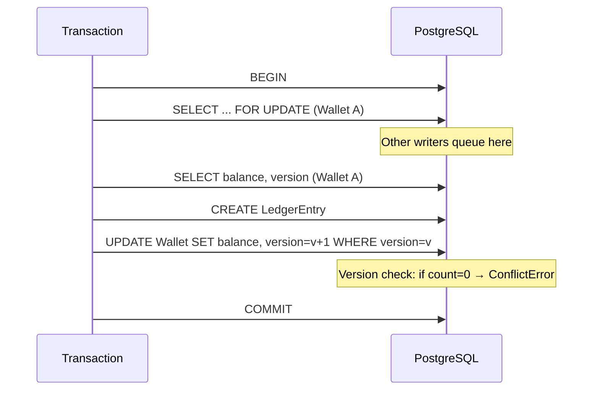
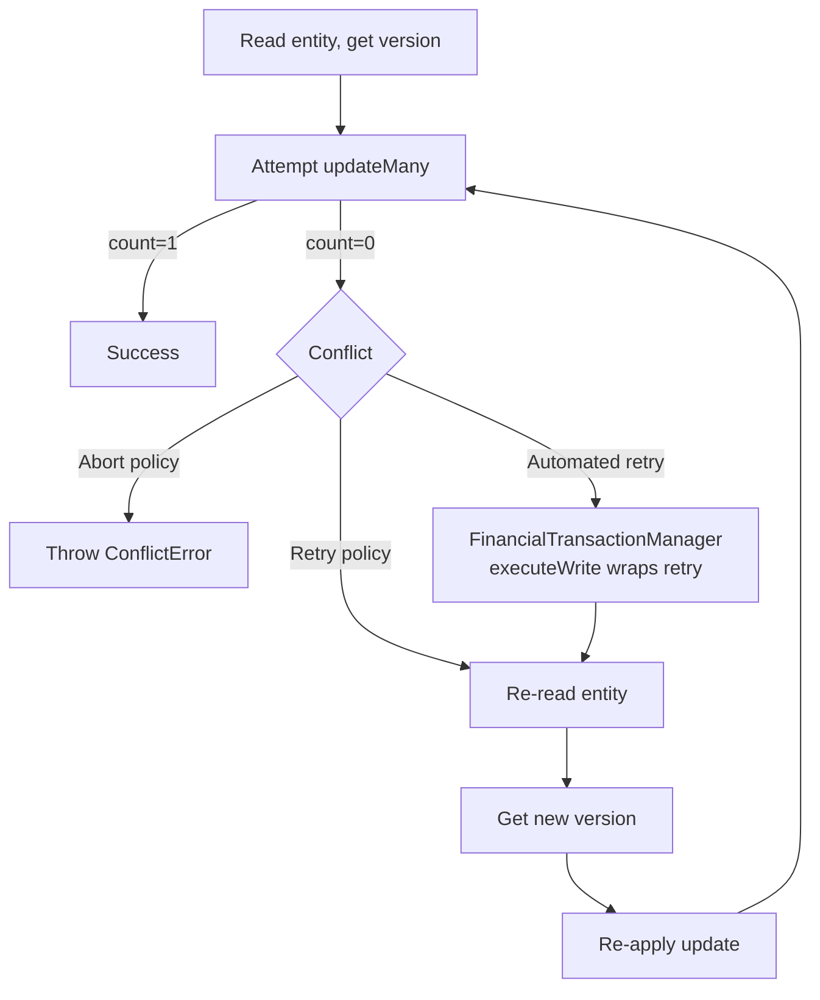

# Optimistic Locking Strategy

## Version Field

All protected entities carry a `version Int @default(1)` field incremented on every write:

```prisma
model Wallet {
  id      String  @id @default(cuid())
  balance Decimal @default(0) @db.Decimal(38, 12)
  version Int     @default(1)
}
```

## Update Pattern

Every balance-altering write uses `updateMany` with a version condition:

```typescript
const updated = await tx.wallet.updateMany({
  where: { id: walletId, version: wallet.version },
  data: { balance: nextBalance, version: { increment: 1 } },
});

if (updated.count === 0) {
  throw new ConflictError("Wallet version conflict — concurrent modification detected");
}
```

This ensures:
- If another transaction modified the wallet between our read and write, `updateMany` matches zero rows.
- We detect the conflict and can retry or abort.
- The version is atomically incremented, creating a linear history.

## Entities with Version Checking

| Entity | Version Field | Protection Layer | Scope |
|--------|---------------|-----------------|-------|
| `Wallet` | ✅ `version` | Pessimistic lock + version check | `posting-engine.ts`, `approval-workflow.ts`, `transactions.service.ts` |
| `ConnectorConfig` | ✅ `version` | Optimistic only via `config-lock.ts` | `connector-platform/config.ts`, `lifecycle.ts`, `orchestrator.ts` |
| `ApprovalRule` | ✅ `version` | Optimistic only via `config-lock.ts` | `approval-policy.service.ts` |
| `PolicyException` | ✅ `version` | Optimistic only via `config-lock.ts` | `governance.service.ts` |
| `Policy` | ✅ `version` | Optimistic only via `config-lock.ts` | `policies.service.ts` |
| `AccountControl` | ✅ `version` | Optimistic only via `config-lock.ts` | `treasury.service.ts` |
| `GovernanceFramework` | ✅ `version` | Optimistic only via `config-lock.ts` | `policy-registry.ts` |
| `TreasuryAccount` | ❌ No version | Pessimistic lock only (FOR UPDATE WAIT) | `treasury.service.ts`, `plaid.service.ts` |

## Config Entity Lock Utility

The `config-lock.ts` utility provides a generic optimistic lock helper:

```typescript
async function withOptimisticLock<T>(
  delegate: { updateMany: (args: any) => Promise<{ count: number }> },
  id: string,
  expectedVersion: number,
  data: Record<string, any>,
): Promise<boolean> {
  const result = await delegate.updateMany({
    where: { id, version: expectedVersion },
    data: { ...data, version: { increment: 1 } },
  });
  return result.count === 1;
}
```

Used by 15 service files across 6 modules:
- `governance.service.ts` — PolicyException updates
- `policy-registry.ts` — GovernanceFramework updates
- `policies.service.ts` — Policy create/update
- `approval-policy.service.ts` — ApprovalRule create/update
- `connector-platform/config.ts` — ConnectorConfig create/update
- `connector-platform/lifecycle.ts` — ConnectorConfig lifecycle events
- `connector-platform/orchestrator/*` — ConnectorConfig orchestration
- `erp.service.ts`, `plaid-banking.service.ts` — external config syncing
- `plaid-webhook-handler.ts` — webhook-triggered config updates

## Hybrid Strategy

For high-contention financial writes (wallets), pessimistic + optimistic are combined:



```
1. RowLockManager.lockInTx()        — FOR UPDATE (pessimistic, prevents concurrent writers)
2. Read wallet (now at current version inside lock)
3. wallet.updateMany(version)       — version check (detects if lock was somehow bypassed)
4. version: { increment: 1 }        — advances the version
```

This double protection ensures:
- Concurrent writers queue up at the FOR UPDATE lock (no wasted work on version conflicts)
- Version check catches any edge case where a lock wasn't acquired
- Version is always monotonically increasing

## Retry Strategy for Version Conflicts



## Migration History

Version fields were added to config entities in migration `20260705104422_add_version_to_config_entities`:

```sql
ALTER TABLE "ConnectorConfig" ADD COLUMN "version" INTEGER DEFAULT 1;
ALTER TABLE "ApprovalRule" ADD COLUMN "version" INTEGER DEFAULT 1;
ALTER TABLE "PolicyException" ADD COLUMN "version" INTEGER DEFAULT 1;
ALTER TABLE "Policy" ADD COLUMN "version" INTEGER DEFAULT 1;
ALTER TABLE "AccountControl" ADD COLUMN "version" INTEGER DEFAULT 1;
ALTER TABLE "GovernanceFramework" ADD COLUMN "version" INTEGER DEFAULT 1;
```

`Wallet` already had `version` from the initial schema.

## Developer Guidance

1. **Never bypass the version check** — every balance update must use `updateMany(where: { version })` with `version: { increment: 1 }`. No raw `wallet.update()` on balances.
2. **TreasuryAccount has no version** — it relies entirely on FOR UPDATE row locking. If contention becomes an issue, add a `version` field and migrate.
3. **Config entities use optimistic locking only** — they have low contention. If contention increases, consider adding pessimistic locking.
4. **The `config-lock.ts` utility handles ConflictError mapping** — it throws `ConflictError` when `count === 0`, which client code should catch and handle (retry or report).
5. **Read-modify-write is the pattern** — always read the entity inside the lock (to get the current version), modify, then write with version check.
6. **Test version conflicts** — use the `test/concurrency.test.ts` optimistic locking test as a template for new entities.
