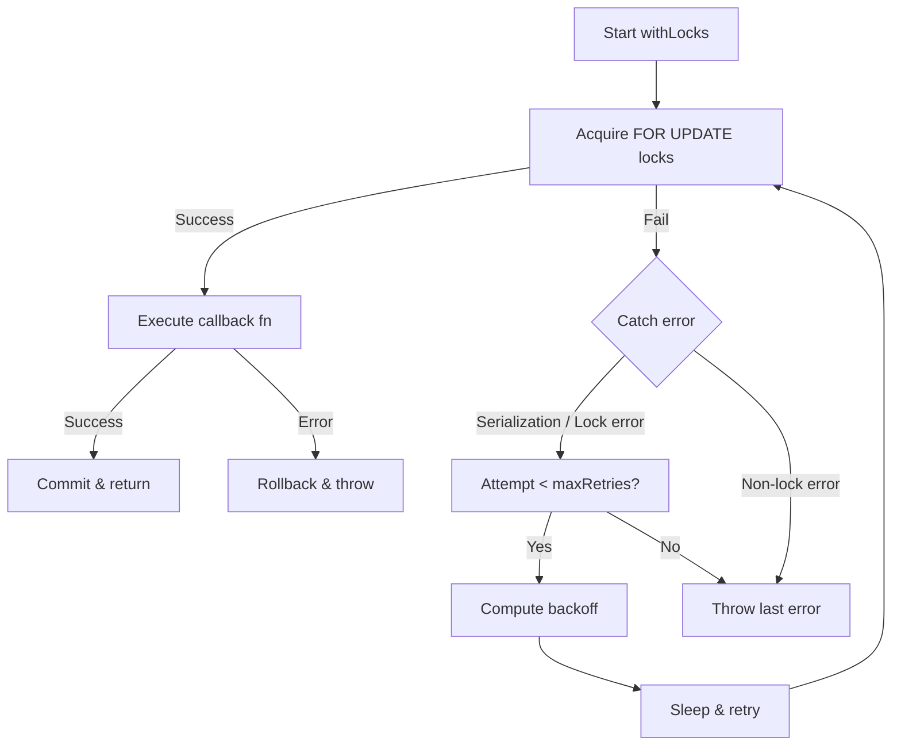

# Row Locking Strategy

## RowLockManager

`RowLockManager` provides pessimistic row-level locking for financial entities.

```
RowLockManager
  ├── withLocks(targets, fn, options?)   — Opens $transaction, acquires locks, runs fn
  ├── lockInTx(targets, tx, options?)    — Acquires locks within existing transaction
  ├── tryLock(target, tx)               — Non-blocking lock attempt (returns boolean)
  └── isLocked(entity, id, tx)          — Checks if row is locked
```

## Lock Acquisition SQL

```sql
-- Default behavior (WAIT) — blocks until lock acquired or timeout
SELECT 1 FROM "Wallet" WHERE "id" = $1 FOR UPDATE

-- NOWAIT — fails immediately if row is locked (55P03)
SELECT 1 FROM "Wallet" WHERE "id" = $1 FOR UPDATE NOWAIT

-- SKIP LOCKED — skips locked rows (returns empty result)
SELECT 1 FROM "Wallet" WHERE "id" = $1 FOR UPDATE SKIP LOCKED
```

## Lock Ordering

Lock targets are automatically sorted to prevent deadlocks:

```typescript
orderLockTargets([
  { entity: "TreasuryAccount", id: "B" },
  { entity: "TreasuryAccount", id: "A" },
])
// → [{ entity: "TreasuryAccount", id: "A" }, { entity: "TreasuryAccount", id: "B" }]
```

## Lock Modes

| Mode | SQL | Use Case |
|------|-----|----------|
| `FOR_UPDATE` | `FOR UPDATE` | Prevent any concurrent write (default) |
| `FOR_NO_KEY_UPDATE` | `FOR NO KEY UPDATE` | Weaker lock, allows key changes |
| `FOR_SHARE` | `FOR SHARE` | Read-only shared lock |
| `FOR_KEY_SHARE` | `FOR KEY SHARE` | Weakest shared lock |

## Lock Configuration Options

```typescript
type LockOptions = {
  behavior?: "WAIT" | "NOWAIT" | "SKIP_LOCKED";
  acquireTimeoutMs?: number;    // maxWait for $transaction connection
  timeout?: number;              // $transaction lifetime timeout
  retry?: {
    maxRetries: number;
    baseDelayMs: number;
    maxDelayMs: number;
  };
};
```

## Entity Table Mapping

Financial entities are mapped to their physical Postgres table names:

| Entity | Table | @@map | Notes |
|--------|-------|-------|-------|
| `Wallet` | `Wallet` | No | Model name = table name |
| `TreasuryAccount` | `treasury_accounts` | Yes | Plural, lowercase |
| `Transaction` | `Transaction` | No | Model name = table name |
| `LedgerEntry` | `LedgerEntry` | No | Model name = table name |
| `ExternalTransaction` | `external_transactions` | Yes | Plural, lowercase |
| `ExternalBalance` | `external_balances` | Yes | Plural, lowercase |
| `ReconciliationRun` | `ReconciliationRun` | No | Model name = table name |
| `ReconciliationMatch` | `reconciliation_matches` | Yes | Plural, lowercase |
| `AccountingInvoice` | `accounting_invoices` | Yes | Plural, lowercase |
| `ExchangeRate` | `ExchangeRate` | No | Model name = table name |
| `WorkflowInstance` | `WorkflowInstance` | No | Model name = table name |
| `WorkflowStepInstance` | `WorkflowStepInstance` | No | Model name = table name |

## Module-Level Lock Managers

Each service module creates its own singleton `RowLockManager`:

```typescript
// treasury.service.ts
const treasuryTxManager = new FinancialTransactionManager();
const treasuryLockManager = new RowLockManager(treasuryTxManager);

// posting-engine.ts
const postingLockManager = new RowLockManager(new FinancialTransactionManager());

// approval-workflow.ts
const approvalLockManager = new RowLockManager(new FinancialTransactionManager());

// plaid.service.ts
const plaidTxManager = new FinancialTransactionManager();
const plaidLockManager = new RowLockManager(plaidTxManager);
```

## Retry on Lock Failure

When a lock cannot be acquired (NOWAIT) or a deadlock is detected:

```
Attempt 0 → Lock fail → retry? yes → backoff(100ms × jitter)
Attempt 1 → Lock fail → retry? yes → backoff(200ms × jitter)
Attempt 2 → Lock fail → retry? yes → backoff(400ms × jitter)
Attempt 3 → Lock fail → retry? no  → throw
```

The `shouldRetryLock()` function retries on:
- `could not serialize access`
- `deadlock detected`
- `could not obtain lock` (NOWAIT timeout)
- `lock timeout`
- Postgres codes: `40P01` (deadlock), `55P03` (lock not available)

## Failure Recovery Flow



## Developer Guidance

1. **Always use `withLocks` or `lockInTx`** — never write raw `FOR UPDATE` SQL. The `ENTITY_TABLE_MAP` ensures correct table names (respects `@@map`).
2. **Keep lock scope minimal** — do all I/O (notifications, external calls) outside the lock. The `TreasuryService.transfer` fix is the canonical pattern.
3. **Use sorted lock ordering** — the default `enforceOrdering: true` prevents deadlocks. Only disable if you have a specific reason.
4. **Set appropriate timeouts**: `acquireTimeoutMs` for connection wait (default 10s), `timeout` for transaction duration (default 30s).
5. **Use NOWAIT for interactive requests** — fail fast rather than block indefinitely. Use WAIT for background jobs.
6. **SKIP_LOCKED for batch processing** — useful for queue-like patterns where workers should not contend.
7. **Prefer `lockInTx`** when you already have a `$transaction` open — avoids nested transaction overhead.
8. **Prefer `withLocks`** for standalone operations — it handles transaction management and retry automatically.
