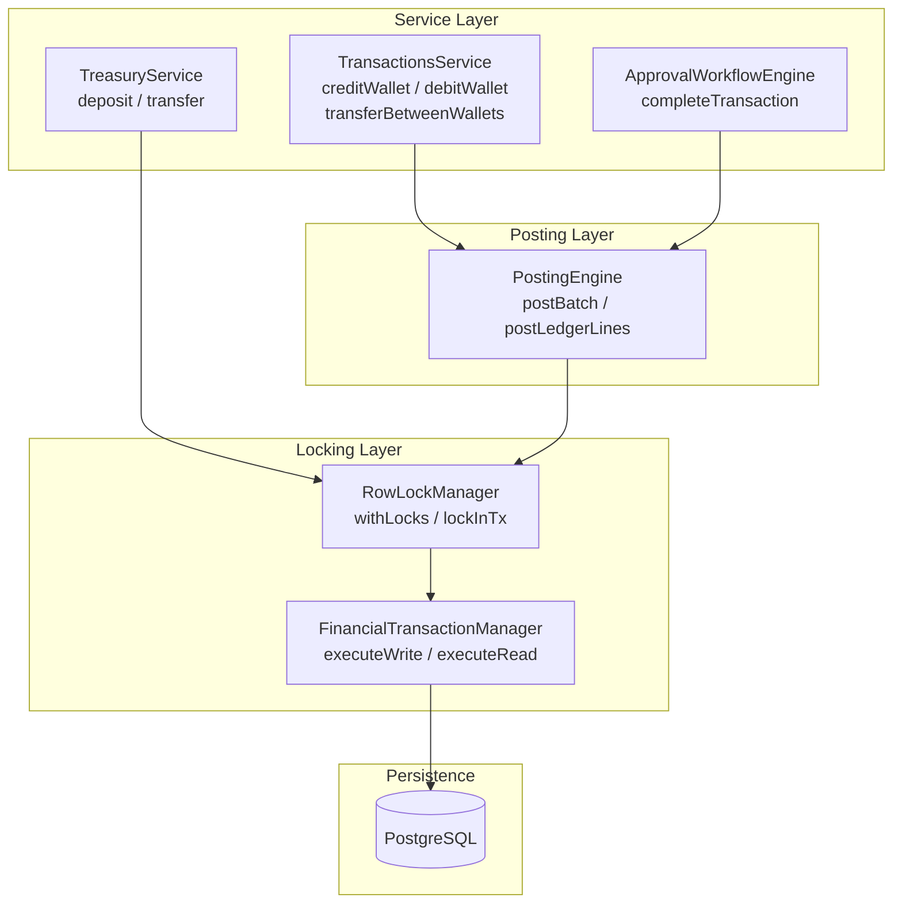
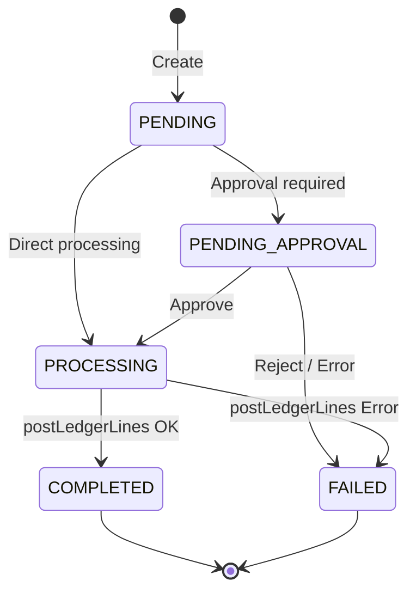
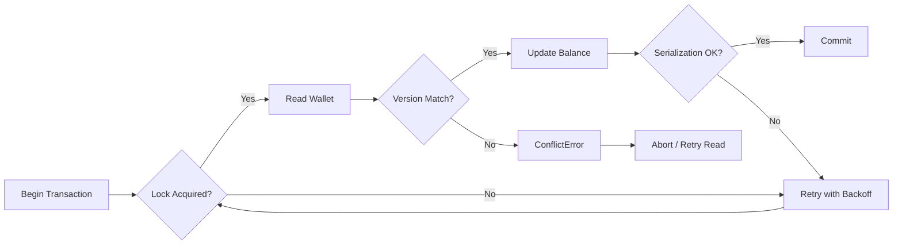

# Transaction Strategy

## Overview

The ledger uses a **double-entry accounting** model where every financial movement is recorded as balanced debit/credit pairs in the `LedgerEntry` table. Wallet balances are derived from the ledger and cached with optimistic version locking.

## Architecture



## Transaction Lifecycle



### Wallet Credit Flow

```
┌─────────────────────────────────────────────────┐
│ 1. Validate inputs, check idempotency            │
│ 2. Check approval policies → route if needed     │
│ 3. Set status → PROCESSING                       │
│ 4. Enter $transaction                            │
│    ├── lockInTx(wallets)       — FOR UPDATE      │
│    ├── create LedgerEntry[]    — immutable       │
│    ├── wallet.updateMany()     — version check   │
│    └── commit                                     │
│ 5. Set status → COMPLETED                        │
│ 6. recordAudit()                                 │
└─────────────────────────────────────────────────┘
```

### Internal Transfer Flow

```
┌─────────────────────────────────────────────────┐
│ 1. Validate source/destination wallets           │
│ 2. Check idempotency, check approval             │
│ 3. Set status → PROCESSING                       │
│ 4. Group lines by currency                        │
│ 5. For each currency group:                       │
│    ├── postLedgerLines(tx, currency, lines)       │
│    │   ├── lockInTx(wallets)                     │
│    │   ├── create LedgerEntry[]                  │
│    │   └── wallet.updateMany() + version check   │
│ 6. Set status → COMPLETED                        │
│ 7. recordAudit()                                 │
└─────────────────────────────────────────────────┘
```

### Approval Completion Flow

```
┌─────────────────────────────────────────────────┐
│ 1. Verify status == PENDING_APPROVAL             │
│ 2. Parse ledgerLines from metadata               │
│ 3. assertBalancedLedger(lines)                   │
│ 4. Enter $transaction                            │
│    ├── postLedgerLines(tx, companyId, txnId, ...)│
│    │   ├── lockInTx(wallets)                     │
│    │   ├── create LedgerEntry[]                  │
│    │   └── wallet.updateMany() + version check   │
│    ├── Set transaction → COMPLETED               │
│    └── recordAudit()                             │
│ 5. On error → set transaction → FAILED           │
└─────────────────────────────────────────────────┘
```

## FinancialTransactionManager

The `FinancialTransactionManager` is the foundation of all transactional financial operations:

```typescript
executeWrite<T>(
  category: OperationCategory,
  fn: (tx: TransactionClient) => Promise<T>,
  options?: TransactionOptions,
): Promise<T>
```

| Feature | Behavior |
|---------|----------|
| Retry on serialization failures | `P2034`, `40P01` — exponential backoff with jitter |
| Default isolation | `RepeatableRead` for writes |
| maxWait | Time to acquire connection from pool |
| timeout | Max transaction lifetime |
| Retry config | `maxRetries: 3`, `baseDelayMs: 100`, `maxDelayMs: 3000` |

## Failure Recovery



## Developer Guidance

1. **Always use `PostingEngine.postLedgerLines()`** for wallet balance changes — no direct `wallet.update()` on balances.
2. **Never bypass `RowLockManager`** — raw `SELECT ... FOR UPDATE` SQL is forbidden; use `lockInTx()` instead.
3. **Version checking is mandatory** — every balance update must use `updateMany(where: { version })` with `version: { increment: 1 }`.
4. **Audit every financial action** — `recordAudit()` must be called for every balance-changing operation.
5. **Cross-currency transfers**: group lines by currency — call `postLedgerLines()` once per group.
6. **Keep locks short**: move I/O (notifications, external API calls) outside the lock scope.
7. **Use `withLocks` for standalone operations** (opens its own `$transaction`), use `lockInTx` when already inside a transaction.
8. **Test concurrency**: always validate with `Promise.allSettled` and verify no double-spend.
