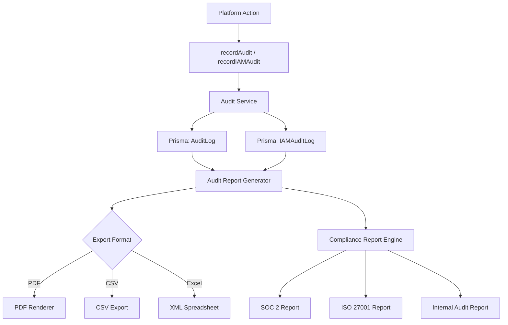
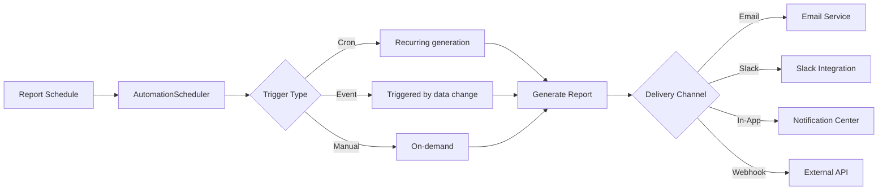
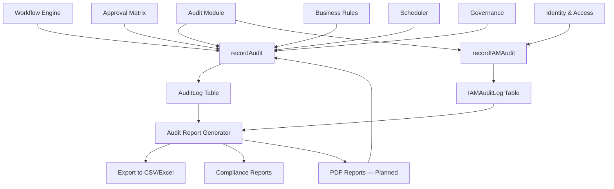

# Audit Reports

Audit Reports provide immutable, chronological records of every significant action across the platform. They serve as the primary compliance artifact for SOC 2, ISO 27001, and internal audit requirements.

**Location:** `src/modules/audit/` (core audit module), `src/app/api/v1/audit-logs/` (API), `src/app/(shell)/automation-studio/audit-logs/` (UI)

---

## Architecture



---

## Audit Report Types

### Platform Audit Reports

| Report | Description | Data Source |
|---|---|---|
| **User Activity Report** | All actions by a specific user within a date range | `AuditLog WHERE actorUserId = ?` |
| **Resource History Report** | Complete lifecycle of a specific resource (create/update/delete) | `AuditLog WHERE resourceType + resourceId` |
| **Change Timeline Report** | Chronological timeline of all changes in a date range | `AuditLog ORDER BY createdAt` |
| **Access Report** | All data access events (reads, exports, API calls) | `AuditLog WHERE action LIKE '%_READ' OR '%_EXPORT'` |
| **Configuration Change Report** | All system configuration modifications | `AuditLog WHERE action LIKE 'CONFIG_%' OR 'SETTINGS_%'` |

### Financial Audit Reports

| Report | Description | Data Source |
|---|---|---|
| **Transaction Audit Trail** | Every financial transaction with creator, approver, and timestamps | `AuditLog WHERE resourceType = 'Transaction'` |
| **Approval Audit Report** | Complete approval chain for every financial decision | `AuditLog WHERE action LIKE 'APPROVAL_%'` |
| **Treasury Movement Report** | All cash movements with authorization records | `AuditLog WHERE resourceType = 'CashMovement'` |
| **Journal Entry Report** | All journal entries with posting, reversal, and adjustment history | `AuditLog WHERE resourceType = 'JournalEntry'` |

### Compliance Audit Reports

| Report | Description | Data Source |
|---|---|---|
| **Policy Violation Report** | All governance violations with severity, source, and resolution | `GovernanceService.listViolations()` |
| **Access Control Report** | User role assignments, permission grants, and SSO events | `IAMAuditLog WHERE action LIKE 'IAM_%'` |
| **Data Export Report** | All data export events (CSV, Excel, PDF) with user and timestamp | `AuditLog WHERE action LIKE '%_EXPORT'` |
| **Security Event Report** | Failed logins, rate limit hits, CSRF violations | `AuditLog WHERE action LIKE 'SECURITY_%'` |

---

## Compliance Report Generation

### SOC 2 Report

SOC 2 compliance reports map audit events to the five Trust Service Criteria:

| TSC Category | Audit Events Mapped |
|---|---|
| **Security** | Authentication, authorization, access control, encryption events |
| **Availability** | Uptime, recovery, backup, incident response events |
| **Processing Integrity** | Transaction processing, validation, reconciliation events |
| **Confidentiality** | Data access, encryption, key rotation events |
| **Privacy** | PII access, consent, data retention events |

### ISO 27001 Report

ISO 27001 compliance reports organize audit events by control domain:

| Control Domain | Relevant Events |
|---|---|
| A.9 Access Control | User provisioning, role changes, permission grants |
| A.12 Operations Security | System changes, backup operations, monitoring |
| A.14 System Acquisition | Configuration changes, integration events |
| A.16 Incident Management | Security events, violations, escalations |

### Internal Audit Report

Internal audit reports are customizable — they accept a date range, event filter, and grouping dimension. The report engine:

1. Queries `AuditLog` with filters (date range, actor, resource type, action pattern)
2. Groups results by the specified dimension (user, resource, action, time)
3. Computes statistics (action counts, unique actors, peak activity periods)
4. Generates a summary with anomaly highlights

---

## Export Formats

### CSV Export

UTF-8 BOM encoding ensures proper display in Excel and Google Sheets. The CSV export:

| Feature | Implementation |
|---|---|
| Encoding | UTF-8 with BOM (`\uFEFF` prefix) |
| Delimiter | Comma (`,`) |
| Quoting | Double-quote for fields containing commas, newlines, or quotes |
| Escaping | Double-quote escaping (`""` for literal `"`) |
| Columns | Configurable — respects column visibility settings |
| Filtering | Applies current filter state before export |
| Sorting | Maintains current sort order |

### Excel Export (XML Spreadsheet 2003)

Zero-dependency XML Spreadsheet 2003 format — renders natively in Excel, LibreOffice, and Google Sheets without any external library.

| Feature | Implementation |
|---|---|
| Format | `SpreadsheetML` XML namespace |
| Encoding | UTF-8 |
| Dependencies | None (pure string construction) |
| Styling | Column widths, number formats, header bold |
| Number formatting | Currency in parentheses for negatives, percentage format |
| Multiple sheets | Supported via separate XML blocks |

### PDF Export (Planned)

PDF generation is planned for Phase 8B.10, targeting:

- Server-side rendering via headless browser or PDF library
- Preserved layout matching the on-screen analytics components
- Embedded charts as vector graphics (SVG → PDF)
- Watermark support for draft reports
- Digital signature integration for SOX compliance

---

## Scheduling and Distribution

Reports can be scheduled for automatic generation and distribution via the Automation Scheduler:

### Schedule Configuration



### Distribution Channels

| Channel | Implementation | Use Case |
|---|---|---|
| **Email** | `notifications.service.ts` → Email channel | Board packs, monthly reports |
| **Slack** | `notifications.service.ts` → Slack channel | Daily summaries, alert digests |
| **In-App** | `notifications.service.ts` → In-app channel | Real-time notifications |
| **Webhook** | `queue.jobs/webhook-send.job.ts` | External system integration |

### Common Schedules

| Report | Frequency | Channel |
|---|---|---|
| Daily Treasury Summary | `0 8 * * 1-5` (weekdays 8 AM) | Slack + In-App |
| Weekly Executive Brief | `0 9 * * 1` (Mondays 9 AM) | Email |
| Monthly P&L | `0 9 1 * *` (1st of month 9 AM) | Email + PDF |
| Quarterly Board Pack | `0 9 1 */3 *` (quarterly) | Email + PDF |
| Audit Preparation | `0 9 25 11 *` (Nov 25th, pre-year-end) | Email + Slack |

---

## Retention Policies

Audit data retention is governed by compliance requirements and configured per entity:

### Default Retention Periods

| Data Type | Retention | Rationale |
|---|---|---|
| **Platform Audit Logs** | 7 years | SOC 2 / SOX compliance |
| **IAM Audit Logs** | 7 years | ISO 27001 compliance |
| **Financial Transaction Audit** | 10 years | Regulatory requirement |
| **Security Event Logs** | 3 years | SOC 2 TSC Security |
| **Configuration Change Logs** | 5 years | Operational audit |
| **User Activity Logs** | 2 years | Privacy / GDPR |

### Retention Enforcement

| Policy | Implementation |
|---|---|
| **Soft delete** | Audit records are never deleted in-place |
| **Archive** | Old records moved to cold storage after retention period |
| **Immutable** | Audit records cannot be modified after creation |
| **Integrity** | Checksum validation on archive restore |
| **Legal hold** | Mechanism to suspend retention deletion during litigation |

### GDPR Compliance

For GDPR's "right to erasure," audit logs are pseudonymized rather than deleted — the actor's personal identifier is replaced with an anonymized hash, preserving the audit trail while removing PII.

---

## Data Model

### AuditLog

| Field | Type | Description |
|---|---|---|
| `id` | `string` | UUID |
| `companyId` | `string` | Tenant scope |
| `actorUserId` | `string` | User who performed the action |
| `action` | `string` | Action identifier (e.g., `TRANSACTION_CREATED`) |
| `resourceType` | `string` | Entity type (e.g., `Transaction`, `WorkflowDefinition`) |
| `resourceId` | `string` | Entity ID |
| `metadata` | `JsonValue` | Action-specific data (amounts, changes, etc.) |
| `createdAt` | `DateTime` | Timestamp of the action |

### IAMAuditLog

| Field | Type | Description |
|---|---|---|
| `id` | `string` | UUID |
| `companyId` | `string` | Tenant scope |
| `actorUserId` | `string` | User who performed the action |
| `action` | `string` | IAM action (e.g., `IAM_ROLE_ASSIGNED`, `IAM_SSO_LOGIN`) |
| `resourceType` | `string` | Entity type |
| `resourceId` | `string` | Entity ID |
| `metadata` | `JsonValue` | IAM-specific data (old/new roles, IP address, etc.) |
| `createdAt` | `DateTime` | Timestamp of the action |

---

## Audit Report API

### Query Parameters

| Parameter | Type | Description |
|---|---|---|
| `dateFrom` | `string` (ISO) | Start of date range |
| `dateTo` | `string` (ISO) | End of date range |
| `actorUserId` | `string` | Filter by actor |
| `action` | `string` | Filter by action pattern |
| `resourceType` | `string` | Filter by entity type |
| `resourceId` | `string` | Filter by specific entity |
| `limit` | `number` | Max results (default 100) |
| `offset` | `number` | Pagination offset |
| `format` | `string` | Export format: `csv`, `xlsx`, `json` |

### Response Format

```json
{
  "entries": [...],
  "total": 1234,
  "hasMore": true,
  "generatedAt": "2026-07-16T10:00:00Z"
}
```

---

## Integration Points



Every significant mutation across the platform calls `recordAudit()` or `recordIAMAudit()`, ensuring no action escapes the audit trail. The audit module is the single source of truth for compliance reporting.
