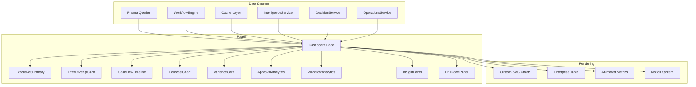
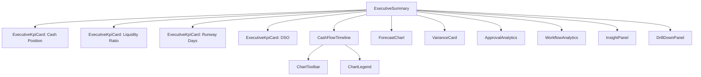
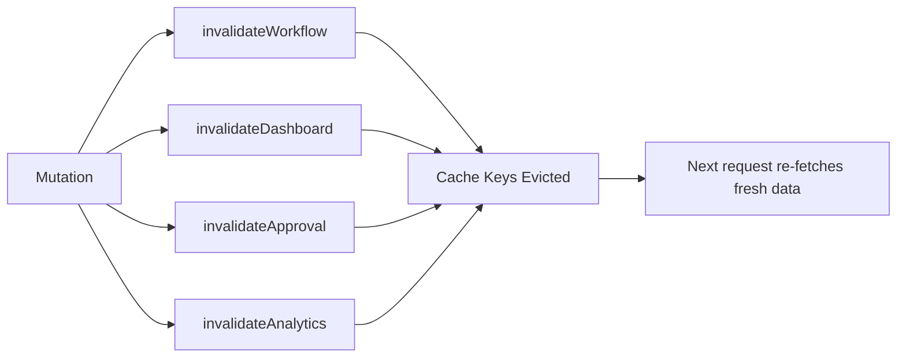
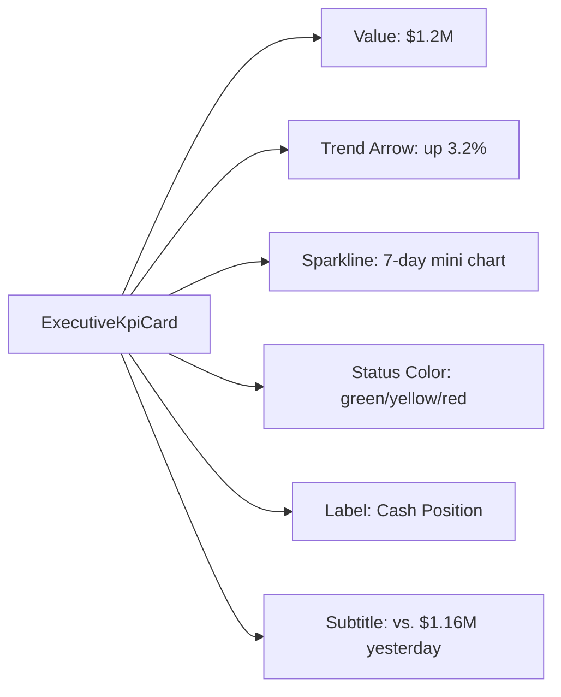
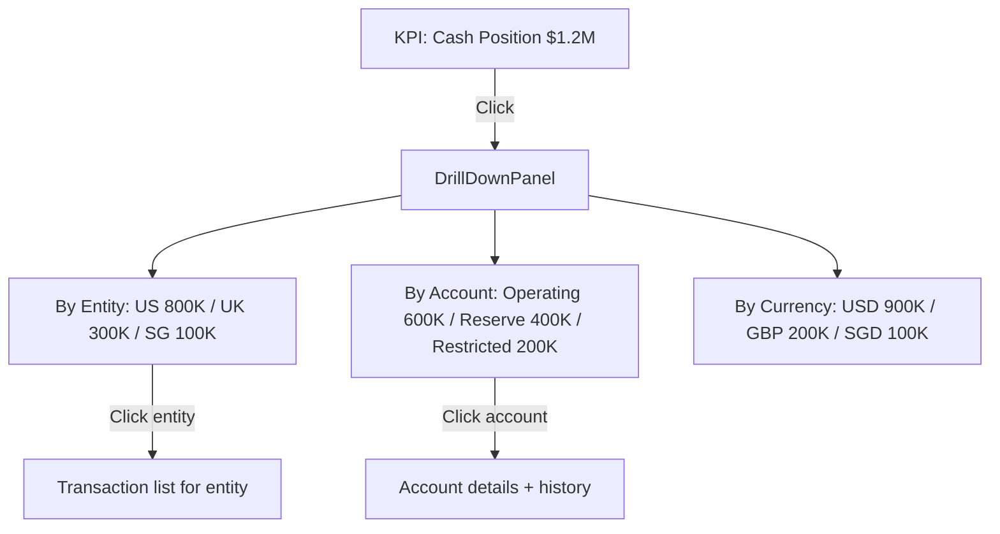
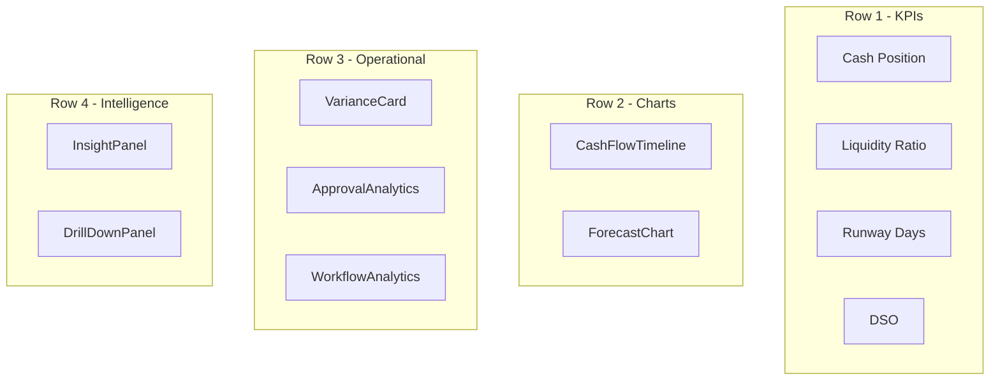
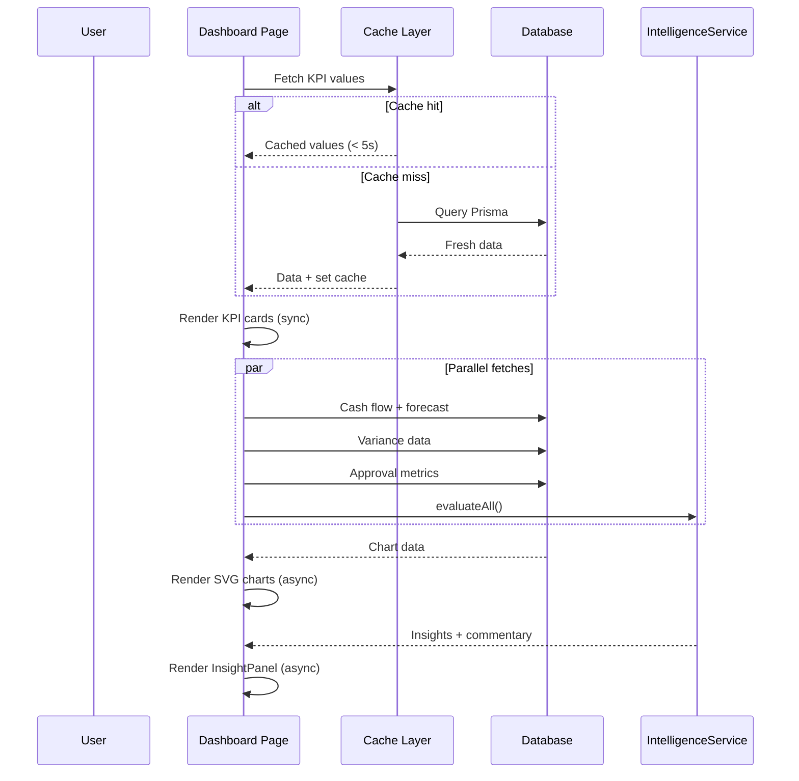

# Executive Dashboard

The Executive Dashboard is the primary interface for CFOs, Treasurers, and Controllers to monitor financial health, track KPIs, review approvals, and access AI-generated insights in real time.

**Location:** `src/components/enterprise/analytics/` (13 components), `src/app/(shell)/automation-studio/` (page routes)

---

## Architecture

---

## Component Architecture

### Component Map

| Component | File | Purpose | Data Requirements |
|---|---|---|---|
| `ExecutiveSummary` | `executive-summary.tsx` | Combined dashboard with KPIs, trends, alerts | Aggregated from all services |
| `ExecutiveKpiCard` | `executive-kpi-card.tsx` | Single KPI metric with trend arrow, sparkline, color-coded status | Value, previousValue, trend, format |
| `ChartCard` | `chart-card.tsx` | Wrapper with entrance animation (350ms fade-in-up) | Child chart content |
| `ChartToolbar` | `chart-toolbar.tsx` | Time range selector and chart controls | Time ranges, active selection |
| `ChartLegend` | `chart-legend.tsx` | Interactive legend with series toggle | Series labels, colors |
| `VarianceCard` | `variance-card.tsx` | Budget vs actual with percentage and direction | Actual, budget, variance |
| `CashFlowTimeline` | `cash-flow-timeline.tsx` | Time-series cash flow with forecast boundary | Cash positions, forecasts |
| `ForecastChart` | `forecast-chart.tsx` | Projections with confidence intervals | Historical + projected data |
| `ApprovalAnalytics` | `approval-analytics.tsx` | Volume, cycle time, approval rate by role | Approval history data |
| `WorkflowAnalytics` | `workflow-analytics.tsx` | Step durations, bottlenecks, failure rates | `WorkflowAnalytics` from service |
| `DrillDownPanel` | `drill-down-panel.tsx` | Hierarchical data exploration | Aggregate + detail data |
| `InsightPanel` | `insight-panel.tsx` | AI-generated insights and anomaly summaries | `IntelligenceService` results |
| `types/index` | `types/index.ts` | Shared TypeScript interfaces | N/A |

### Component Hierarchy

---

## Real-Time Data Updates

### Cache Strategy

| Data Type | Cache Tier | TTL | Invalidation Trigger |
|---|---|---|---|
| KPI values | `CacheTier.CRITICAL` | 5 seconds | Any mutation to underlying data |
| Cash positions | `CacheTier.SHORT` | 60 seconds | Treasury sync events |
| Analytics aggregations | `CacheTier.SHORT` | 60 seconds | Any workflow/schedule change |
| Historical reports | `CacheTier.LONG` | 600 seconds | Report generation |

### Metric Rendering Order

The dashboard follows a **metrics-first** rendering strategy:

1. **Synchronous render** -- KPI card values render immediately from cache
2. **Async render** -- Charts (SVG) render after data fetch completes
3. **AI commentary** -- `InsightPanel` renders when intelligence service responds

This ensures executives see critical numbers instantly, even if charts take a moment to compute.

### Cache Invalidation Chain

---

## KPI Widgets

### Available KPIs

| KPI | Source | Format | Trend |
|---|---|---|---|
| Cash Position | `TreasuryCashPosition` | Currency ($1.2M) | vs. previous period |
| Liquidity Ratio | Calculated from positions | Ratio (1.8x) | Target threshold |
| Runway Days | Cash / burn rate | Days (342d) | Trend line |
| DSO | Receivables / revenue x days | Days (42d) | YoY comparison |
| DPO | Payables / COGS x days | Days (38d) | Trend |
| Budget Variance | Actual vs. budget | Percentage (+/-5.2%) | Direction arrow |
| Approval Cycle Time | Approval history | Hours (2.4h) | Trend |
| Workflow Success Rate | Workflow metrics | Percentage (96.3%) | Trend |
| Active Automations | Schedule count | Count (12) | Stable/growing |
| Connector Health | Operations service | Percentage (98.1%) | Status color |

### KPI Card Layout

Each KPI card supports:

- **Primary value** -- The current metric, rendered first (synchronously)
- **Trend arrow** -- Up/down/stable with percentage change
- **Sparkline** -- Inline mini-chart showing 7-day or 30-day trend
- **Color coding** -- Green (on-target), yellow (warning), red (critical)
- **Drill-down** -- Tap/click to open `DrillDownPanel` with detailed breakdown

---

## Drill-Down

The `DrillDownPanel` provides hierarchical data exploration:

Drill-down is lazy-loaded -- detail panels fetch data on demand, not upfront.

---

## AI Commentary Integration

### Insight Sources

| Source | Service | Content |
|---|---|---|
| **Executive Summary** | `IntelligenceService.evaluateAll()` | One-paragraph overview of financial performance |
| **Variance Explanation** | `IntelligenceService` | Context for significant budget variances |
| **Trend Identification** | `IntelligenceService` | Notable patterns in cash flow or ratios |
| **Anomaly Flagging** | `DecisionService.getTopDecisions()` | Transactions or balances outside normal ranges |
| **Recommendations** | `DecisionService.evaluateAll()` | Actionable next steps based on current data |

### Rendering

The `InsightPanel` renders AI-generated insights with:

- **Clear AI labeling** -- Every insight is marked as AI-generated with a visual indicator
- **Source attribution** -- Which service/data produced the insight
- **Confidence score** -- When available, displayed as a confidence indicator
- **Action buttons** -- Approve, Dismiss, Investigate for each insight
- **Async loading** -- Insights appear when available, without blocking the rest of the dashboard

### Human-in-the-Loop

All AI commentary is advisory. It augments but never replaces human analysis. Every insight has a dismissal path, and dismissed insights are tracked for improving future recommendations.

---

## Mobile Responsiveness

The dashboard is classified as **ExecutiveMobile** -- it adapts to phone, tablet, and desktop viewports.

### Breakpoints

| Breakpoint | Layout | Components |
|---|---|---|
| **Phone** (< 640px) | Single column, stacked KPIs | `MobileMetricCard`, `QuickActionBar` |
| **Tablet** (640-1024px) | 2-column grid, collapsible panels | Full KPIs, simplified charts |
| **Desktop** (> 1024px) | 4-column grid, side panels | All 13 components |

### Mobile-Specific Features

| Feature | Implementation |
|---|---|
| **Bottom navigation** | Overview/Approvals/Treasury/Alerts/Insights |
| **Pull-to-refresh** | Manual data refresh gesture |
| **Touch targets** | Minimum 44px touch area (`touch-target` utility) |
| **Safe areas** | iOS notch/home indicator padding |
| **Offline indicator** | Banner with retry button when disconnected |
| **Connection status** | Green/red/gray dot indicator |

---

## Chart Rendering

All charts render as custom inline SVG -- no external chart library dependencies.

### Rendering Benefits

| Benefit | Detail |
|---|---|
| **Zero bundle weight** | No chart library in the JavaScript bundle |
| **Financial formatting** | Negative values in parentheses, currency symbols, percentage formatting |
| **Color system** | Charcoal surfaces (~95%), typography (~4%), gold accents (~1%) |
| **WCAG 2.1 AA** | Text alternatives, sufficient color contrast, keyboard navigation |
| **Animation** | Framer Motion entrance animations, reduced-motion-safe |

### Chart Types

| Chart | Component | SVG Approach |
|---|---|---|
| Cash flow timeline | `CashFlowTimeline` | Line chart with area fill, forecast boundary line |
| Forecast projection | `ForecastChart` | Line with confidence interval polygon |
| Budget variance | `VarianceCard` | Bar chart with positive/negative coloring |
| Approval cycle time | `ApprovalAnalytics` | Donut chart with role segments |
| Workflow performance | `WorkflowAnalytics` | Stacked bar chart by status |
| KPI sparklines | `ExecutiveKpiCard` | Mini line chart (14 data points) |

---

## Dashboard Layout

### Executive Summary Grid

### Data Flow

---

## Performance

| Optimization | Implementation |
|---|---|
| **Metrics-first render** | KPI values render synchronously from cache before charts load |
| **Cache tiering** | 5s for critical metrics, 60s for standard, 600s for historical |
| **Lazy drill-down** | Detail panels fetch on demand, not upfront |
| **Async AI commentary** | Insights render when available, never block dashboard |
| **Indexed queries** | All Prisma queries use indexed columns |
| **Stale-while-revalidate** | Cache-Control headers allow background refresh |
| **Bundle optimization** | Zero chart library dependencies, custom SVG only |

---

## Accessibility

| Standard | Implementation |
|---|---|
| **WCAG 2.1 AA** | Text alternatives for all charts, sufficient color contrast |
| **Screen reader** | `aria-label` on all interactive elements, `aria-describedby` for chart descriptions |
| **Keyboard** | Full Tab/Enter/Escape navigation through KPIs and drill-down panels |
| **Reduced motion** | `prefers-reduced-motion` disables all animations via `MotionProvider` |
| **Color independence** | Status indicated by icons + labels, not color alone |

---

## Integration Points

| System | How Integrated |
|---|---|
| **Treasury** | Cash positions, FX rates, liquidity metrics via `TreasuryCashPosition` |
| **Ledger** | P&L, balance sheet, journal entries via `Prisma` queries |
| **Workflow Engine** | Execution counts, success rates, step durations via `WorkflowEngine.getMetrics()` |
| **Intelligence** | AI commentary, anomaly detection via `IntelligenceService.evaluateAll()` |
| **Decision** | Recommendations, risk scores via `DecisionService.getTopDecisions()` |
| **Operations** | Connector health, sync status via `OperationsService.getConnectorHealth()` |
| **Governance** | Policy compliance, violations via `GovernanceService.getMetrics()` |
| **Cache** | Tiered caching via `getCached()` with `CacheTier` TTLs |
| **Motion** | Entrance animations via `AnimatedCard`, `PageTransition`, `fadeInUp` |
