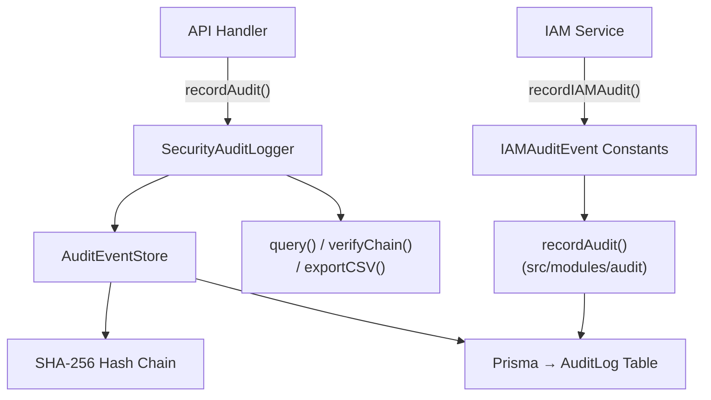
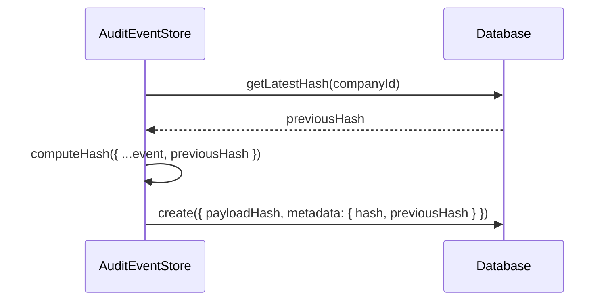

# Audit Logging

## Overview

The audit logging system provides tamper-evident, chronologically ordered records of all security-relevant events across the platform. It is implemented in `src/server/security/audit-logger.ts` with SHA-256 hash chaining to detect tampering, and `src/server/iam/audit-events.ts` for structured IAM-specific events. All audit records are persisted to the `AuditLog` Prisma model.

## Architecture



## Hash Chain (Tamper Evidence)

Every audit entry includes a SHA-256 hash that incorporates the previous entry's hash, creating a blockchain-like chain:



### Hash Computation

Each hash is computed from a JSON-serialized object containing:

| Field | Source |
|---|---|
| `action` | The event action (e.g., `TREASURY_DEPOSIT`) |
| `type` | Resource type (e.g., `TreasuryAccount`) |
| `severity` | `info`, `warning`, or `critical` |
| `userId` | Actor user ID |
| `companyId` | Tenant ID |
| `resource` | Resource ID |
| `details` | Free-text event details |
| `correlationId` | Request correlation ID |
| `ip` | Client IP address |
| `userAgent` | Client user agent |
| `previousHash` | Hash of the preceding entry |
| `timestamp` | ISO 8601 timestamp |

### Chain Verification

The `verifyChain(companyId?)` method validates the entire hash chain for a tenant:

```typescript
const result = await auditEventStore.verifyChain("company_123");
// { valid: true, breaks: 0, entries: 15432 }
```

If any entry has been modified, deleted, or reordered, `breaks > 0` and `valid: false`. This provides:

- **Detection of record tampering**: Any modification to stored metadata changes the hash.
- **Detection of record deletion**: Missing entries break the `previousHash` chain.
- **Detection of record insertion**: New entries inserted out of order will not match the expected chain.

## Severity Levels

| Severity | When to Use | Examples |
|---|---|---|
| **INFO** | Normal operations, routine actions | Login success, document viewed, settings changed |
| **WARNING** | Unusual but not critical events | Failed login attempt, permission denied, rate limit hit |
| **CRITICAL** | Security-sensitive or destructive actions | Account locked, encryption key rotated, data exported, role changed |

### Prisma Mapping

The `AuditSeverity` Prisma enum maps to the application-level strings:

```typescript
AuditSeverity.INFO     → "info"
AuditSeverity.WARNING  → "warning"
AuditSeverity.CRITICAL → "critical"
```

## IAM Audit Events

`src/server/iam/audit-events.ts` defines 40+ structured event types for identity and access management operations:

| Category | Events | Severity |
|---|---|---|
| **Authentication** | `iam.login.success`, `iam.login.failed`, `iam.logout` | INFO / WARNING / INFO |
| **Session** | `iam.session.created`, `iam.session.expired`, `iam.session.revoked` | INFO |
| **Password** | `iam.password.changed`, `iam.password.reset_requested`, `iam.password.reset_completed` | INFO |
| **MFA** | `iam.mfa.enrolled`, `iam.mfa.disabled`, `iam.mfa.verified`, `iam.mfa.failed`, `iam.mfa.recovery_used` | INFO / WARNING |
| **Roles** | `iam.role.assigned`, `iam.role.revoked`, `iam.role.created`, `iam.role.updated`, `iam.role.deleted` | INFO / CRITICAL |
| **Permissions** | `iam.permission.granted`, `iam.permission.revoked` | CRITICAL |
| **Users** | `iam.user.invited`, `iam.user.activated`, `iam.user.deactivated`, `iam.user.deleted` | INFO |
| **API Keys** | `iam.api_key.created`, `iam.api_key.revoked`, `iam.api_key.rotated` | INFO / WARNING |
| **SSO** | `iam.sso.provider_configured`, `iam.sso.provider_disabled` | INFO |
| **ABAC** | `iam.abac.policy_created`, `iam.abac.policy_updated`, `iam.abac.policy_deleted` | CRITICAL |
| **Config** | `iam.audit.config_changed`, `iam.session.policy_changed`, `iam.tenant.settings_changed` | CRITICAL |
| **Identity Provider** | `iam.identity_provider.sync`, `iam.identity_provider.error` | INFO / WARNING |

## What Gets Logged

Every audit entry captures:

| Field | Description | Source |
|---|---|---|
| `id` | Unique entry ID (`aud_{timestamp}_{random}`) | Auto-generated |
| `timestamp` | ISO 8601 creation time | `new Date().toISOString()` |
| `type` | Resource type affected | Handler context |
| `action` | Specific action performed | Handler context |
| `severity` | Event severity level | Handler context |
| `userId` | Actor who performed the action | Auth context (`ctx.userId`) |
| `companyId` | Tenant context | Auth context (`ctx.companyId`) |
| `resource` | ID of the affected resource | Handler context |
| `details` | Free-text description of what happened | Handler context |
| `ip` | Client IP address | `x-forwarded-for` header |
| `userAgent` | Client user agent string | `User-Agent` header |
| `correlationId` | Request tracking ID | `x-request-id` header |
| `hash` | SHA-256 hash of this entry | Computed |
| `previousHash` | Hash of the prior entry in chain | Looked up |

### Before/After State

For data-mutating operations, the audit metadata includes before and after state:

```json
{
  "details": "Account balance updated",
  "before": { "balance": "100000.00" },
  "after": { "balance": "150000.00" },
  "correlationId": "req_abc123"
}
```

## Querying and Filtering

The `query()` method supports rich filtering:

```typescript
const results = await auditEventStore.query({
  companyId: "company_123",
  userId: "user_456",
  severity: "critical",
  startDate: "2026-01-01",
  endDate: "2026-07-16",
  search: "encryption",
  take: 50,
  cursor: "aud_1721000000_abc123", // cursor-based pagination
});
```

| Filter | Type | Description |
|---|---|---|
| `companyId` | string | Filter by tenant |
| `userId` | string | Filter by actor |
| `type` | string | Filter by resource type |
| `action` | string | Filter by action name |
| `severity` | `"info" \| "warning" \| "critical"` | Filter by severity |
| `startDate` | string (ISO) | Events after this date |
| `endDate` | string (ISO) | Events before this date |
| `search` | string | Full-text search across action, type, and resource |
| `cursor` | string | Cursor for pagination |
| `take` | number | Page size (default 50) |

## CSV Export

For compliance reporting and external analysis:

```typescript
const csv = await auditEventStore.exportCSV({ companyId: "company_123" });
// Returns CSV with columns: ID, Timestamp, Type, Severity, User ID, Company ID, Action, ...
```

Export respects all filter parameters and caps at 10,000 records per export.

## Data Retention

The `applyRetention(days)` method deletes audit records older than the specified number of days:

```typescript
const deleted = await auditEventStore.applyRetention(365);
// Deletes all records older than 365 days
```

### Retention Policy (Recommended)

| Data Type | Minimum Retention | Recommended | Reason |
|---|---|---|---|
| Security events | 1 year | 7 years | SOC 2, ISO 27001 |
| Financial events | 7 years | 10 years | PCI DSS, SOX |
| IAM events | 1 year | 5 years | SOC 2, compliance |
| General operations | 90 days | 1 year | Operational debugging |

## Compliance Requirements

| Standard | Requirement | Implementation |
|---|---|---|
| **SOC 2 CC7.2** | Monitor system components for anomalies | Audit logger captures all security events with timestamps |
| **SOC 2 CC7.3** | Evaluate security events and respond | Severity levels enable prioritized response |
| **ISO 27001 A.12.4** | Event logging | Tamper-evident hash chain, structured fields |
| **ISO 27001 A.12.4.1** | Audit trail protection | SHA-256 chaining detects tampering |
| **PCI DSS 10.2** | Automatic audit trails | All privileged actions logged |
| **PCI DSS 10.5** | Audit trail protection | Hash chain, Prisma access controls |
| **GDPR Art. 30** | Records of processing activities | Audit log provides processing record |

## Integration Points

| System | How It Logs |
|---|---|
| `TreasuryService` | `recordAudit()` on deposit, transfer, account creation |
| `RBAC Service` | `recordIAMAudit()` on role/permission changes |
| `MFA Service` | `recordIAMAudit()` on enrollment, verification, failure |
| `Session Manager` | `recordIAMAudit()` on session create, revoke, expire |
| `API Key Service` | `recordIAMAudit()` on key create, revoke, rotate |
| `Encryption Service` | `recordAudit()` on key rotation |
| `Proxy` | Logs rate limit violations, CSRF rejections |

## Singleton Instances

```typescript
import { securityAuditLogger, auditEventStore } from "@/server/security/audit-logger";

// SecurityAuditLogger — high-level API
await securityAuditLogger.log({ action: "LOGIN_SUCCESS", type: "auth", severity: "info", ... });

// AuditEventStore — low-level with query, verify, export
const { entries, nextCursor } = await auditEventStore.query({ companyId: "..." });
```
