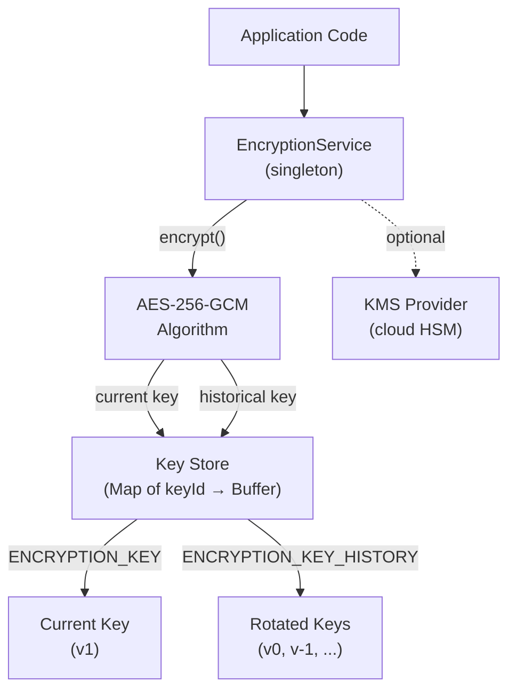
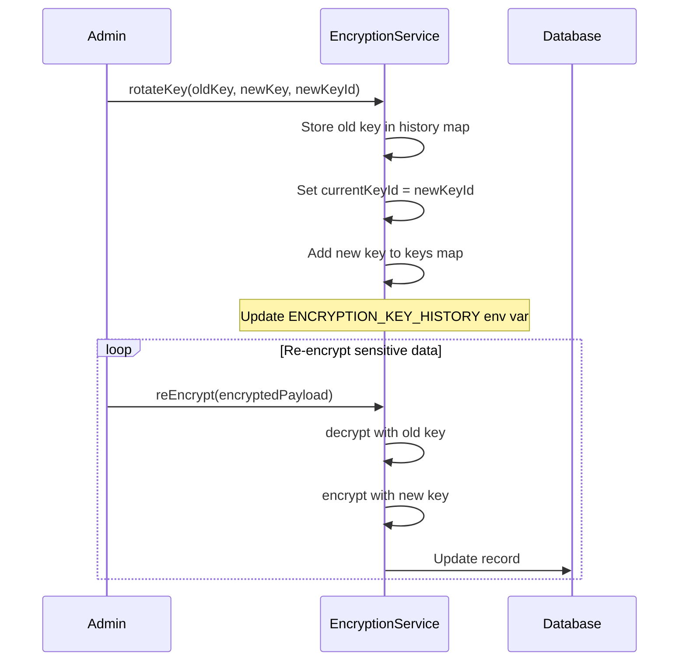

# Encryption

## Overview

The platform implements AES-256-GCM encryption for all sensitive data at rest, including personally identifiable information (PII), financial records, API credentials, and tokens. The encryption service lives at `src/server/security/encryption.ts` and provides encrypt, decrypt, re-encrypt, and key rotation operations with an optional KMS provider interface for cloud HSM integration.

## Encryption Architecture



## Algorithm Details

| Property | Value |
|---|---|
| Algorithm | `aes-256-gcm` |
| Key length | 32 bytes (256 bits) |
| IV length | 16 bytes (random per encryption) |
| Auth tag | 16 bytes (GCM authentication tag) |
| Authenticated | Yes — tampered ciphertext is rejected on decrypt |

### Why AES-256-GCM?

- **Authenticated encryption**: GCM mode produces an authentication tag alongside the ciphertext. Any modification to the ciphertext or metadata causes decryption to fail, preventing padding oracle and bit-flipping attacks.
- **No padding needed**: GCM is a stream cipher mode — no PKCS padding, no padding oracle vulnerabilities.
- **Performance**: Hardware AES-NI instructions on modern CPUs make AES-256-GCM extremely fast.
- **Compliance**: Meets requirements for PCI DSS, SOC 2, ISO 27001, and GDPR encryption standards.

## Encrypted Payload Format

Each encrypted value is stored as:

```
base64(metadata_json):hex(ciphertext)
```

The metadata envelope contains:

```typescript
interface EncryptionMetadata {
  keyId: string;       // Key identifier (e.g., "v1", "v2")
  algorithm: string;   // Always "aes-256-gcm"
  iv: string;          // Hex-encoded 16-byte IV
  authTag: string;     // Hex-encoded 16-byte GCM auth tag
  version: number;     // Payload format version (currently 1)
  timestamp: string;   // ISO 8601 encryption timestamp
}
```

This format enables key rotation without re-encrypting all data — the `keyId` in the metadata tells the decryptor which historical key to use.

## What Gets Encrypted

| Data Category | Examples | Storage |
|---|---|---|
| **PII** | Names, emails, addresses, SSNs | Field-level encryption before Prisma write |
| **Financial data** | Account numbers, routing numbers, balances | Field-level encryption on sensitive fields |
| **Credentials** | API keys, bank credentials, tokens | Encrypted at rest, never logged |
| **Encryption keys** | Historical keys in `ENCRYPTION_KEY_HISTORY` | Env vars, not stored in database |
| **JWT secrets** | Session signing secrets | Env vars, validated at startup |

### Transport Encryption

Transport-layer encryption is handled separately by TLS/HTTPS:

| Layer | Mechanism | Scope |
|---|---|---|
| **At rest** | AES-256-GCM (application-level) | Database fields, files, backups |
| **In transit** | TLS 1.2+ (infrastructure-level) | All HTTP traffic, database connections, Redis connections |

The two layers are complementary — application-level encryption protects data even if the database or backups are compromised, while TLS protects data in transit.

## Key Management

### Current Key

The active encryption key is loaded from `ENCRYPTION_KEY` (64 hex characters = 32 bytes):

```bash
# Generate a new key
node -e "console.log(require('crypto').randomBytes(32).toString('hex'))"
```

The key ID defaults to `"v1"` and can be overridden with `ENCRYPTION_KEY_ID`.

### Key Validation

At construction, the service rejects:

- **Missing key**: Throws `EncryptionKeyError` if `ENCRYPTION_KEY` is not set.
- **Default/insecure keys**: Known test values like `"test-encryption-key-32-chars-long!!"` or all-zeros are rejected.
- **Invalid format**: Keys must be exactly 64 hex characters (32 bytes).

### Key Rotation



**Rotation schedule (recommended):**

| Key Type | Rotation Frequency | Reason |
|---|---|---|
| Primary encryption key | Every 90 days | Compliance best practice |
| API signing keys | Every 180 days | Lower exposure surface |
| Test/development keys | Never rotate | Regenerated per environment |

**Rotation process:**

1. Generate a new 32-byte key and assign a new `keyId` (e.g., `"v2"`).
2. Call `rotateKey(oldKeyHex, newKeyHex, newKeyId)` — this moves the current key to history.
3. Update `ENCRYPTION_KEY` and `ENCRYPTION_KEY_ID` environment variables.
4. Append the old key to `ENCRYPTION_KEY_HISTORY` (format: `v1=hexkey`).
5. Optionally call `reEncrypt()` on existing records to migrate them to the new key.
6. Old keys remain in the key map for decrypting un-migrated data.

### Key History

Historical keys are stored in `ENCRYPTION_KEY_HISTORY` as comma-separated `keyId=hex` pairs:

```
ENCRYPTION_KEY_HISTORY=v0=abc123...,v-1=def456...
```

This allows decrypting data encrypted with any previously-used key. The service loads all historical keys at startup.

## KMS Provider Interface

For enterprise deployments requiring cloud HSM integration, the `KMSProvider` interface allows plugging in external key management:

```typescript
interface KMSProvider {
  encrypt(plaintext: string, context?: Record<string, string>): Promise<string>;
  decrypt(ciphertext: string, context?: Record<string, string>): Promise<string>;
  generateKey(): Promise<{ keyId: string; key: string }>;
}
```

| Provider | Use Case |
|---|---|
| AWS KMS | AWS-hosted deployments with CloudHSM |
| Google Cloud KMS | GCP-hosted deployments |
| Azure Key Vault | Azure-hosted deployments |
| HashiCorp Vault | Self-hosted or multi-cloud |

Set the provider via `encryptionService.setKMSProvider(provider)` at application startup. When a KMS provider is configured, `decryptWithKMS()` delegates to the provider instead of using the local key map.

## Singleton Pattern

The encryption service is a singleton — `getEncryptionService()` returns the same instance across the application:

```typescript
import { getEncryptionService } from "@/server/security/encryption";

const enc = getEncryptionService();
const ciphertext = enc.encrypt("sensitive data");
const plaintext = enc.decrypt(ciphertext);
```

This ensures a consistent key state across all operations within a process.

## Compliance Mapping

| Requirement | Implementation |
|---|---|
| **PCI DSS 3.4** | Cardholder data encrypted at rest with AES-256 |
| **SOC 2 CC6.1** | Encryption key rotation, access controls, audit logging |
| **ISO 27001 A.10.1** | Cryptographic controls — algorithm, key length, key management |
| **GDPR Art. 32** | Encryption as a technical measure for personal data protection |
| **NIST SP 800-57** | Key management lifecycle — generation, distribution, rotation, destruction |

## Error Handling

| Error | Cause | Resolution |
|---|---|---|
| `EncryptionKeyError: ENCRYPTION_KEY required` | Key not set in environment | Generate and set `ENCRYPTION_KEY` |
| `EncryptionKeyError: known default/insecure value` | Test key in production | Generate a real key |
| `EncryptionKeyError: must be 64 hex characters` | Malformed key | Regenerate with `crypto.randomBytes(32)` |
| `EncryptionKeyError: No encryption key found for keyId` | Key rotated but old key not in history | Add old key to `ENCRYPTION_KEY_HISTORY` |
| `EncryptionKeyError: Invalid encrypted payload format` | Corrupted or wrong-format ciphertext | Verify data integrity, check for truncation |

## Security Properties

- **Indistinguishability**: Without the key, ciphertext is computationally indistinguishable from random bytes.
- **Tamper evidence**: GCM auth tag detects any modification to ciphertext or metadata.
- **Key isolation**: Each encryption operation generates a fresh random IV, so identical plaintexts produce different ciphertexts.
- **Forward secrecy on rotation**: Old keys can be destroyed after all data is re-encrypted, preventing decryption of historical data.
- **No hard-coded secrets**: Default and test key values are explicitly rejected at startup.
