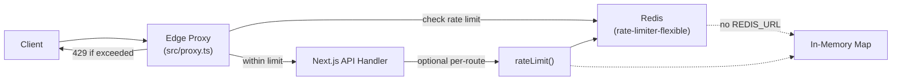
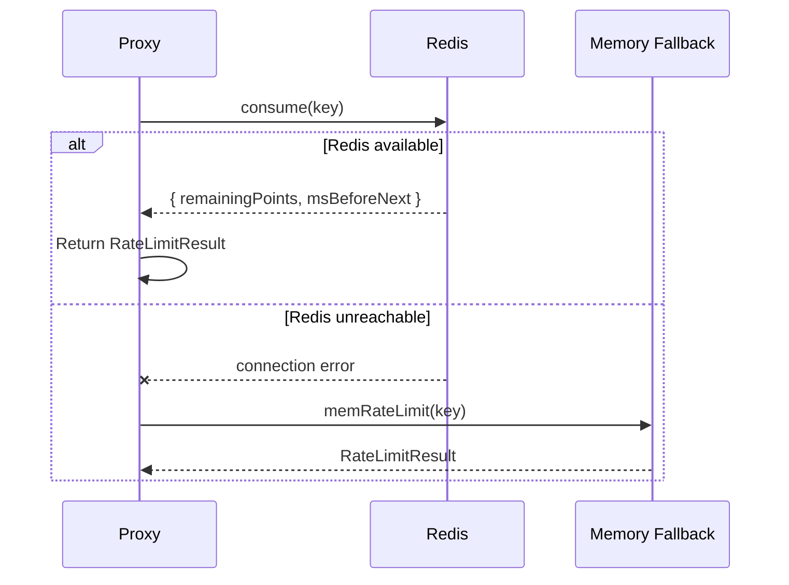
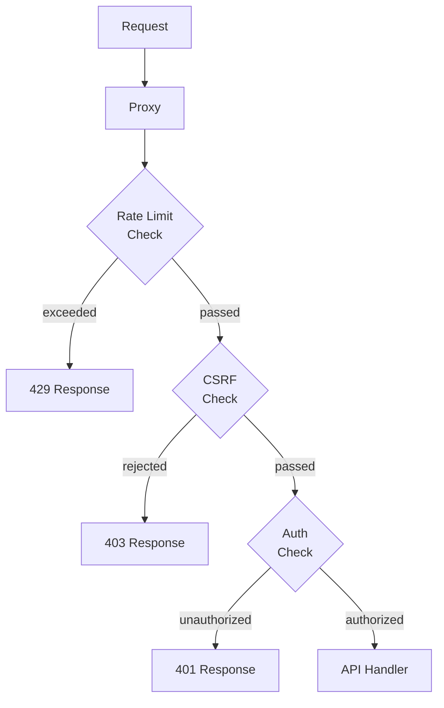

# Rate Limiting

## Overview

Rate limiting protects the platform from abuse, brute-force attacks, and resource exhaustion. The system operates at two layers: an **edge proxy** that applies fast, IP-based limits before requests reach the application, and an **application-level** limiter available for handler-specific policies. Both layers share a common `rateLimit()` function backed by Redis when available, with an automatic in-memory fallback for development and single-instance deployments.

## Architecture



### Edge Proxy Layer (`src/proxy.ts`)

The proxy runs as Next.js middleware on every matched route. For mutation methods (`POST`, `PUT`, `PATCH`, `DELETE`), it extracts the client IP from `x-forwarded-for` and applies tiered rate limits before the request ever reaches a handler:

1. **Auth endpoints** (`/api/auth/*`) — tightest limits to prevent credential stuffing.
2. **Demo bootstrap** (`/api/demo/bootstrap`) — extremely tight to prevent abuse of seeded environments.
3. **Financial endpoints** (`/api/v1/transactions/*`, `/api/v1/treasury/*`) — strict limits to protect monetary operations.
4. **General API** (`/api/*`) — default ceiling for all other mutation routes.

Read-only requests (`GET`, `HEAD`) are not rate-limited at the proxy layer, since they are idempotent and stateless.

### Application Layer

Individual handlers can call `rateLimit(key, maxRequests, windowMs)` for custom per-route or per-user policies. This is useful for:

- AI endpoints with expensive compute (e.g., 5 requests/minute per user).
- File upload endpoints with size-based throttling.
- Reporting endpoints that trigger heavy database queries.

## Tier Limits

| Tier | Endpoint Pattern | Max Requests | Window | Purpose |
|---|---|---|---|---|
| **Auth** | `/api/auth/*` | 10 | 60s | Prevent brute-force login |
| **Demo** | `/api/demo/bootstrap` | 3 | 60s | Protect demo environments |
| **Financial** | `/api/v1/transactions/*`, `/api/v1/treasury/*` | 60 | 60s | Safeguard monetary mutations |
| **API Default** | `/api/*` (all other mutations) | 120 | 60s | General abuse prevention |
| **Public** | Public endpoints (e.g., `/api/v1/demo-requests`) | 200 | 60s | Allow high-volume public access |
| **Application** | Custom per-handler | Configurable | Configurable | Expensive operations (AI, reports) |

## Redis-Backed Distributed Rate Limiting

When `REDIS_URL` is set, the platform uses `rate-limiter-flexible` with a Redis store:



### Redis Configuration

- **Connection**: Lazy-connect with `enableOfflineQueue: false` to avoid blocking on startup.
- **Retry**: Exponential backoff (100ms, 200ms, 300ms) with max 3 retries.
- **Key prefix**: All rate limit keys are prefixed with `rl:` to namespace within Redis.
- **Limiter cache**: Limiter instances are cached by `key:points:duration` to avoid re-creating per request.
- **Graceful degradation**: If Redis emits an error, `redisAvailable` is set to `false` and all subsequent calls fall through to in-memory for the lifetime of the process.

### Key Format

Rate limit keys follow the pattern: `rl:{tier}:{identifier}`

| Tier | Key Example | Scope |
|---|---|---|
| Auth | `rl:auth:192.168.1.1` | Per IP |
| Demo | `rl:demo:10.0.0.5` | Per IP |
| Financial | `rl:financial:192.168.1.1` | Per IP |
| API | `rl:api:192.168.1.1` | Per IP |
| Custom | `rl:ai:{userId}` | Per user |

## In-Memory Fallback

When `REDIS_URL` is not configured (development, CI, single-instance), a simple `Map<string, RateLimitEntry>` provides sliding-window rate limiting:

```typescript
type RateLimitEntry = { count: number; resetAt: number };
```

- Each key stores a counter and a reset timestamp.
- When the current time exceeds `resetAt`, the entry is reset.
- The fallback is **per-process only** — it does not share state across instances, making it unsuitable for production multi-pod deployments.

### When to Use Which

| Environment | Recommended Backend | Reason |
|---|---|---|
| Local development | In-memory | No Redis dependency |
| CI/CD | In-memory | Ephemeral processes |
| Staging | Redis | Mirror production behavior |
| Production | Redis (required) | Distributed accuracy |
| Multi-region | Redis Cluster | Cross-region coordination |

## Response Headers

All rate-limited responses include standard headers:

| Header | Description |
|---|---|
| `X-RateLimit-Remaining` | Number of requests remaining in the current window |
| `X-RateLimit-Reset` | Unix timestamp (seconds) when the window resets |
| `Retry-After` | Seconds until the client should retry (only on 429) |

When the limit is exceeded, the proxy returns:

```json
{
  "error": {
    "code": "TOO_MANY_REQUESTS",
    "message": "Too many requests. Try again later."
  }
}
```

## Configuration

### Environment Variables

| Variable | Default | Description |
|---|---|---|
| `REDIS_URL` | _(none)_ | Redis connection string. When absent, falls back to in-memory. |
| `RATE_LIMIT_AUTH_MAX` | `10` | Max requests for auth endpoints per window |
| `RATE_LIMIT_FINANCIAL_MAX` | `60` | Max requests for financial endpoints per window |
| `RATE_LIMIT_API_MAX` | `120` | Max requests for general API per window |
| `RATE_LIMIT_WINDOW_MS` | `60000` | Default window duration in milliseconds |

### Custom Per-Handler Limits

Handlers can apply custom limits by calling `rateLimit()` directly:

```typescript
import { rateLimit, rateLimitKey } from "@/server/security/rate-limit";

export async function POST(request: Request) {
  const ctx = await requirePermission(request, "ai.generate");
  const key = rateLimitKey("ai", ctx.userId);
  const rl = await rateLimit(key, 5, 60_000); // 5 requests per minute per user
  if (!rl.ok) {
    return NextResponse.json(
      { error: { code: "RATE_LIMITED", message: "AI rate limit exceeded" } },
      { status: 429, headers: { "Retry-After": String(Math.ceil((rl.resetAt - Date.now()) / 1000)) } },
    );
  }
  // ... handler logic
}
```

## Integration with Other Security Systems



- **CSRF protection** runs after rate limiting, so attackers cannot use CSRF checks to infer rate limit state.
- **Auth failures** (`/api/auth/*`) have the tightest limits (10/minute), directly protecting against credential stuffing.
- **Correlation IDs** (`x-request-id`) are included in all 429 responses for debugging and log tracing.

## Monitoring and Alerting

Rate limit violations are tracked via the observability layer:

- **Metrics**: `rate_limit_total` counter with labels for tier, status (allowed/denied), and identifier type.
- **Alerts**: Sustained 429 rates above threshold trigger security alerts.
- **Logs**: All 429 responses are logged with IP, path, tier, and correlation ID.

## Considerations

- **Multi-pod**: In-memory fallback does not synchronize across pods. Production must use Redis.
- **IP spoofing**: When behind a load balancer, ensure `x-forwarded-for` is set by the trusted proxy only. The rate limiter trusts the first IP in the chain.
- **Authenticated rate limiting**: For per-user limits on authenticated endpoints, key by `userId` rather than IP to avoid false positives from shared IPs.
- **Burst tolerance**: The sliding-window algorithm allows brief bursts up to the full limit within a single window, then enforces the average.
