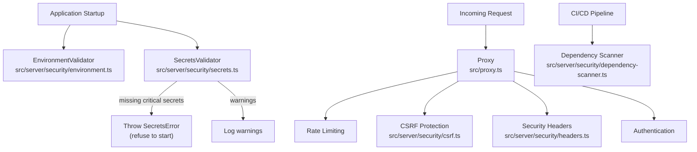
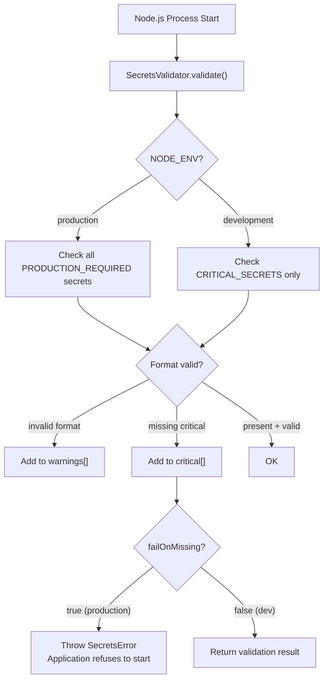

# Secrets Management

## Overview

Secrets management ensures that sensitive credentials, API keys, and configuration values are never exposed in source code, logs, or client-side bundles. The platform enforces a multi-layered defense: environment variable validation at startup, CSRF protection on mutation endpoints, strict security headers, dependency scanning, and a zero-tolerance policy for committed secrets.

## Architecture



## Environment Variable Validation

The `SecretsValidator` (`src/server/security/secrets.ts`) runs at application startup and enforces that all required secrets are present and properly formatted.

### Critical Secrets (Required in All Environments)

| Variable | Format Pattern | Description |
|---|---|---|
| `JWT_SECRET` | `^.{32,}$` | Session signing secret (min 32 chars) |
| `ENCRYPTION_KEY` | `^[a-fA-F0-9]{64}$` | AES-256 encryption key (64 hex chars) |
| `ENCRYPTION_KEY_ID` | Any string | Key identifier for rotation |
| `DATABASE_URL` | `^postgresql:\/\/.+` | PostgreSQL connection string |
| `REDIS_URL` | `^redis(s)?:\/\/.+` | Redis connection string |
| `AUTH_SECRET` | `^.{32,}$` | NextAuth secret (min 32 chars) |
| `NEXT_PUBLIC_APP_URL` | Any string | Application base URL |

### Production-Only Secrets

| Variable | Description |
|---|---|
| `SMTP_HOST` | Email server host |
| `SMTP_PORT` | Email server port |
| `SMTP_USER` | Email server username |
| `SMTP_PASS` | Email server password |
| `SENTRY_DSN` | Error tracking DSN |

### Startup Behavior



### Insecure Key Detection

The validator explicitly rejects known default/test values:

| Value | Rejection Reason |
|---|---|
| `test-encryption-key-32-chars-long!!` | Known test encryption key |
| `0000000000000000000000000000000000000000000000000000000000000000` | All-zeros encryption key |
| `test-jwt-secret-for-testing-only` | Known test JWT secret |

### Diagnostic Mode

The `diagnose()` method provides a comprehensive health check without throwing:

```typescript
const diag = secretsValidator.diagnose();
// {
//   nodeEnv: "production",
//   criticalPresent: ["JWT_SECRET", "ENCRYPTION_KEY", ...],
//   criticalMissing: ["SENTRY_DSN"],
//   warnings: ["ENCRYPTION_KEY should be 64 hex characters"],
//   recommendations: ["Set REDIS_URL for distributed rate limiting"]
// }
```

## CSRF Protection

`src/server/security/csrf.ts` protects mutation endpoints from cross-site request forgery.

### Origin Validation

The `validateOrigin()` function checks the `Origin` and `Referer` headers against a whitelist:

| Allowed Origin | Environment |
|---|---|
| `http://localhost:3000` | Local development |
| `http://localhost:3001` | Local development (alternate port) |
| `https://app.perionyx.com` | Production |
| `https://staging.perionyx.com` | Staging |

Requests from unknown origins to mutation endpoints (`POST`, `PUT`, `PATCH`, `DELETE`) receive a `403 CSRF_REJECTED` response.

### Token-Based CSRF

For form-based submissions, the `CSRFProtection` class provides token generation and validation:

```typescript
const token = csrfProtection.generateToken(); // 64-char hex token
// Include in form as x-csrf-token header
// Server validates: csrfProtection.validateToken(token, storedToken)
```

- Tokens are 32 bytes of cryptographically random data (64 hex characters).
- Constant-time comparison prevents timing attacks.
- GET, HEAD, and OPTIONS requests are exempt (read-only, no side effects).

## Security Headers

`src/server/security/headers.ts` (`SecurityHeadersManager`) applies a comprehensive set of security headers to all responses:

| Header | Value | Purpose |
|---|---|---|
| `Content-Security-Policy` | `default-src 'self'; script-src 'self' 'unsafe-inline' 'unsafe-eval'; ...` | Prevents XSS, data injection |
| `Strict-Transport-Security` | `max-age=31536000; includeSubDomains; preload` | Forces HTTPS for 1 year |
| `X-Content-Type-Options` | `nosniff` | Prevents MIME-type sniffing |
| `X-Frame-Options` | `DENY` | Prevents clickjacking |
| `X-XSS-Protection` | `1; mode=block` | Legacy XSS filter |
| `Referrer-Policy` | `strict-origin-when-cross-origin` | Limits referrer leakage |
| `Permissions-Policy` | `camera=(), microphone=(), geolocation=()` | Disables browser features |
| `Cross-Origin-Opener-Policy` | `same-origin` | Isolates browsing context |
| `Cross-Origin-Resource-Policy` | `same-origin` | Prevents cross-origin reads |
| `Cross-Origin-Embedder-Policy` | `require-corp` | Requires CORS for embedding |

### CSP Directives

The Content Security Policy is built from a directive map:

```typescript
cspPolicies = {
  "default-src": ["'self'"],
  "script-src": ["'self'", "'unsafe-inline'", "'unsafe-eval'"],
  "style-src": ["'self'", "'unsafe-inline'"],
  "img-src": ["'self'", "data:", "https:"],
  "font-src": ["'self'", "data:"],
  "connect-src": ["'self'", "https:", "wss:"],
  "frame-ancestors": ["'none'"],
  "base-uri": ["'self'"],
  "form-action": ["'self'"],
}
```

Additional directives can be added at runtime via `addCspDirective()`.

### Environment Differences

| Header | Development | Production |
|---|---|---|
| HSTS | `max-age=31536000` | `max-age=31536000; includeSubDomains; preload` |
| CSP script-src | Includes `'unsafe-eval'` | Standard only |
| Cache-Control | `no-store, max-age=0` | `no-store, max-age=0` |

## Dependency Scanning

`src/server/security/dependency-scanner.ts` scans project dependencies for known vulnerabilities:

```typescript
const result = dependencyScanner.scan(packageJson.dependencies);
// {
//   scanned: 142,
//   vulnerabilities: ["lodash@4.17.19 has known vulnerability"],
//   warnings: ["some-lib@0.9.0 is a major version below 2.0"],
//   safe: false
// }
```

### Scan Categories

| Check | Action | Example |
|---|---|---|
| Known vulnerable versions | Flag as vulnerability | `lodash@4.17.19` (prototype pollution) |
| Pre-release versions | Flag as warning | `react@19.0.0-beta.1` |
| Major versions below 2.0 | Flag as warning | `express@1.0.0` |

### CI/CD Integration

The dependency scanner integrates into the CI pipeline:

1. `pnpm install` runs `dependency-scanner` as a post-install hook.
2. Known vulnerabilities block the build.
3. Warnings are reported but do not block.

## Never-Commit-Secrets Policy

The platform enforces a zero-tolerance policy for committed secrets:

| Mechanism | Scope | Action |
|---|---|---|
| `.gitignore` | `*.env`, `*.env.local`, `.env*` | Prevents staging secrets |
| Pre-commit hook | `ENCRYPTION_KEY`, `JWT_SECRET`, `DATABASE_URL` patterns | Blocks commit if detected |
| CI secret scanning | All committed files | Blocks merge if secrets found |
| GitHub secret scanning | Pushed commits | Alerts on detected patterns |
| `SecretsValidator` | Application startup | Refuse to start with insecure keys |

### What Never Goes in Code

- Database credentials
- API keys (internal or third-party)
- Encryption keys
- JWT/session secrets
- SMTP credentials
- Third-party service tokens
- Private keys or certificates

All secrets must be provided via environment variables, secret managers (AWS Secrets Manager, GCP Secret Manager, Azure Key Vault), or Kubernetes Secrets.

## Environment Validator

`src/server/security/environment.ts` validates environment-specific configuration:

| Check | Environment | Consequence |
|---|---|---|
| `NODE_ENV` must be set | All | Warning |
| `NEXT_PUBLIC_APP_URL` required | All | Warning |
| `APP_URL` must use HTTPS | Production | Error |
| `JWT_SECRET` must not be test value | Production | Error |
| `NODE_ENV` must be `production` | Production | Error |

## Integration with Other Security Systems

| System | How Secrets Management Integrates |
|---|---|
| **Rate Limiting** | `REDIS_URL` validated at startup; fallback if missing |
| **Encryption** | `ENCRYPTION_KEY` validated for format; insecure defaults rejected |
| **Audit Logging** | Secret validation failures logged as CRITICAL events |
| **Session Management** | `JWT_SECRET` / `AUTH_SECRET` validated at startup |
| **Authentication** | Auth secret required for JWT token verification |
| **CI/CD** | Dependency scanner + secret scanning in pipeline |

## Diagnostics

Run a full secrets diagnostic at any time:

```typescript
import { secretsValidator } from "@/server/security/secrets";

const report = secretsValidator.diagnose();
console.log(report);
```

This outputs which critical secrets are present/missing, any format warnings, and actionable recommendations for production readiness.
