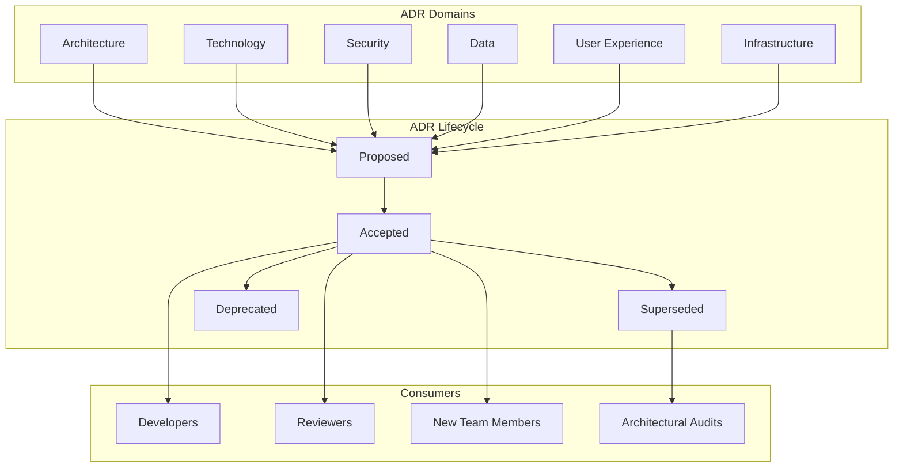

# Architecture Decision Records

Architecture Decision Records (ADRs) capture the significant technical decisions made during the development of Perionyx — what was decided, why it was decided, what alternatives were considered, and what the consequences are. They provide the institutional memory that prevents revisiting settled decisions without explicit justification.

## Architecture

## Core Components

| Component | Description | Source |
|-----------|-------------|--------|
| [ADR List](./adr-list/) | Complete catalog of 30 Architecture Decision Records with status and links | `docs/adrs/` |

## Key Design Decisions

- **Every significant decision gets an ADR** — Not just architecture; security, data, and UX decisions are recorded too
- **ADRs are immutable once accepted** — Superseded ADRs are not deleted; they are marked and linked to their replacement
- **Status is explicit** — Proposed, Accepted, Superseded, or Deprecated; no ambiguity about which decisions are active
- **Consequences are required** — Every ADR must document trade-offs and negative consequences, not just benefits
- **ADRs inform CI enforcement** — Engineering standards and performance budgets trace back to specific ADRs

## Related Documentation

- [Engineering Standards](/docs/engineering-standards/) — Standards derived from ADRs
- [Executive Overview](/docs/executive-overview/) — Platform philosophy driving decisions
- [Architecture](/docs/architecture/) — System architecture documentation
- [Financial Platform](/docs/financial-platform/) — Core financial decisions
