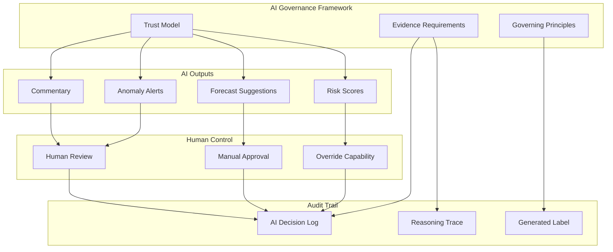

# AI Governance

The AI Governance domain establishes the trust framework for AI-assisted analysis within Perionyx. It defines when AI can be used, what evidence it must provide, and the non-negotiable principles that prevent AI from compromising audit integrity or financial accuracy.

## Architecture

## Core Components

| Component | Description | Source |
|-----------|-------------|--------|
| [Trust Model](./trust-model/) | Confidence levels, human-in-the-loop requirements, escalation paths | `src/modules/intelligence-platform/` |
| [Evidence Requirements](./evidence-requirements/) | Every AI output must include reasoning trace, data sources, confidence score | `src/modules/intelligence-platform/` |
| [Governing Principles](./principles/) | Non-negotiable rules — AI never mutates financial state, always labeled, always auditable | Architecture decision |

## Key Design Decisions

- **AI never becomes the system of record** — AI provides commentary; humans confirm all financial mutations
- **Every output is labeled** — "AI-generated" watermark on all intelligence outputs; no silent AI decisions
- **Reasoning traces are mandatory** — Black-box scores are rejected; every engine must explain its reasoning
- **Confidence thresholds trigger escalation** — Low-confidence outputs are flagged for mandatory human review
- **AI decisions are auditable** — Every AI output is logged with timestamp, input data, reasoning, and confidence

## Related Documentation

- [Intelligence Platform](/docs/intelligence/) — The 6 engines governed by this framework
- [Security — Audit Logging](/docs/security/audit-logging/) — AI decision logging
- [Engineering Standards — Engineering Constitution](/docs/engineering-standards/engineering-constitution/) — Foundational principles
- [Executive Overview](/docs/executive-overview/) — "AI explains but never becomes the system of record"
