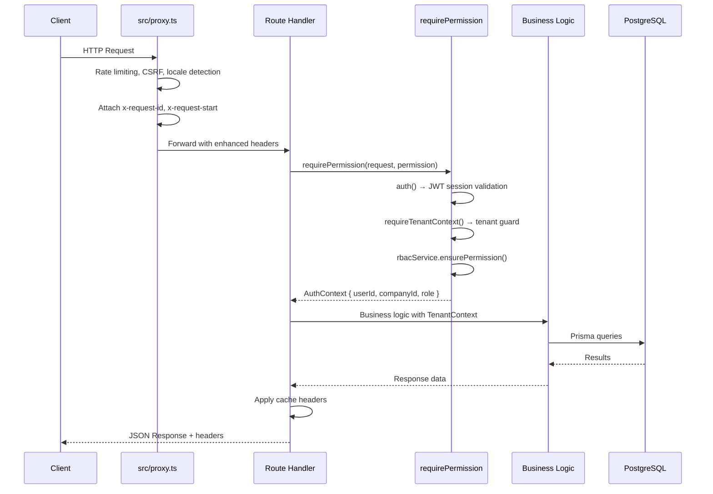

# API Architecture

---

## Overview

The API is built on Next.js App Router route handlers at `src/app/api/v1/`. There are 40+ endpoint directories serving RESTful interfaces across treasury, ledger, intelligence, orchestration, IAM, connectors, reporting, risk, and enterprise experience domains.

## Standard Handler Pattern

Every API V1 handler follows a consistent pattern:

```typescript
import { NextResponse } from "next/server";
import { requirePermission } from "@/server/security/require-permission";
import { handleRouteError, parseJsonBody, cacheHeaders, noCacheHeaders } from "@/server/http/handle-route";

export async function GET(request: Request) {
  try {
    const ctx = await requirePermission(request, "permission.name");
    const data = await fetchData(ctx.companyId, searchParams);
    return NextResponse.json(data, {
      headers: {
        ...cacheHeaders(60),
        "x-request-id": request.headers.get("x-request-id") ?? "",
      },
    });
  } catch (error) {
    return handleRouteError(error, request);
  }
}
```

### Handler Flow



## Request Flow (Proxy Layer)

**File**: `src/proxy.ts`

The proxy runs for all requests and performs:

1. **Request ID**: generates UUID, sets `x-request-id` and `x-request-start` headers
2. **Locale Detection**: checks `NEXT_LOCALE` cookie → `Accept-Language` header → defaults to `"en"`. Sets `x-next-intl-locale` header.
3. **Rate Limiting**: Redis-backed (with in-memory fallback) for mutation methods (POST, PUT, PATCH, DELETE). Returns 429 with `Retry-After`, `X-RateLimit-Remaining`, `X-RateLimit-Reset` headers on limit.
4. **Auth Extraction**: reads JWT from cookies or API key from `Authorization: Bearer` header. Validates API key format (`va_[0-9a-f]{64}`).

## Unified Error Handling

**File**: `src/server/http/handle-route.ts`

All endpoints use shared error handling:

| Function | Purpose |
|---|---|
| `handleRouteError(error, request)` | Catches `AppError` (typed error with code + statusCode) or generic errors. Returns structured JSON `{ error: { code, message } }` with appropriate status code. |
| `zodErrorResponse(error, request)` | Handles Zod validation failures. Returns `{ error: { code: "VALIDATION", message, issues } }` with status 400. |
| `parseJsonBody<T>(request)` | Parses request body as JSON, throws `AppError("INVALID_JSON", 400)` on failure. |

## Cache Strategy

| Method | Headers |
|---|---|
| GET (list/retrieve) | `cacheHeaders(ttl)` — public cache with `s-maxage` (15–120s), `stale-while-revalidate` (10× ttl), `Vary: Accept-Encoding` |
| POST/PUT/PATCH/DELETE | `noCacheHeaders()` — `no-store, no-cache, must-revalidate, proxy-revalidate`, `Pragma: no-cache`, `Expires: 0` |

Applied to 18 read endpoints with tiered TTLs.

## HTTP Methods

| Method | Convention |
|---|---|
| `GET` | List resources (with `searchParams` for filtering) or retrieve by ID |
| `POST` | Create resource — `parseJsonBody<T>()` + optional Zod validation |
| `PATCH` | Partial update |
| `PUT` | Full update |
| `DELETE` | Remove resource |

## Response Headers

Every API response includes:
- `x-request-id` — correlation ID for request tracing
- `Server-Timing` — request duration (set by proxy)
- Cache headers (as above)
- Security headers (CSP, HSTS, etc. — set at proxy/CDN level)

## API Endpoint Index

| Directory | Domain |
|---|---|
| `admin/` | System administration |
| `alerting/` | Alert configuration and management |
| `api-keys/` | API key management |
| `audit-logs/` | Audit trail access |
| `cache/` | Cache management |
| `calendar/` | Financial calendar |
| `companies/` | Company profile and settings |
| `connectors/` | Connector management |
| `copilot/` | AI copilot interface |
| `currencies/` | Currency and FX rate management |
| `enterprise/` | Enterprise configuration |
| `enterprise-experience/` | Experience platform |
| `export/` | Data export |
| `financial-reports/` | Report generation |
| `fx/` | Foreign exchange operations |
| `iam/` | Identity and access management |
| `integration-platform/` | Integration platform |
| `integrations/` | Integration management |
| `intelligence/` | Intelligence scores, KPIs, trends |
| `invites/` | User invitations |
| `ledger/` | General ledger |
| `notifications/` | Notification management |
| `observability/` | System observability |
| `operations/` | Operations management |
| `orchestration/` | Workflow and automation |
| `policies/` | Policy management |
| `queue/` | Job queue monitoring |
| `rbac/` | Role-based access control |
| `realtime/` | Real-time updates |
| `reconciliation/` | Bank reconciliation |
| `reports/` | Reporting |
| `risk/` | Risk management |
| `sandbox/` | Sandbox management |
| `tick/` | Tick data |
| `transactions/` | Financial transactions |
| `treasury/` | Treasury operations |
| `wallets/` | Wallet management |
| `webhooks/` | Webhook management |

## Permission Enforcement

Every endpoint calls `requirePermission(request, permission)` which:
1. Validates authentication (session or API key)
2. Extracts tenant context
3. Checks RBAC permission against user's role
4. Returns `AuthContext` for downstream use

## Zod Validation

Endpoints that accept input use Zod schemas for:
- Request body validation (types, ranges, required fields)
- Human-readable error messages explaining how to fix
- Early rejection before business logic execution

## Response Format

All responses use JSON with a consistent envelope for errors:

```typescript
// Success
Response.json(data)

// Error
{ error: { code: string; message: string; issues?: ZodIssue[] } }
```

Error codes: `UNAUTHORIZED`, `FORBIDDEN`, `VALIDATION`, `NOT_FOUND`, `CONFLICT`, `TOO_MANY_REQUESTS`, `INTERNAL`, and domain-specific `AppError` codes.
