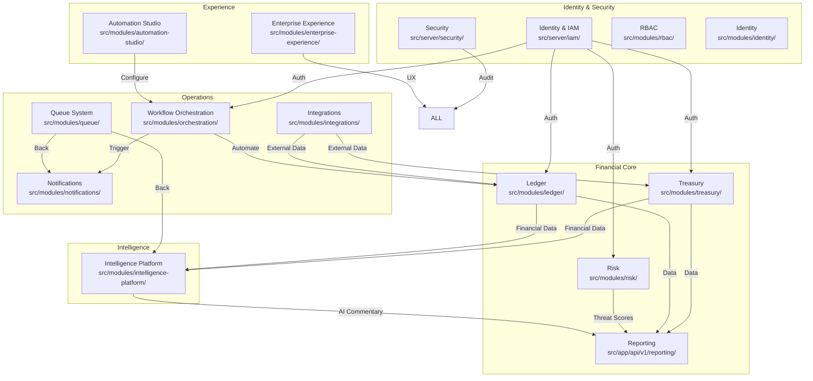
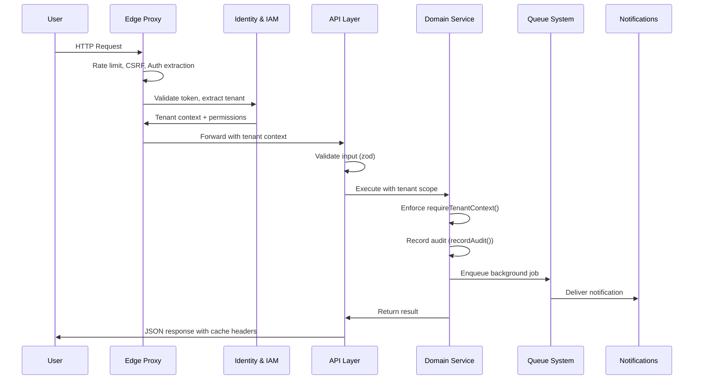

# Domain Architecture

## Domain Map

## Identity & IAM

**Location:** `src/server/iam/`, `src/modules/identity/`, `src/modules/rbac/`

**Responsibilities:**
- Authentication (NextAuth v5, JWT sessions, Credentials provider)
- Authorization (RBAC with 46+ granular permissions, ABAC for attribute-based rules)
- Multi-factor authentication
- SSO integration (SAML, OIDC)
- User provisioning and session management
- Permission registry (`PermissionRegistry` in `src/server/iam/`)

**Interactions:**
- Authenticates users for all domains
- Authorizes API calls via permission checks at route level and service facade level
- Records mutations via `recordIAMAudit()`

## Security

**Location:** `src/server/security/`

**Responsibilities:**
- CSRF protection (token validation on mutating requests)
- Rate limiting (configurable per endpoint category)
- AES-256-GCM encryption (PII, financial data, credentials)
- Input sanitization and validation
- Security audit logging (dependency scanner, CSP/HSTS headers)
- Secrets validation

**Interactions:**
- Applied at edge proxy for all inbound requests
- Encryption used by Treasury and Ledger for sensitive data fields
- Audit logging integrated with IAM audit service

## Treasury

**Location:** `src/modules/treasury/` (3 files)

**Responsibilities:**
- Cash management (positions, pools, movements)
- Liquidity positions (`TreasuryLiquidityPosition`)
- FX exposure tracking (`TreasuryFXExposure`)
- Cash forecasting (`TreasuryCashForecast`)
- Bank integration via `external-banking.service.ts`
- Cash positioning (`TreasuryCashPosition`)
- Counterparty risk (`TreasuryCounterpartyRisk`)
- Working capital management (`TreasuryWorkingCapital`)
- Cash policies (`TreasuryCashPolicy`)

**Interactions:**
- Receives transaction data from Integrations (Plaid, bank connectors)
- Feeds cash position data to Intelligence Platform for forecasting
- Provides financial data to Reporting for board packs and cash flow statements

## Ledger

**Location:** `src/modules/ledger/` (10 files)

**Responsibilities:**
- Double-entry accounting with `LedgerEntry` model
- Journal lifecycle management
- Transaction validation (`transaction-validator.ts`)
- State machine enforcement (`transaction-state-machine.ts`)
- Posting engine (`posting-engine.ts`)
- Approval workflow (`approval-workflow.ts`)
- Reconciliation (`reconciliation-engine.ts`)
- Reversal handling (`reversal-engine.ts`)
- Idempotency (`idempotency.service.ts`)

**Interactions:**
- Posts journals from Workflow Orchestration
- Provides ledger balances to Reporting
- Feeds transaction history to Intelligence Platform
- Records audit trail on every mutation

## Reporting

**Location:** `src/app/api/v1/reporting/`, `src/components/enterprise/analytics/` (13 components)

**Responsibilities:**
- Financial statement generation (P&L, balance sheet, cash flow)
- Variance reporting (budget vs actual)
- Cash flow timeline visualization
- Board pack generation
- AI commentary integration (from Intelligence Platform)
- Saved views and scheduling
- Exports (CSV, XML Excel via `export-utils.ts`)

**Key components:**
- `ExecutiveKpiCard` — metric display with trend and sparkline
- `CashFlowTimeline` — time-series cash flow with forecast boundary
- `ForecastChart` — projection visualization
- `VarianceCard` — budget vs actual variance display
- `DrillDownPanel` — hierarchical data exploration
- `InsightPanel` — AI-generated insights display

## Risk

**Location:** `src/modules/risk/` (2 files)

**Responsibilities:**
- Counterparty risk scoring
- Exposure limits monitoring
- Risk alert generation
- Compliance threshold checking

**Interactions:**
- Consumes position data from Treasury
- Produces risk scores consumed by Reporting and Notifications
- Alerts triggered via Notifications when thresholds breached

## Integrations

**Location:** `src/modules/integrations/`

**Responsibilities:**
- Connector framework (`src/modules/integrations/connectors/`) with `IConnector` interface
- Plugin architecture via connector interface
- Plaid integration for bank connectivity
- Webhook system (`webhook.service.ts`, `webhook-registry.service.ts`)
- ACH, HTTP, and mock connector implementations
- Input validation (`input-validator.ts`)
- Data lineage tracking (`lineageRecords`)
- Synchronization engine
- Health monitoring (`IntegrationHealth` model)
- Sandbox mode (`Company.sandbox` flag)

**Interactions:**
- Synchronizes external financial data into Treasury and Ledger
- Triggers webhooks on financial events
- Monitors connector health and reports to Operations

## Intelligence Platform

**Location:** `src/modules/intelligence-platform/` (14 files, 6 engines)

**Responsibilities:**
- Anomaly detection in financial transactions
- Cash flow forecasting
- AI-powered recommendations
- NLP-generated financial commentary
- Risk scoring
- Compliance monitoring

**Interactions:**
- Consumes data from Treasury and Ledger
- Produces insights consumed by Reporting and Notifications
- AI outputs are labeled as generated — never become system of record

## Workflow Orchestration

**Location:** `src/modules/orchestration/` (12 files)

**Responsibilities:**
- Workflow engine execution
- Step-based automation (conditional branches, approvals, delays)
- Workflow state tracking
- Error handling and retry logic

**Interactions:**
- Orchestrates journal posting in Ledger
- Triggers Notifications at workflow milestones
- Configured by Automation Studio

## Enterprise Experience

**Location:** `src/modules/enterprise-experience/` (10 files)

**Responsibilities:**
- Enterprise form system (14 components)
- Enterprise table system (data-table, cell-formatters, inline-edit, multi-sort)
- Enterprise motion system (13 animated components)
- Mobile experience (9 mobile components, 2 mobile pages)
- Accessibility (skip navigation, landmark labels, focus management)
- Keyboard shortcuts (`useKeyboardShortcuts()`)
- Responsive design (5 breakpoints, mobile-first)

## Notifications

**Location:** `src/modules/notifications/` (6 files, 3 channels)

**Responsibilities:**
- Notification delivery via Email, Slack, and in-app channels
- Background job-based delivery via Queue System
- Notification preferences and routing

**Interactions:**
- Receives trigger events from Workflow Orchestration and other domains
- Enqueues delivery to Queue System (PgBoss)

## Queue System

**Location:** `src/modules/queue/` (13 files, 9 job types)

**Responsibilities:**
- Job type definitions with typed payload schemas
- Queue management via PgBoss (pg-boss 12.24)
- Worker pool with concurrency control
- Dead-letter routing

**Job types:**
- Notification delivery
- Workflow execution
- AI scoring
- Report generation
- Connector sync
- (4 additional internal types)

## Automation Studio

**Location:** `src/modules/automation-studio/`

**Responsibilities:**
- Business rules builder and evaluation (`business-rules-builder.ts`)
- Approval matrix configuration and evaluation (`approval-matrix-evaluator.ts`)
- Schedule management (`automation-scheduler.ts`)
- Template library (`template-library.ts`)
- Workflow analytics (`workflow-analytics.service.ts`)
- Setup wizard and enterprise readiness (`enterprise-readiness.service.ts`)
- Integration with ConditionEvaluator (`condition-evaluator.ts`)

## Domain Interaction Pattern

