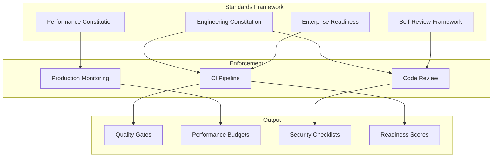

# Engineering Standards

The Engineering Standards domain codifies the non-negotiable practices, performance budgets, review processes, and readiness gates that govern all development on Perionyx. These standards ensure that every feature, optimization, and refactor maintains the platform's audit integrity, performance targets, and enterprise-grade quality.

## Architecture

## Core Components

| Component | Description | Source |
|-----------|-------------|--------|
| [Engineering Constitution](./engineering-constitution/) | Foundational principles — clarity, confidence, speed, beauty, trust for every UI decision | `docs/architecture/perionyx-engineering-constitution.md` |
| [Performance Constitution](./performance-constitution/) | Latency budgets, bundle size limits, rendering performance targets | `docs/architecture/performance-constitution.md` |
| [Self-Review Framework](./self-review-framework/) | 10-question security review mandatory before every commit | `docs/architecture/self-review-framework.md` |
| [Enterprise Readiness](./enterprise-readiness/) | 12-domain readiness verification — identity, treasury, governance, workflow, AI, connectors | `src/modules/automation-studio/enterprise-readiness.service.ts` |

## Key Design Decisions

- **Standards are enforced, not suggested** — CI pipeline rejects builds that violate constitution rules
- **Performance budgets are per-component** — Not just page-level; individual components have latency and bundle limits
- **Self-review is mandatory** — No code ships without passing all 10 security review questions
- **Readiness is measurable** — Enterprise readiness is a score with domain-level pass/warn/fail badges
- **Standards evolve with the platform** — ADRs document why standards change; no silent rule changes

## Related Documentation

- [AI Governance](/docs/ai-governance/) — AI-specific governance principles
- [Security](/docs/security/) — Security practices enforced by these standards
- [Architecture Decision Records](/docs/adrs/) — Why each standard exists
- [Executive Overview](/docs/executive-overview/) — Platform philosophy driving these standards
