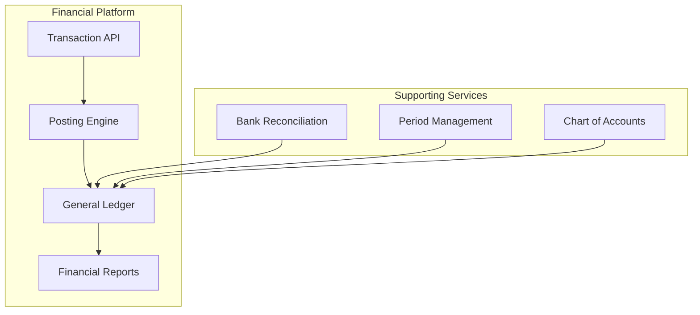
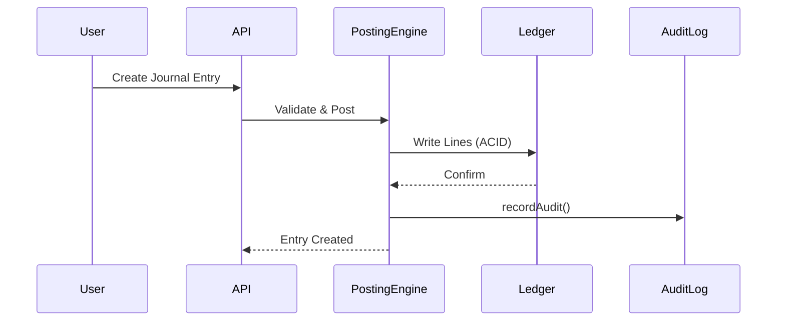

# Financial Platform

The Financial Platform is the system of record for all financial data in Perionyx. It implements double-entry accounting with append-only journal entries, automated period closing, and bank reconciliation.

## Architecture

The financial platform follows a four-layer architecture:

## Core Components

| Component | Description | Source |
|-----------|-------------|--------|
| [Chart of Accounts](./chart-of-accounts/) | Account hierarchy, types, and classification | `src/modules/accounting/chart-of-accounts.ts` |
| [Ledger Core](./ledger-core/) | Double-entry ledger with ACID guarantees | `src/modules/accounting/ledger.service.ts` |
| [Double Entry](./double-entry/) | Posting rules, balance assertions, equation validation | `src/modules/accounting/posting-engine.ts` |
| [Journal Entries](./journal-entries/) | Entry lifecycle, line items, and cross-references | `src/modules/accounting/journal.service.ts` |
| [Period Closing](./period-closing/) | Monthly/quarterly/annual close workflows | `src/modules/accounting/close.service.ts` |
| [Bank Reconciliation](./bank-reconciliation/) | Statement matching and variance analysis | `src/modules/accounting/reconciliation.service.ts` |
| [Accounting Periods](./accounting-periods/) | Period management, adjustments, and lock status | `src/modules/accounting/period.service.ts` |
| [Transaction Strategy](./transaction-strategy/) | ACID patterns, locking, isolation levels | `src/server/persistence/transaction-manager.ts` |

## Key Design Decisions

- **Immutable journal entries** — Never mutated; reversals create new entries with cross-references
- **Append-only ledger** — Historical records are never overwritten
- **ACID guarantees** — All financial mutations use database transactions
- **Audit trail** — Every mutation calls `recordAudit()` with before/after state
- **Multi-tenant** — Every table carries a `companyId` column for tenant isolation

## Data Flow

## Related Documentation

- [Architecture — Financial Engine](/docs/architecture/financial-engine/)
- [Security — Audit Logging](/docs/security/audit-logging/)
- [Multi-tenancy — Tenant Isolation](/docs/multi-tenancy/tenant-isolation/)
