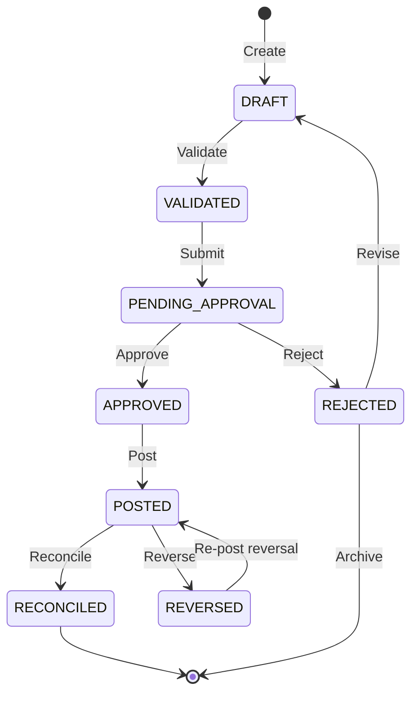

# Journal Entries

## Overview

The Journal Engine manages the complete journal entry lifecycle from creation through posting. It supports standard, recurring, adjusting, reversing, closing, and intercompany journal types with full audit trail and balanced validation.

## Journal Lifecycle

A journal entry progresses through six stages. Each stage is a separate module in `src/modules/ledger/`:

### Stage 1 — Validation (`transaction-validator.ts`)

Before any journal enters the system, the validator checks:

- **Balance integrity:** Total debits must equal total credits (within currency precision tolerance)
- **Account validity:** All accounts must exist and be active
- **Tenant scope:** Transaction must belong to the requesting company
- **Currency consistency:** All entries in a journal must share the same currency
- **Date constraints:** Transaction date cannot be in the future (configurable tolerance)
- **Reference uniqueness:** External reference IDs are checked for idempotency

### Stage 2 — State Machine (`transaction-state-machine.ts`)

The state machine enforces valid state transitions. Illegal transitions (e.g., approving a draft without validation) are rejected at the application layer. Valid states: `DRAFT`, `VALIDATED`, `PENDING_APPROVAL`, `APPROVED`, `POSTED`, `RECONCILED`, `REVERSED`, `REJECTED`.

### Stage 3 — Posting Engine (`posting-engine.ts`)

The posting engine commits validated and approved journals to the ledger. It:

- Creates `LedgerEntry` records for each debit and credit line
- Updates account balances atomically within a database transaction
- Records a unique transaction ID for audit trail integrity
- Fails the entire batch if any individual entry fails (all-or-nothing)

### Stage 4 — Approval Workflow (`approval-workflow.ts`)

Journals requiring approval enter the approval workflow. The workflow:

- Routes to approvers based on approval matrix rules in Automation Studio
- Supports sequential and parallel approval paths
- Records each approval decision with timestamp and actor
- Escalates on timeout based on configurable thresholds
- Delegates to alternate approvers when primary is unavailable

### Stage 5 — Reconciliation (`reconciliation-engine.ts`)

Posted entries are reconciled against external statements (bank statements, payment processor reports). The reconciliation engine:

- Matches ledger entries to external transactions by reference ID, amount, and date
- Flags unmatched entries for investigation
- Supports partial reconciliation (multi-match)
- Produces reconciliation reports for audit

### Stage 6 — Reversal (`reversal-engine.ts`)

When a posted entry must be reversed (error correction, dispute resolution), the reversal engine:

- Creates a new set of offsetting entries (never mutates original)
- Cross-references the reversal to the original transaction ID
- Requires explicit approval for reversals above configurable thresholds
- Records the reason and authorization in the audit trail

## Journal Statuses

| Status | Description |
|--------|-------------|
| Draft | Initial state, editable, not yet submitted |
| Approved | Reviewed and approved, ready for posting |
| Posted | Committed to the general ledger |
| Reversed | Offset by a reversing entry, audit trail preserved |
| Voided | Cancelled with complete audit trail and reason |

## Journal Types

| Type | Description |
|------|-------------|
| Standard | Regular journal entry |
| Recurring | Creates entries on a schedule (daily/weekly/monthly/quarterly/annual) |
| Adjusting | Period-end adjustments (accruals, deferrals) |
| Reversing | Auto-reverses in the next period |
| Closing | Period/year-end closing entries |
| Opening | Opening balance setup |
| Intercompany | Transactions between legal entities |
| Allocations | Cost/revenue allocation distributions |
| Consolidation | Consolidation adjustment entries |
| Template | Reusable journal templates |

## Journal Structure

Each journal entry contains:

- **Header**: Journal number, type, status, description, period, currency
- **Lines**: Multiple line items with account, debit/credit, dimensions
- **Validation**: Must be balanced (total debits == total credits)

## Balanced Validation

All journals enforce:
1. At least one line item
2. Total debits == total credits (within 0.001 tolerance)
3. All line accounts exist and are active
4. Period is open for posting

## Recurring Journals

Recurring journals are defined with:
- Template entry structure
- Frequency (daily/weekly/monthly/quarterly/annual/custom)
- Next run date and optional end date
- Maximum occurrence count
- Active/paused status

The `getDueRecurring()` method returns all recurring journals whose `nextRunDate` is due for generation.

## Idempotency (`idempotency.service.ts`)

The idempotency service prevents duplicate processing of the same external transaction. It:

- Uses `idempotencyKey` (typically the external reference ID) as a unique constraint
- Returns the existing result for duplicate keys (no re-processing)
- Automatically expires keys after a configurable TTL
- Logs duplicate attempts for audit review

## Audit Trail

Every journal lifecycle transition calls `recordAudit()` with:

| Field | Source |
|---|---|
| `actorId` | JWT session (edge proxy) |
| `companyId` | Tenant context |
| `transactionId` | Journal reference |
| `action` | State transition (submit, approve, post, reverse) |
| `before` | Previous state |
| `after` | New state |
| `timestamp` | Server time |
| `correlationId` | Proxy-generated request ID |
| `ipAddress` | Request origin |

## JournalService

| Method | Description |
|--------|-------------|
| `addJournal()` | Create a journal entry |
| `getJournal()` | Get journal by ID |
| `getAllJournals()` | List all journals |
| `getJournalsByStatus()` | Filter by status |
| `getJournalsByType()` | Filter by type |
| `getJournalsByPeriod()` | Filter by period |
| `getJournalsByCompany()` | Filter by company |
| `getDraftJournals()` | Get all draft journals |
| `getUnpostedJournals()` | Get draft + approved journals |
| `generateJournalNumber()` | Generate unique journal number |
| `addRecurring()` | Create recurring journal |
| `getDueRecurring()` | Get due recurring journals |
