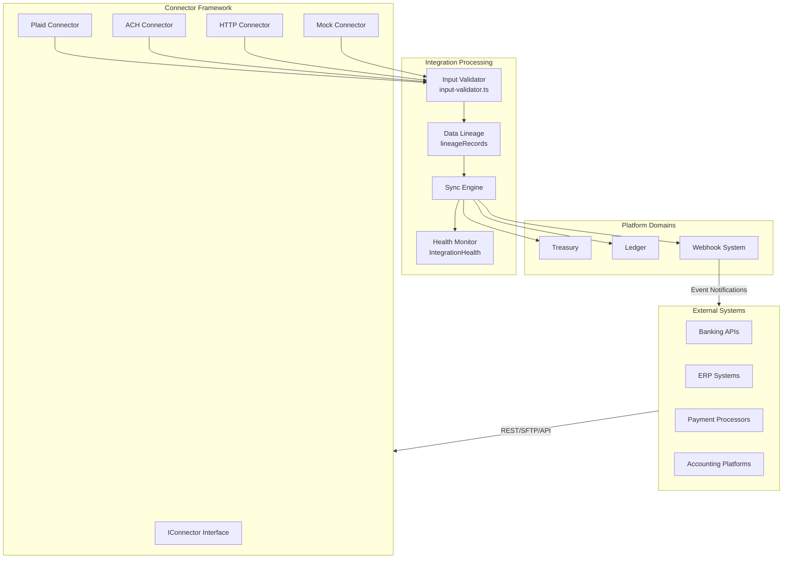

# Integration Platform

## Overview

The Integration Platform connects Perionyx to external financial systems — banks, ERPs, payment processors, and accounting platforms. It is located in `src/modules/integrations/` and provides a plugin-based connector architecture, webhook system, and data synchronization engine.

## Architecture



## Connector Framework

The connector framework (`src/modules/integrations/connectors/`) defines a standard `IConnector` interface that all connectors implement:

```typescript
interface IConnector {
  connect(config: ConnectorConfig): Promise<ConnectionResult>;
  disconnect(connectionId: string): Promise<void>;
  healthCheck(connectionId: string): Promise<HealthStatus>;
  sync(connectionId: string, options?: SyncOptions): Promise<SyncResult>;
  validate(config: ConnectorConfig): Promise<ValidationResult>;
}
```

This plugin architecture allows new connectors to be added without modifying existing integration code.

### Built-in Connectors

| Connector | Type | Purpose |
|---|---|---|
| Plaid | Bank connectivity | Account verification, balance inquiry, transaction history |
| ACH | Payment processing | Automated Clearing House payments |
| HTTP | Generic REST | Connect to any REST API with configurable authentication |
| Mock | Testing | Simulated data for development and sandbox environments |

## Canonical Data Model

All external data is transformed into a canonical format before entering the platform. This decouples external systems from internal domain models. The canonical model includes:

- **Standardized fields** — Amount, currency, date, reference ID, description
- **Enriched metadata** — Source system, original format, sync timestamp
- **Lineage records** — Chain of custody for every data point

## Validation (`input-validator.ts`)

Every data point entering through the integration platform passes through validation:

- **Schema validation** — Required fields, data types, format constraints
- **Business validation** — Account exists, currency supported, amount within limits
- **Duplicate detection** — Idempotency check against external reference IDs
- **Sanity checks** — Reasonable date ranges, non-negative amounts where applicable

Validation failures are logged with detailed error messages and returned to the connector for handling.

## Synchronization Engine

The sync engine manages data synchronization lifecycle:

1. **Discovery** — Identifies new or changed data in the external system
2. **Fetch** — Retrieves data through the connector
3. **Validate** — Runs through `input-validator.ts`
4. **Transform** — Converts to canonical format
5. **Lineage** — Records data provenance
6. **Store** — Persists into the appropriate domain module
7. **Notify** — Triggers webhooks and notifications

Sync can be triggered on-demand (manual refresh) or scheduled (via Automation Scheduler with cron expressions).

## Health Monitoring

Connector health is tracked via the `IntegrationHealth` model:

| Metric | Description |
|---|---|
| Connection status | Connected, disconnected, error |
| Last sync time | Timestamp of most recent successful sync |
| Sync success rate | Percentage of successful syncs in the window |
| Error count | Number of errors in the current window |
| Data freshness | Age of most recent data from this connector |

Health data is consumed by the Operations dashboard and can trigger alerts through the Notifications platform.

## Sandbox Mode

The `Company.sandbox` flag enables full sandbox mode for testing:

- All connector calls are redirected to mock implementations
- No real financial data is transmitted to external systems
- Mock connectors return deterministic, configurable test data
- Audit logs clearly mark sandbox activity

Sandbox companies cannot be promoted to production — a new production company must be created.

## Integration with Other Domains

| Domain | Integration Point |
|---|---|
| Treasury | Bank balance and transaction data via Plaid and ACH connectors |
| Ledger | External transactions posted as journal entries |
| Reporting | Sync status and data freshness in operations dashboards |
| Notifications | Sync failures and health degradation trigger alerts |
| Automation Studio | Scheduled sync via Automation Scheduler |
| Queue System | Long-running syncs enqueued as background jobs |
