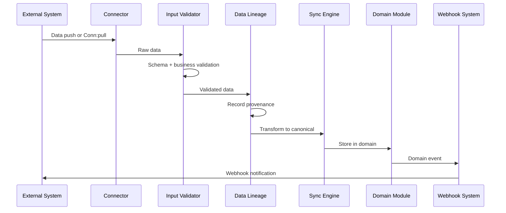

# Data Lineage

## Overview

Data lineage is tracked through `lineageRecords` in the Prisma schema, providing full traceability for audit — every number in the platform can be traced back to its external source.

## Recorded Data

| Recorded Data | Purpose |
|---|---|
| Source system | Which external system provided the data |
| Original ID | The ID in the source system |
| Sync timestamp | When the data was last synchronized |
| Transformation log | What transformations were applied |
| Connector version | Which connector version processed the data |

## Canonical Data Model

All external data is transformed into a canonical format before entering the platform. This decouples external systems from internal domain models. The canonical model includes:

- **Standardized fields** — Amount, currency, date, reference ID, description
- **Enriched metadata** — Source system, original format, sync timestamp
- **Lineage records** — Chain of custody for every data point

## Validation (`input-validator.ts`)

Every data point entering through the integration platform passes through validation before lineage records are created:

- **Schema validation** — Required fields, data types, format constraints
- **Business validation** — Account exists, currency supported, amount within limits
- **Duplicate detection** — Idempotency check against external reference IDs
- **Sanity checks** — Reasonable date ranges, non-negative amounts where applicable

Validation failures are logged with detailed error messages and returned to the connector for handling.

## Data Flow with Lineage

## Integration with Other Domains

| Domain | Integration Point |
|---|---|
| Treasury | Bank balance and transaction data via Plaid and ACH connectors |
| Ledger | External transactions posted as journal entries |
| Reporting | Sync status and data freshness in operations dashboards |
| Notifications | Sync failures and health degradation trigger alerts |
| Automation Studio | Scheduled sync via Automation Scheduler |
| Queue System | Long-running syncs enqueued as background jobs |
