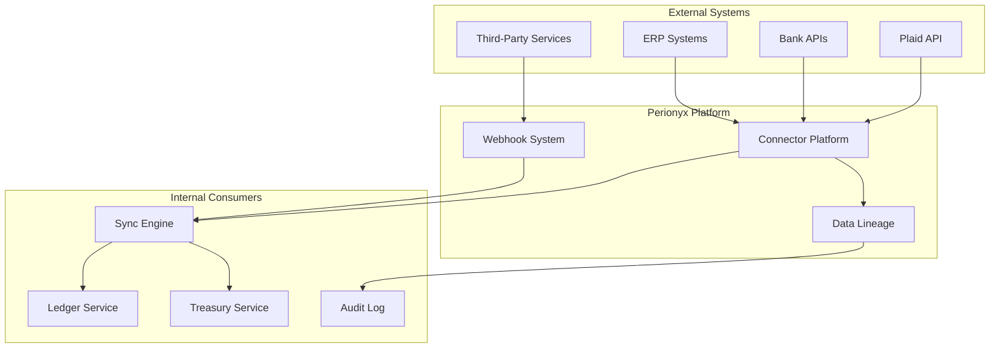

# Integrations

The Integrations domain provides the connective tissue between Perionyx and external financial systems — banks via Plaid, ERPs via direct connectors, and third-party services via webhooks. It ensures data flows reliably, is traceable end-to-end, and maintains tenant isolation across every integration boundary.

## Architecture

## Core Components

| Component | Description | Source |
|-----------|-------------|--------|
| [Connector Platform](./connector-platform/) | Lifecycle management — validate, health-check, sync, retry, circuit-break | `src/modules/connectors/` |
| [Plaid Integration](./plaid-integration/) | Bank account linking, balance sync, transaction import via Plaid | `src/modules/connectors/` |
| [Webhook System](./webhook-system/) | Inbound and outbound webhook routing, signature verification, retry | `src/modules/connectors/` |
| [Data Lineage](./data-lineage/) | End-to-end traceability from external source to ledger entry | `src/modules/connectors/` |
| [ERP Connectivity](./erp-connectivity/) | SAP, Oracle, NetSuite, QuickBooks bidirectional sync | `src/modules/connectors/` |

## Key Design Decisions

- **Connectors are stateless wrappers** — All state lives in the database; connector processes can restart without data loss
- **Health checks run proactively** — `ConnectorLifecycle.healthCheck()` runs on a schedule, not just on failure
- **Data lineage is immutable** — Every sync records source, timestamp, hash, and destination for auditability
- **Webhook signatures are verified** — HMAC validation prevents spoofed inbound events
- **ERP sync uses conflict resolution** — Last-write-wins with manual override; financial data never silently overwritten

## Related Documentation

- [Treasury — Cash Management](/docs/treasury/cash-management/) — Consumes bank feed data
- [Security — Authentication](/docs/security/authentication/) — API key and OAuth for connectors
- [Security — Secrets Management](/docs/security/secrets-management/) — Credential storage for external APIs
- [Intelligence — Anomaly Detection](/docs/intelligence/anomaly-detection/) — Flags sync anomalies
