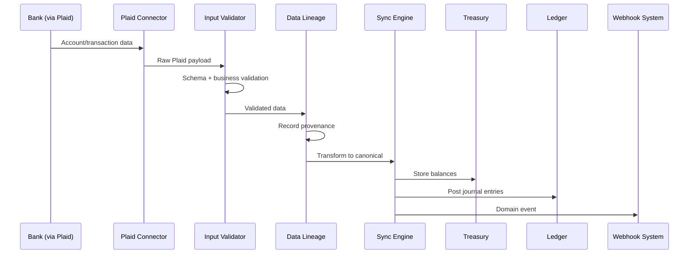

# Plaid Integration

## Overview

Plaid provides bank account connectivity for Perionyx, enabling real-time and historical financial data ingestion from thousands of financial institutions.

## Capabilities

- **Account verification** — Ownership verification, balance confirmation
- **Transaction history** — Categorized transaction retrieval
- **Real-time balances** — Up-to-date account balance data
- **Identity verification** — KYC-compatible identity checks

## Data Flow

Plaid data flows through the standard connector pipeline:

1. **Validation** — Schema and business rules via `input-validator.ts`
2. **Lineage tracking** — Provenance recorded in `lineageRecords`
3. **Sync engine** — Transforms to canonical format and persists
4. **Domain modules** — Data delivered to Treasury and Ledger

## Built-in Plaid Connector

The Plaid connector is one of four built-in connectors in the platform:

| Connector | Type | Purpose |
|---|---|---|
| **Plaid** | Bank connectivity | Account verification, balance inquiry, transaction history |
| ACH | Payment processing | Automated Clearing House payments |
| HTTP | Generic REST | Connect to any REST API with configurable authentication |
| Mock | Testing | Simulated data for development and sandbox environments |

## Integration Points

| Domain | Integration Point |
|---|---|
| Treasury | Bank balance and transaction data via Plaid and ACH connectors |
| Ledger | External transactions posted as journal entries |
| Reporting | Sync status and data freshness in operations dashboards |
| Notifications | Sync failures and health degradation trigger alerts |
| Automation Studio | Scheduled sync via Automation Scheduler |
| Queue System | Long-running syncs enqueued as background jobs |
