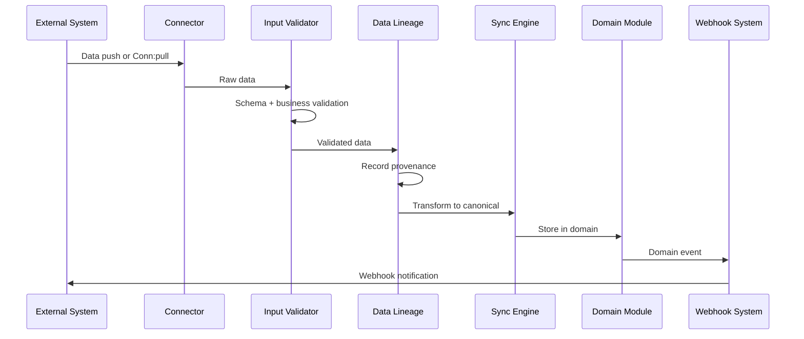

# Webhook System

## Overview

The webhook system delivers event notifications to external systems when financial activities occur within Perionyx. It is composed of two services: the **Webhook Service** for event delivery and the **Webhook Registry** for configuration management.

## Webhook Service (`webhook.service.ts`)

The webhook service delivers events to external systems when financial activities occur:

- **Journal postings** — New ledger entries
- **Cash movements** — Treasury transactions
- **Approval completions** — Workflow milestones
- **Alert triggers** — Threshold breaches

## Webhook Registry (`webhook-registry.service.ts`)

The webhook registry manages webhook configurations:

- **Endpoint management** — Register, update, remove webhook URLs
- **Event filtering** — Subscribe to specific event types
- **Secret management** — HMAC signing for payload verification
- **Retry policy** — Exponential backoff for failed deliveries
- **Delivery logging** — Full history of webhook delivery attempts

## Delivery Flow

## Integration with Other Domains

| Domain | Integration Point |
|---|---|
| Treasury | Bank balance and transaction data via Plaid and ACH connectors |
| Ledger | External transactions posted as journal entries |
| Reporting | Sync status and data freshness in operations dashboards |
| Notifications | Sync failures and health degradation trigger alerts |
| Automation Studio | Scheduled sync via Automation Scheduler |
| Queue System | Long-running syncs enqueued as background jobs |
