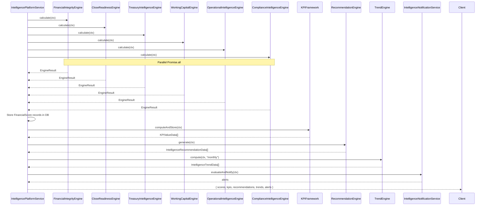

# Forecasting Models

## Overview

The Trend Engine (`trend.engine.ts`) computes historical data points from stored `FinancialScore` records, determines trend direction using linear regression, and generates 3-period forecasts using ordinary least squares.

## Supported Periods

The Trend Engine supports the following periods:
- `daily`
- `weekly`
- `monthly`
- `quarterly`
- `yearly`

## Methodology

1. **Historical data retrieval** — Pulls `FinancialScore` records per score type from the database
2. **Trend direction** — Determined using linear regression on historical data points
3. **Forecast generation** — 3-period forecast using ordinary least squares (OLS)

## Role in the Intelligence Platform

The Trend Engine is orchestrated by `IntelligencePlatformService.runFullAssessment(ctx)`, which runs all six engines in parallel, stores FinancialScore records, then calls the Trend Engine:

## Data Model

All intelligence data is stored in Prisma models scoped to `companyId`:
- `FinancialScore` — score snapshots per type
- `KPIValue` — time-series KPI records
- `IntelligenceRecommendation` — actionable recommendations
- `IntelligenceTrend` — computed trend data with forecasts
- `InsightEvent` — events (score changes, threshold breaches)
- `HealthAlert` — unresolved alerts
- `ExecutiveScorecard` — generated scorecard snapshots
- `ExplainSource` — provenance links
