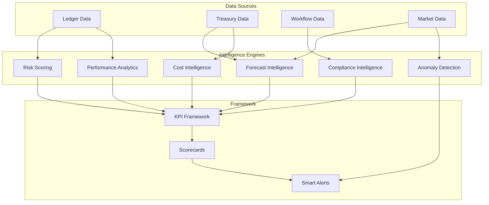

# Intelligence Platform

The Intelligence Platform is Perionyx's AI-assisted analysis layer — 6 scoring engines across 14 files that provide commentary, anomaly detection, and forecast suggestions. Critically, AI explains but never becomes the system of record: all AI output is labeled as generated, and AI never posts journals, approves transactions, or mutates financial state without human confirmation.

## Architecture

## Core Components

| Component | Description | Source |
|-----------|-------------|--------|
| [Intelligence Engines](./intelligence-engines/) | Six scoring engines — risk, performance, compliance, forecast, anomaly, cost | `src/modules/intelligence-platform/` |
| [KPI Framework](./kpi-framework/) | Configurable KPI definitions, thresholds, and trend tracking | `src/modules/intelligence-platform/` |
| [Anomaly Detection](./anomaly-detection/) | Statistical outlier detection across transactions, balances, and workflows | `src/modules/intelligence-platform/` |
| [Forecasting Models](./forecasting-models/) | Deterministic cash flow and revenue forecasting with scenario support | `src/modules/intelligence-platform/` |
| [Scorecards](./scorecards/) | Executive scorecards aggregating engine outputs into at-a-glance views | `src/modules/intelligence-platform/` |

## Key Design Decisions

- **AI is explainable or it doesn't ship** — Every engine output includes reasoning trace; black-box scores are rejected
- **AI never mutates financial state** — Intelligence outputs are suggestions; human confirmation is required for any action
- **Engines are independently deployable** — Each engine runs in isolation; a failure in one does not degrade others
- **KPI thresholds are configurable per tenant** — Different industries have different baselines
- **Anomaly detection uses rolling windows** — Not point-in-time; seasonal patterns are accounted for

## Related Documentation

- [Reporting — Analytics Engine](/docs/reporting/analytics-engine/) — Consumes intelligence outputs for dashboards
- [Treasury — Liquidity Forecasting](/docs/treasury/liquidity-forecasting/) — Uses forecast models
- [AI Governance](/docs/ai-governance/) — Trust model and evidence requirements for AI outputs
- [Engineering Standards — Performance Constitution](/docs/engineering-standards/performance-constitution/) — Latency budgets for inference
