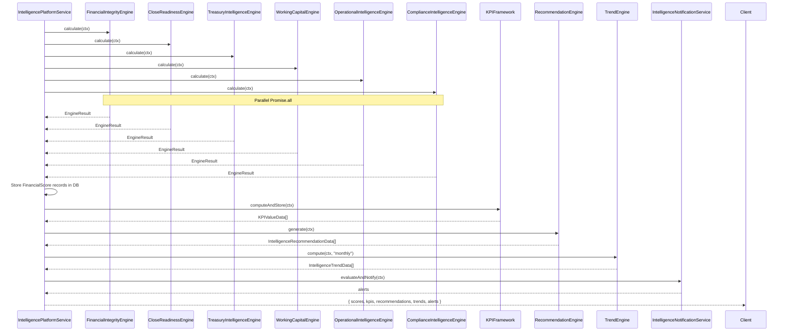

# Intelligence Platform

**Location**: `src/modules/intelligence-platform/` (14 source files)

The Intelligence Platform provides deterministic financial health scoring, KPI computation, trend analysis, recommendations, and scorecards across six domains. All calculations are performed via Prisma queries against the PostgreSQL database — no LLM or AI is involved in factual financial scoring.

---

## Architecture

```
IntelligencePlatformService
├── FinancialIntegrityEngine      .calculate(ctx) → EngineResult
├── CloseReadinessEngine          .calculate(ctx) → EngineResult
├── TreasuryIntelligenceEngine    .calculate(ctx) → EngineResult
├── WorkingCapitalEngine          .calculate(ctx) → EngineResult
├── OperationalIntelligenceEngine .calculate(ctx) → EngineResult
├── ComplianceIntelligenceEngine  .calculate(ctx) → EngineResult
├── KPIFramework                  .computeAndStore(ctx) → KPIValueData[]
├── RecommendationEngine          .generate(ctx) → IntelligenceRecommendationData[]
├── TrendEngine                   .compute(ctx, period) → IntelligenceTrendData[]
├── ScorecardService              .generate(ctx, role) → ScorecardData
├── ExplainEngine                 .link() / .getSources() — provenance tracking
└── IntelligenceNotificationService .evaluateAndNotify() — threshold-based alerts
```

## Engine Pattern

Every engine follows the same signature:

```typescript
static async calculate(ctx: TenantContext): Promise<EngineResult>
```

Where `EngineResult` is:

```typescript
interface EngineResult {
  score: number;
  previousScore?: number;
  components: ScoreComponent[];
  summary: string;
  severity: Severity; // "critical" | "warning" | "normal" | "good"
  evidence: Record<string, unknown>;
  recommendations: Array<{
    title: string;
    reason: string;
    priority: RecommendationPriority;
    confidence: RecommendationConfidence;
  }>;
}
```

Each engine:
1. Queries Prisma for raw financial data (GL balances, transactions, reconciliations, approvals, sync history, etc.)
2. Computes weighted component scores based on business rules
3. Aggregates into a 0–100 composite score
4. Produces severity, evidence map, and actionable recommendations
5. Returns a deterministic result — same inputs always produce the same outputs

### Score Components

Each engine defines weighted components. For example, `FinancialIntegrityEngine` computes:
- **Ledger Integrity** (25%): account balance counts, journal entries
- **Reconciliation Health** (25%): reconciliation run statuses
- **Transaction Integrity** (20%): duplicate reference detection
- **Approval Completeness** (15%): approval thread counts
- **Validation Health** (10%): unresolved validation issues
- **Sync Integrity** (5%): sync history statuses

## Six Engines

| Engine | File | Key Metrics |
|---|---|---|
| Financial Integrity | `engines/financial-integrity.engine.ts` | GL balances, journals, reconciliations, duplicate refs, approvals, sync health |
| Close Readiness | `engines/close-readiness.engine.ts` | Closing checklists, unreconciled items, journal entry backlogs, period end status |
| Treasury Intelligence | `engines/treasury-intelligence.engine.ts` | Cash position, liquidity ratios, FX exposure, counterparty risk, working capital |
| Working Capital | `engines/working-capital.engine.ts` | AR/AP aging, days payable/receivable, cash conversion cycle |
| Operational Intelligence | `engines/operational-intelligence.engine.ts` | Connector health, sync latency, queue depth, error rates |
| Compliance Intelligence | `engines/compliance-intelligence.engine.ts` | Policy violations, audit log gaps, framework compliance |

## Full Assessment Flow

`IntelligencePlatformService.runFullAssessment(ctx)` orchestrates all engines:



## Recommendation Engine

`recommendation.engine.ts` aggregates recommendations from all six engine results, deduplicates by title, and stores them as `IntelligenceRecommendation` records. Each recommendation has priority (`critical`/`high`/`normal`/`low`), confidence (`high`/`medium`/`low`), and evidence linking back to engine scores.

## Trend Engine

`trend.engine.ts` computes historical data points from stored `FinancialScore` records per score type, determines trend direction using linear regression, and generates 3-period forecasts using ordinary least squares. Supports `daily`, `weekly`, `monthly`, `quarterly`, and `yearly` periods.

## Explain Engine

`explain-engine.ts` provides provenance tracking — links any score, KPI, recommendation, or metric back to its source data (report, ledger, journal, transaction, document, integration, approval, audit). Supports bidirectional lookups: "what sources explain this target?" and "what targets reference this source?".

## Data Model

All intelligence data is stored in Prisma models scoped to `companyId`:
- `FinancialScore` — score snapshots per type
- `KPIValue` — time-series KPI records
- `IntelligenceRecommendation` — actionable recommendations
- `IntelligenceTrend` — computed trend data with forecasts
- `InsightEvent` — events (score changes, threshold breaches)
- `HealthAlert` — unresolved alerts
- `ExecutiveScorecard` — generated scorecard snapshots
- `ExplainSource` — provenance links
