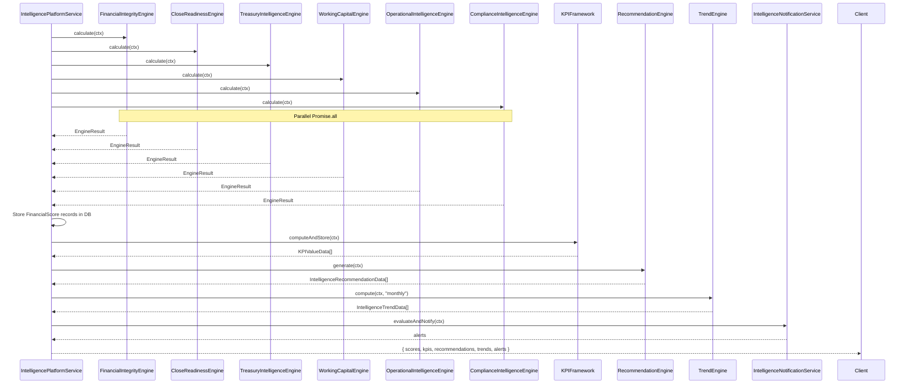

# KPI Framework

## Overview

`kpi-framework.ts` computes 50+ KPIs across five categories after running all six intelligence engines. Each KPI has:

- Key (e.g., `cashBalance`, `currentRatio`)
- Label, unit, category
- Current/previous/target values
- Threshold-based status: `on_track`, `at_risk`, `critical`, `neutral`
- Trend direction: `up`, `down`, `flat`, `volatile`

## Role in the Intelligence Platform

The KPI Framework is orchestrated by `IntelligencePlatformService.runFullAssessment(ctx)`, which runs all six engines in parallel, stores FinancialScore records, then calls the KPI Framework to compute and store KPIs:

## Data Model

KPI data is stored in Prisma models scoped to `companyId`:
- `FinancialScore` — score snapshots per type
- `KPIValue` — time-series KPI records
- `IntelligenceRecommendation` — actionable recommendations
- `IntelligenceTrend` — computed trend data with forecasts
- `InsightEvent` — events (score changes, threshold breaches)
- `HealthAlert` — unresolved alerts
- `ExecutiveScorecard` — generated scorecard snapshots
- `ExplainSource` — provenance links
