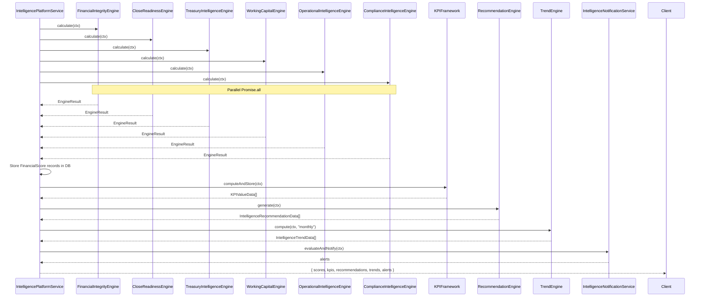

# Scorecards

## Overview

`scorecard.service.ts` generates role-specific scorecard snapshots for the following roles: `ceo`, `cfo`, `controller`, `treasurer`, `finance-manager`, `board`, `auditor`.

Each scorecard includes:
- All six domain scores
- Role-filtered KPIs
- Role-filtered recommendations
- Generated summary text

## Role in the Intelligence Platform

The Scorecard Service is orchestrated by `IntelligencePlatformService.runFullAssessment(ctx)`, which runs all six engines in parallel, stores FinancialScore records, then generates scorecards:

## Six Engines

| Engine | File | Key Metrics |
|---|---|---|
| Financial Integrity | `engines/financial-integrity.engine.ts` | GL balances, journals, reconciliations, duplicate refs, approvals, sync health |
| Close Readiness | `engines/close-readiness.engine.ts` | Closing checklists, unreconciled items, journal entry backlogs, period end status |
| Treasury Intelligence | `engines/treasury-intelligence.engine.ts` | Cash position, liquidity ratios, FX exposure, counterparty risk, working capital |
| Working Capital | `engines/working-capital.engine.ts` | AR/AP aging, days payable/receivable, cash conversion cycle |
| Operational Intelligence | `engines/operational-intelligence.engine.ts` | Connector health, sync latency, queue depth, error rates |
| Compliance Intelligence | `engines/compliance-intelligence.engine.ts` | Policy violations, audit log gaps, framework compliance |

## Data Model

All intelligence data is stored in Prisma models scoped to `companyId`:
- `FinancialScore` — score snapshots per type
- `KPIValue` — time-series KPI records
- `IntelligenceRecommendation` — actionable recommendations
- `IntelligenceTrend` — computed trend data with forecasts
- `InsightEvent` — events (score changes, threshold breaches)
- `HealthAlert` — unresolved alerts
- `ExecutiveScorecard` — generated scorecard snapshots
- `ExplainSource` — provenance links
