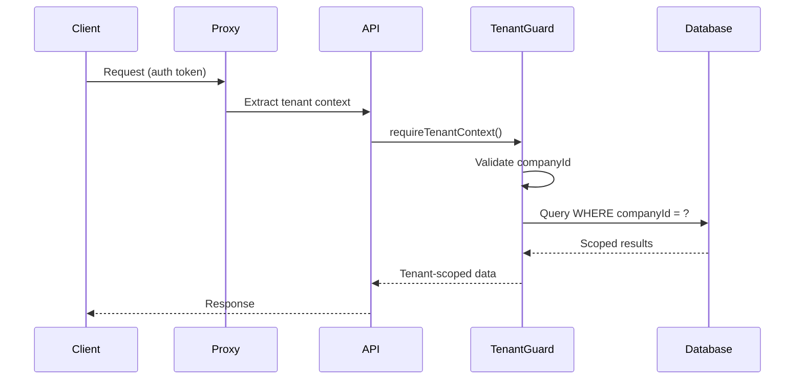

# Multi-Tenancy

The Multi-Tenancy domain ensures complete data isolation between organizations on a shared Perionyx deployment. Every database table carries a `companyId` column, every query is scoped by `requireTenantContext()`, and no cross-tenant data access is possible without explicit architectural override.

## Architecture

## Core Components

| Component | Description | Source |
|-----------|-------------|--------|
| [Tenant Isolation](./tenant-isolation/) | Query scoping, row-level security, cross-tenant access prevention | `src/server/persistence/` |
| [Company Model](./company-model/) | Company entity hierarchy, subscription tiers, feature flags | `src/modules/company/` |

## Key Design Decisions

- **Every table has `companyId`** — No exceptions; even system tables are tenant-scoped
- **Isolation is enforced at the application layer** — `requireTenantContext()` is a guard, not an opt-in middleware
- **No shared queries without explicit scoping** — Even admin tools require a tenant context
- **Company model supports hierarchy** — Parent companies can have subsidiaries, each with independent tenant isolation
- **Feature flags are per-company** — Different tenants can have different feature sets without code branches

## Related Documentation

- [Security — Authentication](/docs/security/authentication/) — Identity verification per tenant
- [Security — Authorization](/docs/security/authorization/) — Tenant-scoped permission checks
- [Financial Platform](/docs/financial-platform/) — All financial data is tenant-scoped
- [Engineering Standards — Enterprise Readiness](/docs/engineering-standards/enterprise-readiness/) — Multi-tenancy as a readiness gate
