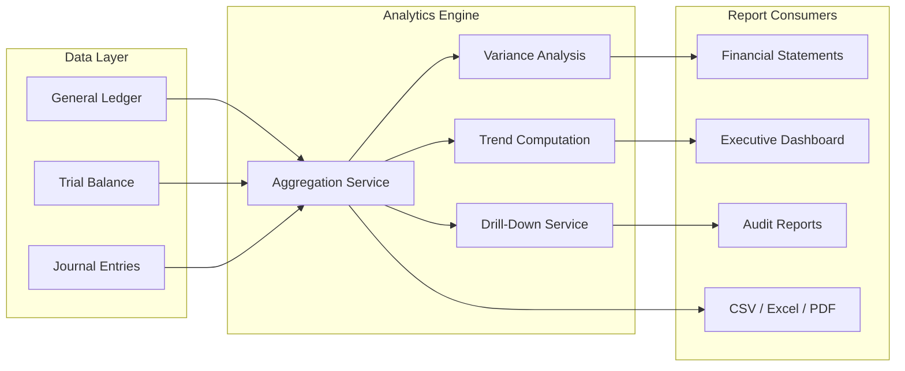

# Reporting & Analytics

The Reporting & Analytics domain transforms raw financial data into actionable intelligence for CFOs, controllers, and auditors. It covers statutory financial statements, real-time executive dashboards, audit-ready report generation, and the analytics engine that powers drill-down and variance analysis.

## Architecture

## Core Components

| Component | Description | Source |
|-----------|-------------|--------|
| [Financial Statements](./financial-statements/) | Balance sheet, income statement, cash flow statement generation | `src/modules/reporting/` |
| [Executive Dashboard](./executive-dashboard/) | Real-time KPIs, cash flow timeline, approval analytics, workflow health | `src/components/enterprise/analytics/` |
| [Audit Reports](./audit-reports/) | Chronological audit trails, tamper-evident logs, compliance exports | `src/modules/reporting/` |
| [Analytics Engine](./analytics-engine/) | Aggregation, variance analysis, trend computation, drill-down | `src/modules/reporting/` |

## Key Design Decisions

- **Reports are generated, not materialized** — On-demand from source data ensures no stale snapshots persist
- **Audit reports are append-only** — Generated from immutable audit logs; never manually edited
- **Dashboard metrics have staleness labels** — Every cached value shows `last updated` timestamp for executive confidence
- **Export formats respect column visibility** — CSV and Excel exports reflect the user's current view configuration
- **Variance analysis uses period-over-period comparison** — Month, quarter, and year-over-year with absolute and percentage deltas

## Related Documentation

- [Financial Platform](/docs/financial-platform/) — Source data for all reports
- [Intelligence — KPI Framework](/docs/intelligence/kpi-framework/) — KPI definitions powering the dashboard
- [Security — Audit Logging](/docs/security/audit-logging/) — Immutable audit log source
- [Executive Overview](/docs/executive-overview/) — Platform philosophy and positioning
