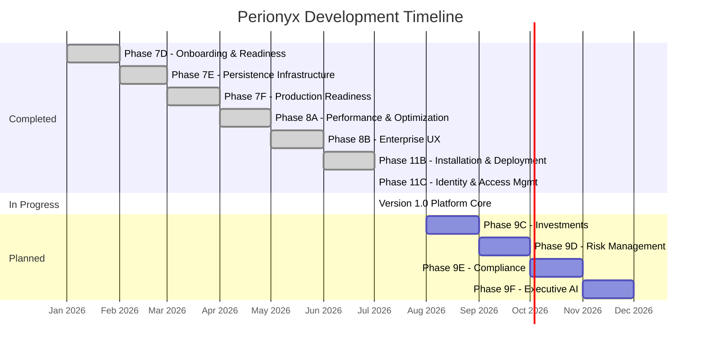

# Roadmap

The Roadmap documents what has been built, what is in progress, and what comes next. Perionyx development follows a phased approach where each phase adds a complete, tested, and documented capability — never shipping partial features to production.

## Architecture

## Core Components

| Component | Description | Source |
|-----------|-------------|--------|
| [Completed Phases](./completed-phases/) | All finished development phases with deliverables and metrics | `docs/releases/` |
| [Future Roadmap](./future-roadmap/) | Upcoming phases, feature priorities, and timeline estimates | Planning documents |

## Key Design Decisions

- **Phases are atomic** — A phase is either complete or not started; no half-shipped features
- **Documentation ships with code** — Every phase includes docs, not just code
- **Build verification is mandatory** — `pnpm typecheck` and `pnpm build` must pass before any phase is marked complete
- **Zero breaking changes within major versions** — New phases extend, never break, existing APIs
- **Infrastructure phases precede feature phases** — Persistence, security, and deployment come before features that depend on them

## Related Documentation

- [Executive Overview](/docs/executive-overview/) — Platform vision driving the roadmap
- [Engineering Standards — Enterprise Readiness](/docs/engineering-standards/enterprise-readiness/) — Readiness gates for each phase
- [Architecture Decision Records](/docs/adrs/) — Decisions that shaped the roadmap
- [Engineering Standards — Engineering Constitution](/docs/engineering-standards/engineering-constitution/) — Principles guiding prioritization
