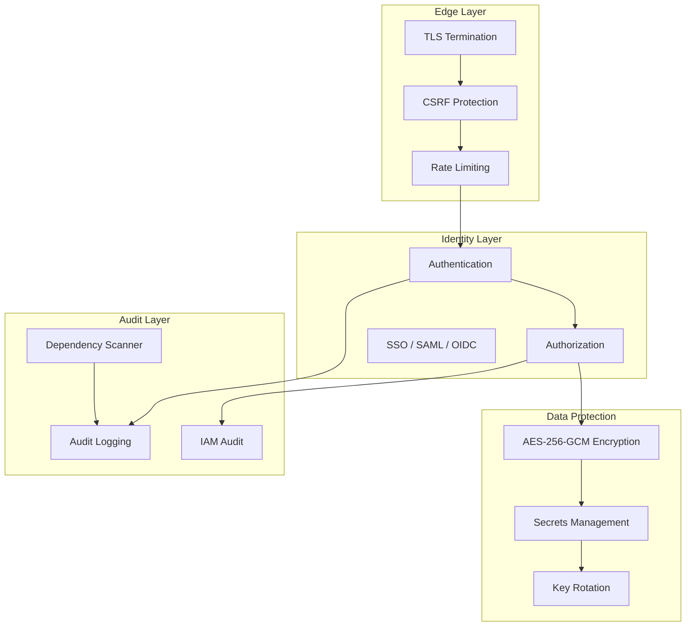

# Security

The Security domain implements defense-in-depth across the entire Perionyx platform — from identity verification at the edge to immutable audit trails at the storage layer. Every mutation affecting financial data, security configuration, approvals, or permissions is logged, encrypted, and scoped to a single tenant.

## Architecture

## Core Components

| Component | Description | Source |
|-----------|-------------|--------|
| [Authentication](./authentication/) | Session-based auth, OAuth, SSO (SAML/OIDC), API keys, MFA | `src/server/security/` |
| [Authorization](./authorization/) | 46+ granular permissions, RBAC, ABAC, role hierarchy | `src/modules/permissions/` |
| [Encryption](./encryption/) | AES-256-GCM field-level encryption with automatic key rotation | `src/server/security/` |
| [Audit Logging](./audit-logging/) | Immutable audit trail — actor, timestamp, before/after, IP, correlation ID | `src/modules/audit/` |
| [Rate Limiting](./rate-limiting/) | Edge and application-layer rate limiting with sliding window counters | `src/proxy.ts` |
| [Secrets Management](./secrets-management/) | Environment validation, secrets scanning, credential storage | `src/server/security/` |

## Key Design Decisions

- **Zero-trust by default** — Every request is authenticated and authorized; no implicit trust from internal networks
- **Audit logs are append-only** — Never mutated or deleted; generated from database triggers where possible
- **Encryption is field-level, not just at-rest** — Sensitive fields are encrypted before they reach the database
- **Key rotation is automatic** — AES-256-GCM keys rotate on a configurable schedule without downtime
- **Rate limiting is tiered** — Edge rate limiting (proxy) catches abuse; application rate limiting enforces business rules
- **Secrets never in code** — Environment validation rejects startup if any secret is hardcoded

## Related Documentation

- [Multi-tenancy — Tenant Isolation](/docs/multi-tenancy/tenant-isolation/) — Tenant-scoped security boundaries
- [AI Governance — Trust Model](/docs/ai-governance/trust-model/) — AI access controls and trust boundaries
- [Engineering Standards — Self-Review Framework](/docs/engineering-standards/self-review-framework/) — Security review checklist
- [Integrations — Connector Platform](/docs/integrations/connector-platform/) — External API credential management
