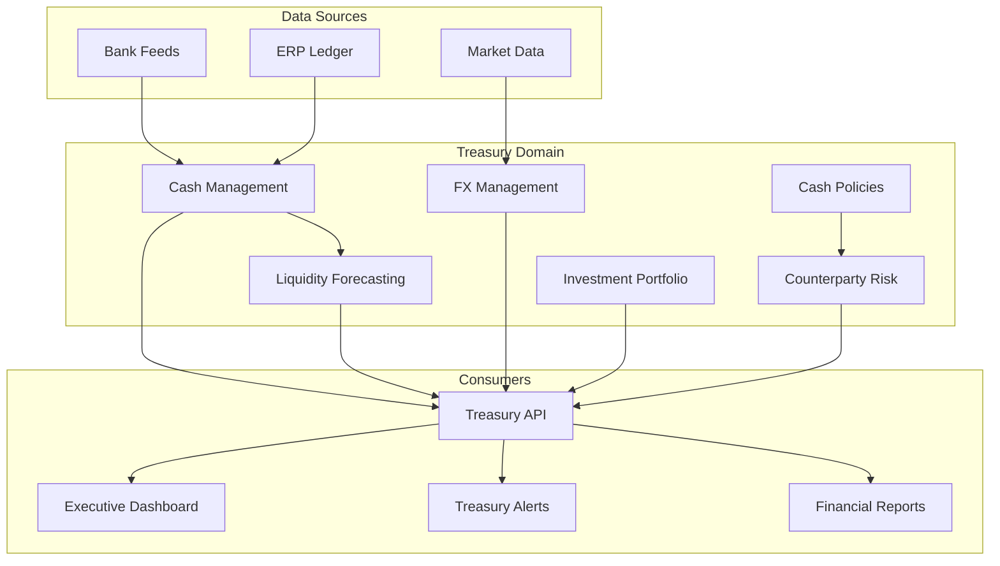

# Treasury Management

The Treasury Management domain provides real-time visibility into an organization's cash positions, liquidity forecasts, foreign exchange exposures, investment portfolios, counterparty risk, and policy compliance. It is the operational backbone for treasurers who need precision, status-at-a-glance, and zero ambiguity on balances and transfers.

## Architecture

## Core Components

| Component | Description | Source |
|-----------|-------------|--------|
| [Cash Management](./cash-management/) | Real-time cash positions across accounts and entities | `src/modules/treasury/` |
| [Liquidity Forecasting](./liquidity-forecasting/) | Forward-looking cash flow projections and runway analysis | `src/modules/treasury/` |
| [FX Management](./fx-management/) | Currency exposure tracking, hedging, and conversion | `src/modules/treasury/` |
| [Investment Portfolio](./investment-portfolio/) | Short-term investment tracking, yield, and maturity schedules | `src/modules/treasury/` |
| [Counterparty Risk](./counterparty-risk/) | Bank and counterparty credit risk scoring and limits | `src/modules/treasury/` |
| [Cash Policies](./cash-policies/) | Automated policy enforcement for cash concentration and sweep rules | `src/modules/treasury/` |

## Key Design Decisions

- **Cash positions are computed, not stored** — Aggregated in real time from bank feeds and ledger data to avoid stale caches
- **Liquidity forecasts use deterministic models** — AI suggests scenarios but all projections are explainable and auditable
- **FX exposures are point-in-time snapshots** — Captured at transaction date for audit integrity, revalued for current exposure
- **Policy violations surface as alerts, not blocks** — Treasurers maintain control; the system flags but does not autonomously override

## Related Documentation

- [Financial Platform — Ledger Core](/docs/financial-platform/)
- [Intelligence — Forecasting Models](/docs/intelligence/forecasting-models/)
- [Integrations — Plaid Integration](/docs/integrations/plaid-integration/)
- [Security — Encryption](/docs/security/encryption/)
