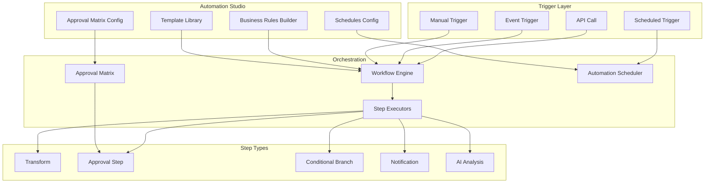

# Workflow Engine

The Workflow Engine is the orchestration backbone of Perionyx — it executes multi-step financial workflows including approvals, data transformations, conditional branching, and scheduled automations. It powers the Automation Studio where finance teams configure business rules, approval matrices, and recurring schedules without writing code.

## Architecture

## Core Components

| Component | Description | Source |
|-----------|-------------|--------|
| [Workflow Engine](./workflow-engine/) | Core orchestration — step execution, state management, error handling | `src/modules/workflow-engine/` |
| [Step Executors](./step-executors/) | 15+ step type executors — transform, approval, conditional, notification, AI | `src/modules/workflow-engine/` |
| [Approval Matrix](./approval-matrix/) | Role-based, department-based, and threshold-based approval routing | `src/modules/automation-studio/approval-matrix-evaluator.ts` |
| [Scheduling](./scheduling/) | Cron-based, event-based, and condition-based trigger management | `src/modules/automation-studio/automation-scheduler.ts` |
| [Automation Studio](./automation-studio/) | Visual builder for business rules, approvals, and scheduled automations | `src/app/(shell)/automation-studio/` |

## Key Design Decisions

- **Executors are stateless** — All workflow state is persisted; executors can restart mid-step without data loss
- **Approval matrix is a resolver, not an executor** — `ApprovalMatrixEvaluator` determines WHAT to do; `ApprovalStepExecutor` handles HOW
- **Condition evaluator is shared** — `OPERATOR_MAP` in `condition-evaluator.ts` is the single source of truth for business rules and workflow branching
- **Scheduling wraps PgBoss** — No queue management duplication; `AutomationScheduler` delegates to `queue.service.ts`
- **Templates are in-memory** — Ephemeral per process; DB persistence planned for a future phase

## Related Documentation

- [Integrations — Webhook System](/docs/integrations/webhook-system/) — Event triggers for workflows
- [Security — Authorization](/docs/security/authorization/) — Permission checks on workflow mutations
- [Intelligence — Anomaly Detection](/docs/intelligence/anomaly-detection/) — AI analysis step type
- [Multi-tenancy — Tenant Isolation](/docs/multi-tenancy/tenant-isolation/) — Workflow scoping per company
