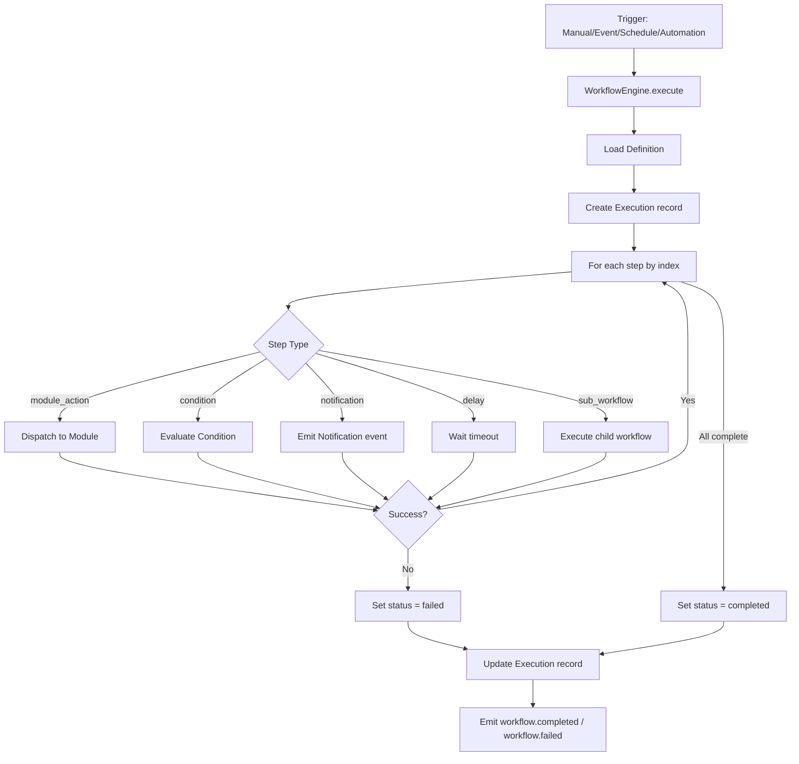

# Scheduling

## Scheduler Service

`SchedulerService` manages cron-based scheduling:

- `create(ctx, data)` — creates a schedule with cron expression and timezone (default UTC)
- `update(ctx, id, data)` — updates cron/timezone/active status
- `delete(ctx, id)` — removes schedule
- `executeDue(ctx)` — queries for due schedules and executes their workflows

## Execution Flow

Scheduled workflows follow the same execution path as manual triggers:

## Data Models

- `WorkflowSchedule` — cron expression, timezone, next/last run
- `WorkflowExecution` — per-run state, status, trigger, retry count
