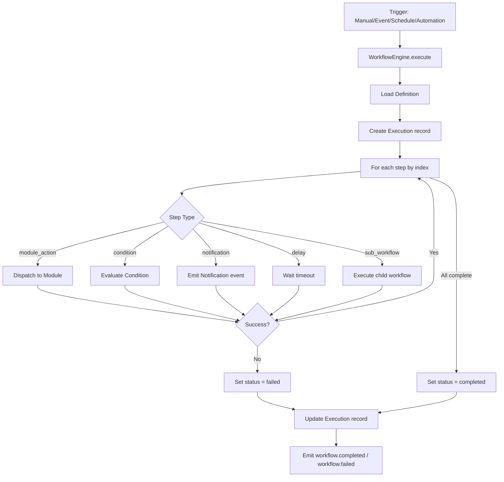

# Step Executors

## Step Types

The workflow engine dispatches each step to a specialized executor based on its type:

| Type | Behavior |
|---|---|
| `module_action` | Dispatches to a named module (treasury, ledger, reporting, integration, intelligence, approval, notification) |
| `condition` | Evaluates a configurable condition; can halt on failure |
| `notification` | Sends notifications via the event bus on completion/failure |
| `delay` | Waits for a configurable timeout |
| `sub_workflow` | Executes a child workflow |

## Dispatch Flow

`WorkflowEngine.execute(ctx, workflowId, trigger, input?)`:

1. Loads the `WorkflowDefinition` from Prisma (must be ACTIVE and same company)
2. Creates a `WorkflowExecution` record with status `running`
3. Iterates steps sequentially by `index`, executing each via `executeStep()`
4. Returns `ExecutionResult` with execution ID, status, step records, and metrics

## Error Handling

If any step fails, the execution status is set to `failed` and remaining steps are skipped.

## Execution Flow



## Internal Event Bus

Step executors interact with the event bus for notification dispatch:

```typescript
on(eventType, handler)  // register handler
off(eventType, handler) // unregister handler
emit(ctx, eventType, source, payload?, correlationId?) // publish event
```

Events carry: `id`, `companyId`, `eventType`, `source`, `payload`, `correlationId`, `timestamp`. Handlers run via `Promise.allSettled` for isolation.
