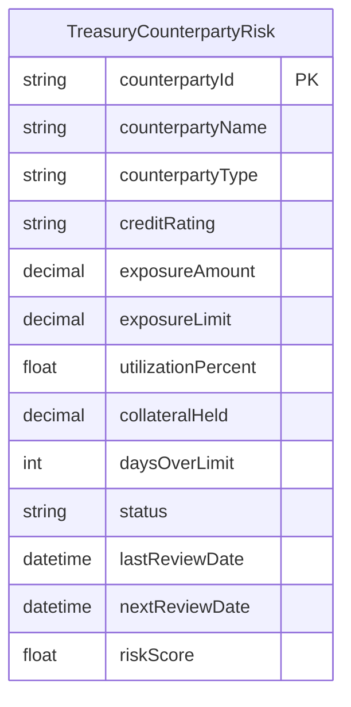
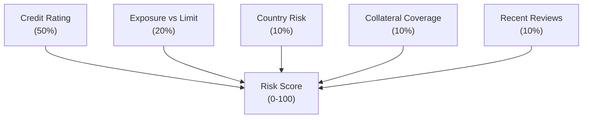
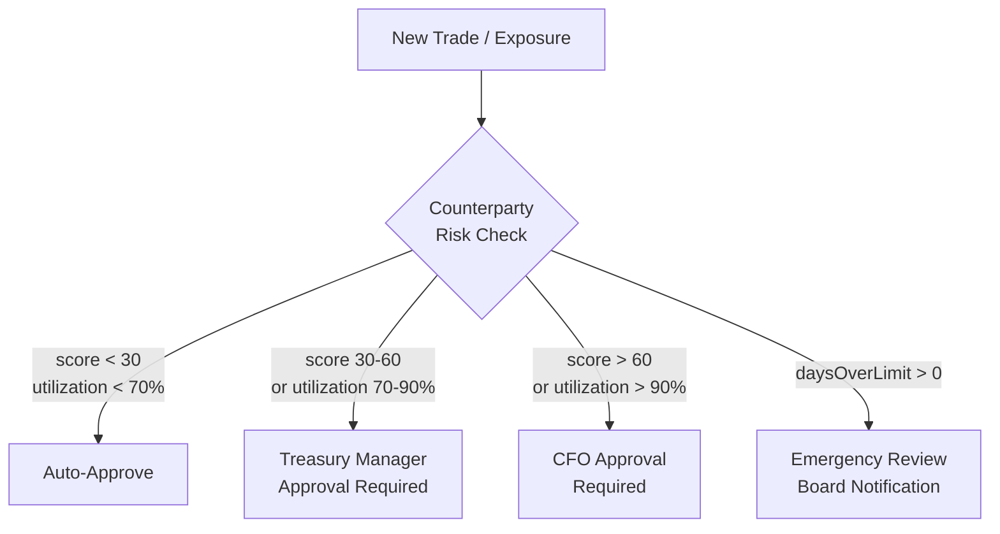

# Counterparty Risk

## Overview

The Counterparty Risk module tracks credit exposure to banking and financial counterparties, monitoring limits, utilization, credit ratings, and overall health. It is backed by the `TreasuryCounterpartyRisk` Prisma model and integrates with the approval matrix for threshold-based escalation and with the alert system for breach notifications.

## Counterparty Exposure Model



### Counterparty Types

| Type | Description | Examples |
|---|---|---|
| **Bank** | Deposit and lending counterparties | JPMorgan, Deutsche Bank, HSBC |
| **Investment** | Money market funds, commercial paper issuers | BlackRock, Fidelity |
| **Trading** | FX forwards, derivatives counterparties | Citi, Barclays |
| **Internal** | Intercompany lending and transfers | Subsidiaries, affiliates |

### Field Descriptions

| Field | Type | Description |
|---|---|---|
| `counterpartyId` | string (PK) | Unique identifier |
| `counterpartyName` | string | Human-readable name |
| `creditRating` | string | External credit rating (e.g., "AA+", "A") |
| `exposureAmount` | decimal(38,12) | Current total exposure |
| `exposureLimit` | decimal(38,12) | Maximum allowed exposure |
| `utilizationPercent` | float | `exposureAmount / exposureLimit * 100` |
| `collateralHeld` | decimal(38,12) | Value of collateral securing exposure |
| `daysOverLimit` | int | Consecutive days exposure exceeded limit |
| `status` | string | `HEALTHY`, `WATCH`, `CRITICAL` |
| `riskScore` | float | Computed risk score (0-100) |

## Risk Scoring Methodology

The risk score (0-100) is a weighted composite of five factors:



### Factor Details

| Factor | Weight | Scoring Method | Range |
|---|---|---|---|
| **Credit Rating** | 50% | Map rating to numeric score | 0 (AAA) → 40 (CCC) |
| **Exposure vs Limit** | 20% | `utilizationPercent` scaled to 0-40 | 0 (0%) → 40 (100%+) |
| **Country Risk** | 10% | Sovereign rating of counterparty domicile | 0 (low risk) → 10 (high risk) |
| **Collateral Coverage** | 10% | `collateralHeld / exposureAmount` | 0 (fully covered) → 10 (unsecured) |
| **Recent Reviews** | 10% | Time since last review + review outcome | 0 (recent positive) → 10 (overdue/negative) |

### Score Calculation Example

```
Counterparty: Deutsche Bank (AA-)
Credit Rating:     AA- → 8   × 0.50 = 4.0
Exposure:          72% limit  × 0.20 = 14.4
Country Risk:      Germany     × 0.10 = 1.0
Collateral:        85% covered × 0.10 = 1.5
Last Review:       30 days ago × 0.10 = 2.0

Risk Score = 4.0 + 14.4 + 1.0 + 1.5 + 2.0 = 22.9
Health: Healthy (0-30)
```

## Credit Rating Scale

| Rating | Category | Typical Count | Risk Interpretation |
|---|---|---|---|
| AA+ | Superior | 2 | Near-government credit quality |
| AA | Excellent | 4 | Very low credit risk |
| AA- | Excellent | 3 | Very low credit risk |
| A+ | Good | 5 | Low credit risk |
| A | Good | 4 | Low credit risk |
| BBB+ | Adequate | 2 | Moderate credit risk, investment grade |

### Rating Migration Monitoring

The system tracks rating changes over time:

| Change | Severity | Action |
|---|---|---|
| Upgrade (e.g., A → A+) | INFO | Log, no action required |
| Downgrade (e.g., AA- → A+) | WARNING | Trigger review, notify Treasury Manager |
| Multi-notch downgrade | CRITICAL | Immediate review, exposure reduction plan |
| Fallen below investment grade | CRITICAL | Emergency review, exit strategy required |

## Health Classification

| Score Range | Health | Action Required |
|---|---|---|
| 0-30 | **Healthy** | Standard monitoring, annual review |
| 31-60 | **Watch** | Enhanced monitoring, quarterly review, limit review |
| >60 | **Critical** | Immediate review, exposure reduction, escalation to CFO |

## Limit Utilization

| Utilization | Color Code | Action |
|---|---|---|
| <70% | **Green** | Normal operations, no restrictions |
| 70-90% | **Amber** | Review new exposures before approval, consider limit increase |
| >90% | **Red** | Limit approaching — require Treasury Manager approval for new exposures |

### Concentration Limits

The system enforces concentration limits to prevent over-exposure to any single counterparty:

| Limit Type | Default | Source | Enforcement |
|---|---|---|---|
| Single counterparty | 20% of total exposure | TreasuryCashPolicy | Pre-trade check |
| Single country | 30% of total exposure | TreasuryCashPolicy | Daily aggregation check |
| Single sector | 40% of total exposure | TreasuryCashPolicy | Weekly aggregation check |
| Top 5 counterparties | 60% of total exposure | TreasuryCashPolicy | Monthly review |

### Days Over Limit

When `daysOverLimit > 0`, the counterparty is in breach:

| Days Over Limit | Severity | Escalation |
|---|---|---|
| 1-7 days | WARNING | Notify Treasury Analyst |
| 8-30 days | WARNING | Notify Treasury Manager, generate remediation plan |
| 30+ days | CRITICAL | Notify CFO, mandatory exposure reduction |

## Integration with Approval Matrix

Counterparty risk data feeds into the approval matrix for threshold-based approval routing:



### Approval Routing Rules

| Condition | Approval Level | SLA |
|---|---|---|
| Risk score < 30, utilization < 70% | Auto-approved | Immediate |
| Risk score 30-60 OR utilization 70-90% | Treasury Manager | 4 hours |
| Risk score > 60 OR utilization > 90% | CFO | 24 hours |
| Days over limit > 30 | CFO + Board notification | 48 hours |
| Credit rating downgrade (2+ notches) | CFO + Compliance Officer | 24 hours |

## Alert Thresholds

| Condition | Alert Type | Recipients | Channel |
|---|---|---|---|
| Utilization exceeds 70% | Amber alert | Treasury Analyst | Dashboard + email |
| Utilization exceeds 90% | Red alert | Treasury Manager | Dashboard + email + SMS |
| Risk score exceeds 30 | Watch alert | Treasury Manager | Dashboard + email |
| Risk score exceeds 60 | Critical alert | CFO + Treasury Manager | Dashboard + email + SMS |
| Credit rating downgrade | Rating alert | Treasury Manager + Compliance | Dashboard + email |
| Days over limit > 0 | Breach alert | Treasury Manager | Dashboard + email |
| Days over limit > 30 | Breach escalation | CFO + Compliance | Dashboard + email + SMS |

## Exposure Management

The Counterparty Risk Grid displays all counterparties with:

- **Credit rating badge** — color-coded by tier (AA = blue, A = green, BBB = amber)
- **Current exposure vs limit** — numeric display with limit percentage
- **Utilization progress bar** — green/amber/red fill based on thresholds
- **Risk score** — numeric with color weighting (green/amber/red)
- **Health indicator** — icon and label (healthy/watch/critical)
- **Review date** — last review date and next scheduled review

### Dashboard Metrics

| Metric | Description | Computation |
|---|---|---|
| Total exposure | Sum of all counterparty exposures | `SUM(exposureAmount)` |
| Total limit utilization | Overall limit usage | `SUM(exposureAmount) / SUM(exposureLimit) * 100` |
| Average risk score | Mean risk score across counterparties | `AVG(riskScore)` |
| Counterparties on watch | Count with status = WATCH | `COUNT(status = 'WATCH')` |
| Counterparties critical | Count with status = CRITICAL | `COUNT(status = 'CRITICAL')` |
| Collateral coverage ratio | Total collateral vs total exposure | `SUM(collateralHeld) / SUM(exposureAmount) * 100` |

## Data Refresh and Caching

| Data | Refresh Frequency | Cache Tier |
|---|---|---|
| Risk scores | Daily (market close) | SHORT (5s) |
| Exposure amounts | Real-time (on transaction) | CRITICAL (5s) |
| Credit ratings | Weekly (rating agency updates) | MEDIUM (60s) |
| Utilization percentages | Real-time (on exposure change) | SHORT (5s) |
| Health classifications | Daily (after score update) | MEDIUM (60s) |

## Review Cycle

| Review Type | Frequency | Scope | Owner |
|---|---|---|---|
| Standard review | Annually | All counterparties | Treasury Analyst |
| Enhanced review | Quarterly | Counterparties with score > 30 | Treasury Manager |
| Emergency review | Ad-hoc | Counterparties with score > 60 or breach | CFO |
| Rating migration review | On rating change | Affected counterparty only | Treasury Manager |
| Concentration review | Monthly | Top 10 by exposure | Treasury Manager |
