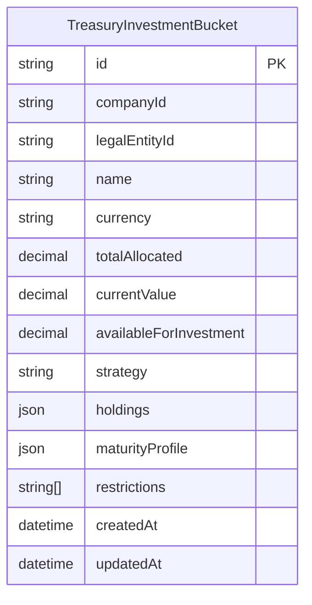
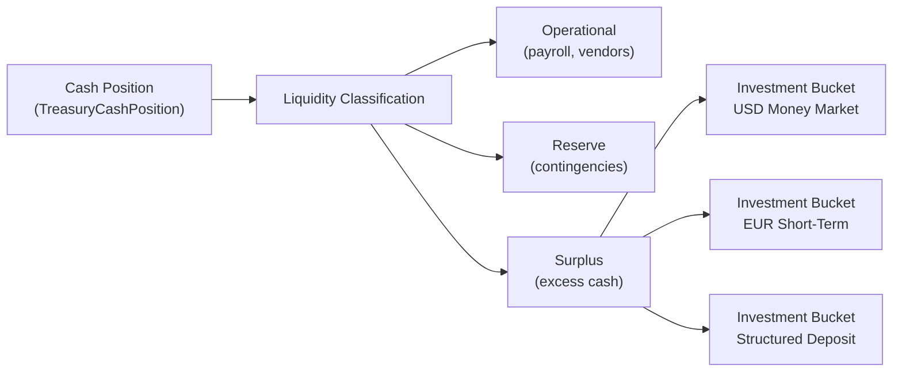
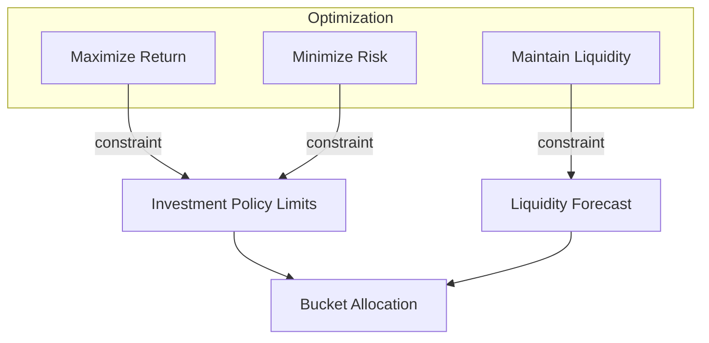
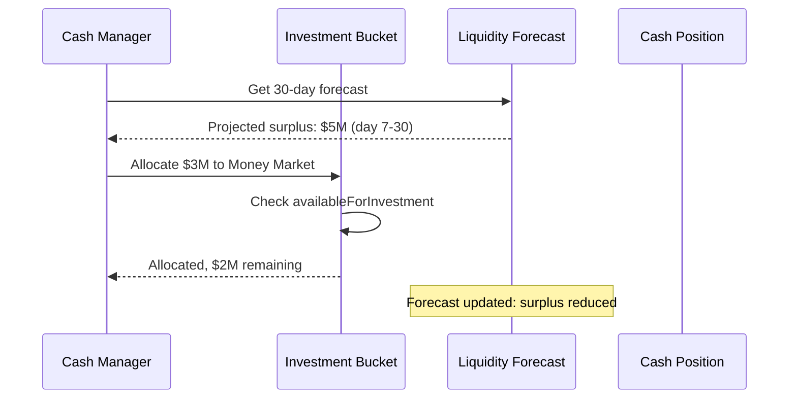

# Investment Portfolio

## Overview

The Investment Portfolio module manages short-term surplus cash deployments across investment buckets. It is backed by the `TreasuryInvestmentBucket` Prisma model and provides visibility into allocations, holdings, maturity profiles, and restrictions. The module integrates with liquidity forecasting to ensure investment decisions do not compromise operational or reserve cash needs.

## Investment Bucket Model

Each investment bucket represents a discrete allocation of surplus cash into short-term instruments:



### Field Descriptions

| Field | Type | Description |
|---|---|---|
| `name` | string | Unique name per company (e.g., "USD Money Market", "EUR Short-Term") |
| `currency` | string | Denomination currency |
| `totalAllocated` | decimal(38,12) | Total cash allocated to this bucket |
| `currentValue` | decimal(38,12) | Current market value of holdings |
| `availableForInvestment` | decimal(38,12) | Cash not yet deployed, available for new investments |
| `strategy` | string | Investment strategy enum (see below) |
| `holdings` | JSON | Array of `InvestmentHolding` objects |
| `maturityProfile` | JSON | `MaturityProfile` object with breakdown by time bucket |
| `restrictions` | string[] | Compliance/investment policy restrictions |

### Unique Constraints

- `@@unique([companyId, name])` — bucket names are unique per company.
- `@@index([companyId, legalEntityId])` — fast lookup by legal entity.

## Surplus Cash Deployment

Investment buckets are funded from surplus cash identified by the liquidity management layer:



### Liquidity-to-Investment Flow

1. **Cash position aggregation** — all accounts are aggregated by currency and entity.
2. **Liquidity classification** — cash is classified as operational, reserve, or surplus.
3. **Surplus identification** — cash above the `targetBalance` (from `TreasuryCashPolicy`) and reserve buffer is available for investment.
4. **Bucket allocation** — surplus is allocated to investment buckets based on strategy, restrictions, and availability.

## Investment Strategies

| Strategy | Description | Risk Level | Typical Instruments |
|---|---|---|---|
| **Conservative** | Capital preservation priority | Low | Money market funds, T-bills, government bonds |
| **Moderate** | Balanced return with acceptable risk | Medium | Commercial paper, corporate bonds, CDs |
| **Aggressive** | Higher return targets | High | Corporate bonds, structured products |
| **Laddered** | Staggered maturities for liquidity | Low-Medium | Bonds/CDs with staggered maturity dates |
| **Custom** | Strategy-specific rules | Varies | Custom instrument mix |

## Holdings Structure

Each bucket's `holdings` JSON field contains an array of individual positions:

```typescript
interface InvestmentHolding {
  instrumentId: string;
  name: string;
  type: string;           // e.g., "money_market", "treasury_bill", "commercial_paper"
  issuer: string;
  principal: number;
  currentValue: number;
  yield: number;          // Annualized yield
  maturityDate: string;   // ISO date
  settlementDate: string;
  counterparty: string;   // Issuing institution
}
```

## Maturity Profile

The `maturityProfile` JSON provides a time-bucketed view of when holdings mature:

| Time Bucket | Description | Liquidity Impact |
|---|---|---|
| **Overnight** | Matures within 1 business day | Immediate cash availability |
| **1-7 days** | Matures within the week | Very short-term planning |
| **8-30 days** | Matures within the month | Short-term cash flow |
| **31-90 days** | Matures within the quarter | Medium-term planning |
| **91-180 days** | Matures within 6 months | Longer-term allocation |
| **180+ days** | Matures beyond 6 months | Illiquid allocation |

## Risk-Return Optimization

The investment portfolio balances three competing objectives:



### Optimization Factors

| Factor | Weight | Source |
|---|---|---|
| Yield / return | 30% | Market data, instrument terms |
| Credit risk | 25% | Counterparty risk scores |
| Liquidity need | 25% | Liquidity forecast (1-30 day horizon) |
| Maturity alignment | 15% | Cash flow timing from forecast |
| Restrictions | 5% | Investment policy, regulatory constraints |

### Restrictions

The `restrictions` array enforces compliance constraints:

| Restriction | Description |
|---|---|
| `no_high_yield` | Exclude high-yield (junk) bonds |
| `government_only` | Only government-issued instruments |
| `max_maturity_90d` | No instruments maturing beyond 90 days |
| `no_single_issuer_above_20pct` | Concentration limit per issuer |
| `domestic_currency_only` | No foreign currency instruments |

## Integration with Liquidity Forecasting

The investment module uses the `TreasuryCashForecast` model to inform allocation decisions:



### Forecast-Informed Allocation Rules

1. **Never invest operational cash** — only surplus above target balance and reserve buffer.
2. **Match maturity to forecast horizon** — if the 30-day forecast shows a large outflow on day 25, don't invest in 30-day instruments.
3. **Maintain liquidity buffer** — keep sufficient uninvested cash to cover the 7-day forecasted outflows.
4. **Re-evaluate on forecast update** — when the liquidity forecast is refreshed, check if existing bucket allocations remain appropriate.

## Compliance Constraints

| Constraint | Source | Enforcement |
|---|---|---|
| Maximum single-counterparty exposure | TreasuryCashPolicy (`counterpartyLimit`) | Pre-trade check before allocation |
| Maximum investment amount | TreasuryCashPolicy (`investmentLimit`) | Bucket creation and top-up validation |
| Concentration limits | Investment policy (restrictions array) | Holdings-level validation |
| Regulatory requirements | Jurisdiction-specific rules | Restriction tags on buckets |
| Board-approved investment policy | TreasuryCashPolicy | Bucket strategy must match approved strategies |

## API Surface

| Operation | Method | Description |
|---|---|---|
| List buckets | `GET /api/v1/treasury/investments` | List all buckets for company |
| Get bucket | `GET /api/v1/treasury/investments/:id` | Get bucket with holdings detail |
| Create bucket | `POST /api/v1/treasury/investments` | Create new investment bucket |
| Allocate funds | `POST /api/v1/treasury/investments/:id/allocate` | Move surplus cash into bucket |
| Rebalance | `POST /api/v1/treasury/investments/:id/rebalance` | Adjust holdings within bucket |
| Close bucket | `POST /api/v1/treasury/investments/:id/close` | Liquidate and return cash to operational |

## Monitoring and Metrics

| Metric | Description | Alert Threshold |
|---|---|---|
| `investment.totalAllocated` | Total across all buckets | Above available surplus |
| `investment.avgYield` | Weighted average yield | Below benchmark |
| `investment.maturityShortfall` | Instruments maturing after forecast horizon | > 10% of portfolio |
| `investment.counterpartyConcentration` | Max single-issuer exposure | Above policy limit |
| `investment.restrictionViolations` | Holdings violating restrictions | Any violation |
