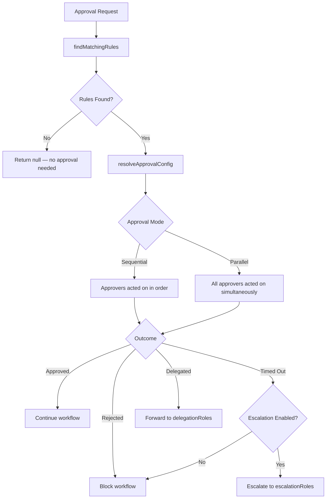
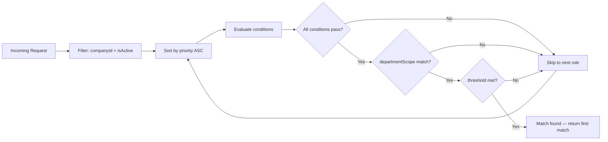
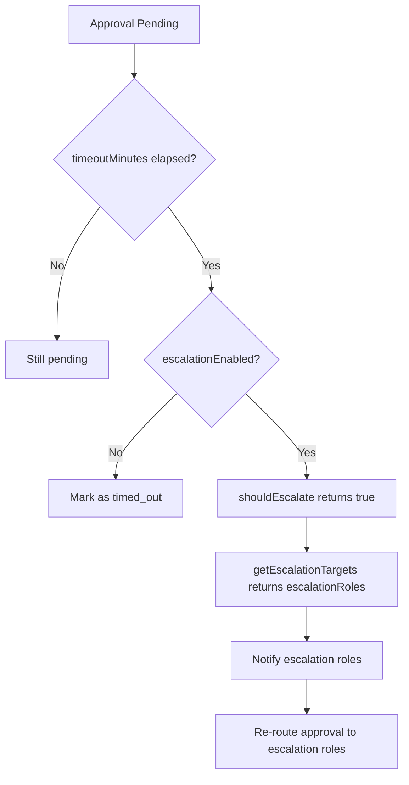
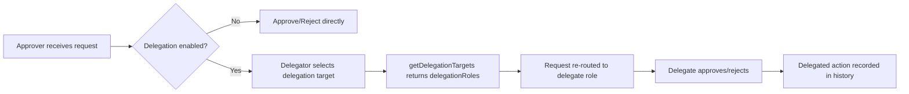
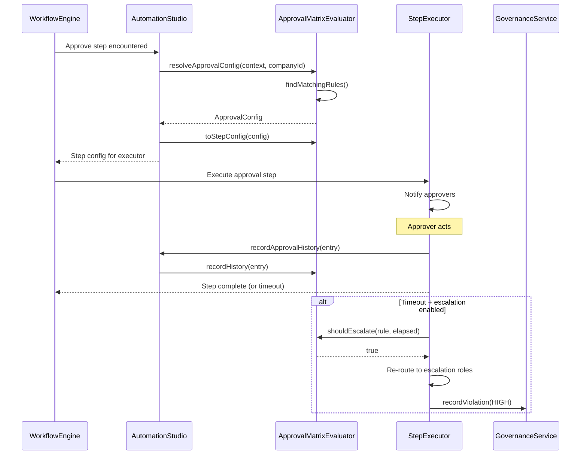

# Approval Matrix

The Approval Matrix defines who must approve what, in what order, and what happens when approvals stall. It routes approval requests through configurable rules based on role, department, and monetary thresholds — then handles escalation and delegation automatically.

**Location:** `src/modules/automation-studio/approval-matrix-evaluator.ts` (214 lines)

---

## Architecture



## Rule Model

Each `ApprovalMatrixRule` defines a single approval gate. Rules are stored in-memory per process and backed by Prisma persistence.

| Field | Type | Purpose |
|---|---|---|
| `id` | `string` | Unique rule identifier |
| `companyId` | `string` | Tenant scope — rules never cross company boundaries |
| `name` | `string` | Human-readable label (e.g., "Treasury > $50K CFO Approval") |
| `priority` | `number` | Lower number = higher priority; first match wins |
| `conditions` | `ApprovalCondition[]` | All must match for the rule to apply |
| `requiredApprovers` | `number` | Minimum distinct approvers needed |
| `approverRoles` | `string[]` | Roles that can approve (e.g., `["CFO", "TREASURER"]`) |
| `approvalMode` | `"sequential" \| "parallel"` | Sequential = one-at-a-time chain; parallel = all simultaneously |
| `timeoutMinutes` | `number` | Minutes before an approval request times out |
| `escalationEnabled` | `boolean` | Whether stale approvals escalate |
| `escalationDelayMinutes` | `number \| null` | Minutes to wait before escalating |
| `escalationRoles` | `string[] \| null` | Roles to escalate to |
| `delegationEnabled` | `boolean` | Whether approvers can delegate |
| `delegationRoles` | `string[] \| null` | Roles eligible to receive delegated approvals |
| `departmentScope` | `string \| null` | Restrict rule to a specific department |
| `thresholdField` | `string \| null` | Field to compare against threshold (e.g., `"amount"`) |
| `thresholdOperator` | `ConditionOperator \| null` | Comparison operator (`gt`, `gte`, `lt`, etc.) |
| `thresholdValue` | `number \| null` | Threshold value to compare |
| `isActive` | `boolean` | Disabled rules are skipped during matching |

### Condition Types

Each `ApprovalCondition` specifies a field/operator/value triple evaluated against the approval context:

| Operator | Meaning | Example |
|---|---|---|
| `eq` | Equals | `status === "COMPLETED"` |
| `neq` | Not equals | `region !== "US"` |
| `gt` | Greater than | `amount > 10000` |
| `gte` | Greater than or equal | `amount >= 10000` |
| `lt` | Less than | `amount < 50000` |
| `lte` | Less than or equal | `amount <= 50000` |
| `in` | Value in list | `department in ["finance", "treasury"]` |
| `contains` | String contains | `description contains "wire"` |
| `matches` | Regex match | `vendor matches "^ACME"` |

---

## Rule Matching Algorithm

`findMatchingRules(context, companyId, amount?, department?)` executes the following:

1. **Filter** — Only active rules belonging to the same `companyId`
2. **Sort** — By `priority` ascending (lower priority number = checked first)
3. **Evaluate conditions** — Every `ApprovalCondition` in the rule must pass via the shared `conditionEvaluator` (same engine used by `ConditionalBranchStepExecutor`)
4. **Department scope** — If the rule has `departmentScope` set and the request department doesn't match, reject
5. **Threshold check** — If `thresholdField`, `thresholdOperator`, and `thresholdValue` are all set, evaluate the threshold against the `amount` parameter

The first matching rule wins. This is intentional — it creates a deterministic, auditable routing path where the highest-priority (lowest number) rule governs.



---

## Escalation Logic

When an approval request sits unanswered past its `timeoutMinutes`, the evaluator can escalate it to higher-authority roles.



**Key methods:**

- `shouldEscalate(rule, elapsedMinutes)` — Returns `true` if `escalationEnabled && elapsedMinutes >= escalationDelayMinutes`
- `getEscalationTargets(rule, elapsedMinutes)` — Returns the `escalationRoles` array if escalation conditions are met, empty array otherwise

Escalation is time-based, not retry-based. Once the delay threshold is crossed, the approval is re-routed to the escalation roles permanently — there is no repeated escalation loop.

---

## Delegation Logic

Delegation allows an approver to forward their approval responsibility to another role. This is configured per-rule via `delegationEnabled` and `delegationRoles`.



**Key method:**

- `getDelegationTargets(rule)` — Returns `delegationRoles` if delegation is enabled, empty array otherwise

The `ApprovalHistoryEntry` records every delegation with the `delegatedTo` field, maintaining a complete audit trail of who acted and who forwarded their responsibility.

---

## Approval History

Every approval action — approve, reject, delegate, escalate, or timeout — is recorded in an in-memory history log. The `ApprovalHistoryEntry` captures:

| Field | Description |
|---|---|
| `id` | Unique entry identifier |
| `ruleId` | The rule that governed this approval |
| `instanceId` | Workflow instance ID |
| `stepId` | Step within the workflow |
| `approverId` | User who acted |
| `approverRole` | Role of the user who acted |
| `action` | One of: `approved`, `rejected`, `delegated`, `escalated`, `timed_out` |
| `comment` | Optional comment from the approver |
| `delegatedTo` | If delegated, the target role/user |
| `actedAt` | ISO timestamp of the action |

**Query methods:**

- `getHistory(instanceId, stepId)` — History for a specific step in a specific workflow instance
- `getAllHistory(instanceId)` — All approval history for a workflow instance
- `getHistoryByRule(ruleId)` — All history entries governed by a specific rule

---

## Integration with Workflow Engine

The `AutomationStudioService` constructor wires the approval matrix into the workflow engine through two callback hooks:

### Approval Config Enricher

```typescript
this.workflowEngine.setApprovalConfigEnricher(async (ctx, stepDef, instanceInput) => {
  const context = { ...(stepDef.config ?? {}), ...(instanceInput ?? {}) };
  const config = approvalMatrixEvaluator.resolveApprovalConfig(context, ctx.companyId, {
    amount: context.amount as number | undefined,
    department: context.department as string | undefined,
  });
  if (!config) return null;
  return approvalMatrixEvaluator.toStepConfig(config);
});
```

When the workflow engine encounters an `approval` step, it calls this enricher. The enricher merges the step definition config with the instance input, resolves the matching approval rule, and returns a step config that the `ApprovalStepExecutor` uses to determine who to notify and what approval mode to use.

### Approval History Recorder

```typescript
this.workflowEngine.setApprovalHistoryRecorder(async (
  instanceId, stepId, approverId, approverRole, action, comment, delegatedTo,
) => {
  approvalMatrixEvaluator.recordHistory({ ... });
});
```

Every approve/reject/delegate/escalate action in the `ApprovalStepExecutor` is recorded through this hook, ensuring a complete audit trail.

### Step Config Generation

`toStepConfig(config)` converts an `ApprovalConfig` into the flat `Record<string, unknown>` format consumed by the workflow engine's step executor:

```typescript
{
  requiredApprovers: config.approverRoles,
  requiredApproverCount: config.requiredApprovers,
  timeoutMinutes: config.timeoutMinutes,
  approvalMode: config.approvalMode,
  escalationEnabled: config.escalationEnabled,
  escalationDelayMinutes: config.escalationDelayMinutes,
  escalationRoles: config.escalationRoles,
  delegationEnabled: config.delegationEnabled,
  delegationRoles: config.delegationRoles,
}
```

---

## Governance Integration

When an approval is rejected or times out, the evaluator can record a governance violation via `GovernanceService.recordViolation()`:

```typescript
await GovernanceService.recordViolation(ctx, {
  severity: "HIGH",
  sourceModule: "approval_rule",
  title: `Approval Matrix: ${rule.name}`,
  description: reason,
  details: { ruleId: rule.id, ruleName: rule.name },
});
```

This feeds into the governance health score and violation dashboard visible in the automation studio.

---

## Configuration Examples

### Simple threshold routing

A single rule routing all treasury payments over $50,000 to the CFO:

```json
{
  "name": "High-Value Treasury Payment",
  "priority": 1,
  "conditions": [
    { "field": "category", "operator": "eq", "value": "treasury" },
    { "field": "type", "operator": "eq", "value": "payment" }
  ],
  "requiredApprovers": 1,
  "approverRoles": ["CFO"],
  "approvalMode": "sequential",
  "timeoutMinutes": 480,
  "escalationEnabled": true,
  "escalationDelayMinutes": 240,
  "escalationRoles": ["CEO"],
  "thresholdField": "amount",
  "thresholdOperator": "gte",
  "thresholdValue": 50000
}
```

### Department-scoped sequential approval

A multi-step approval requiring both Finance Manager and Controller for any budget change in the Engineering department:

```json
{
  "name": "Engineering Budget Change",
  "priority": 2,
  "conditions": [
    { "field": "category", "operator": "eq", "value": "budget" },
    { "field": "type", "operator": "eq", "value": "modification" }
  ],
  "requiredApprovers": 2,
  "approverRoles": ["FINANCE_MANAGER", "CONTROLLER"],
  "approvalMode": "sequential",
  "timeoutMinutes": 720,
  "escalationEnabled": true,
  "escalationDelayMinutes": 360,
  "escalationRoles": ["VP_FINANCE"],
  "delegationEnabled": true,
  "delegationRoles": ["FINANCE_MANAGER", "CONTROLLER"],
  "departmentScope": "engineering"
}
```

### Parallel approval for high-risk transactions

Risk-flagged transactions requiring simultaneous sign-off from both Compliance and Treasury:

```json
{
  "name": "High-Risk Transaction Sign-Off",
  "priority": 0,
  "conditions": [
    { "field": "riskLevel", "operator": "in", "value": ["high", "critical"] }
  ],
  "requiredApprovers": 2,
  "approverRoles": ["COMPLIANCE_OFFICER", "TREASURER"],
  "approvalMode": "parallel",
  "timeoutMinutes": 240,
  "escalationEnabled": false,
  "delegationEnabled": false,
  "thresholdField": "amount",
  "thresholdOperator": "gte",
  "thresholdValue": 100000
}
```

---

## API Surface

| Method | Description |
|---|---|
| `registerRule(rule)` | Add a rule to the in-memory evaluator |
| `getRule(id)` | Retrieve a rule by ID |
| `listRules(companyId)` | List all rules for a company |
| `unregisterRule(id)` | Remove a rule from the evaluator |
| `findMatchingRules(ctx, companyId, amount?, dept?)` | Find all matching rules for a context |
| `resolveApprovalConfig(ctx, companyId, options?)` | Resolve the best approval config (first match) |
| `shouldEscalate(rule, elapsedMinutes)` | Check if a rule should escalate |
| `getEscalationTargets(rule, elapsedMinutes)` | Get escalation role list |
| `getDelegationTargets(rule)` | Get delegation role list |
| `recordHistory(entry)` | Record an approval action |
| `getHistory(instanceId, stepId)` | Query history for a specific step |
| `getAllHistory(instanceId)` | Query all history for an instance |
| `toStepConfig(config)` | Convert ApprovalConfig to step executor format |

---

## Data Flow


