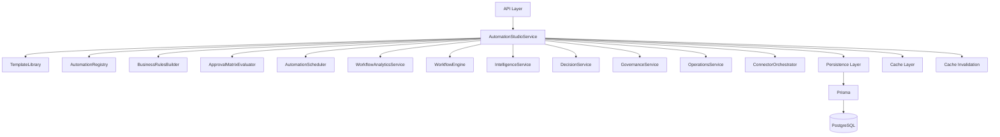
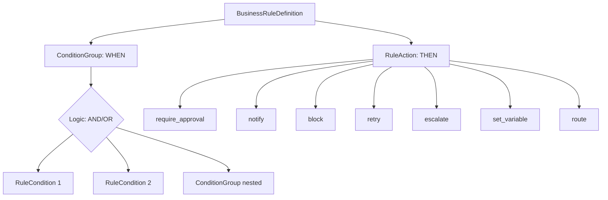
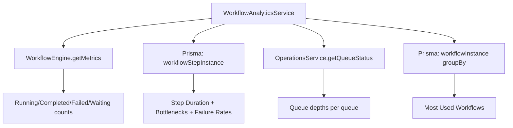
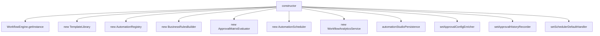
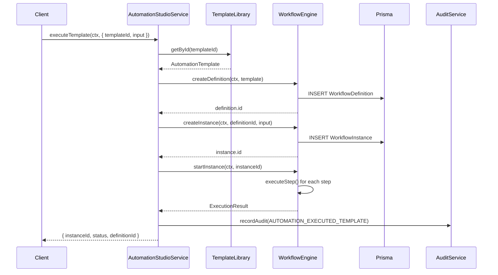

# Automation Studio

Automation Studio is the orchestration facade that unifies template management, business rules, approval matrices, scheduling, workflow analytics, and governance integration behind a single service. It is the primary interface through which the platform's automation capabilities are consumed.

**Location:** `src/modules/automation-studio/automation-studio.service.ts` (1231 lines)

---

## Architecture



The `AutomationStudioService` is a **Facade** — it delegates every operation to the appropriate subsystem while providing a unified, tenant-scoped API. No business logic lives in the facade itself; it coordinates, persists, audits, and caches.

---

## Subsystem Map

| Subsystem | Module | Storage | Responsibility |
|---|---|---|---|
| **TemplateLibrary** | `template-library.ts` | In-memory `Map` | 10 built-in workflow templates, search, versioning, duplication |
| **AutomationRegistry** | `automation-registry.ts` | In-memory `Map` | Business rules, blueprints, registry state |
| **BusinessRulesBuilder** | `business-rules-builder.ts` | In-memory `Map` | IF/THEN condition groups with AND/OR logic |
| **ApprovalMatrixEvaluator** | `approval-matrix-evaluator.ts` | In-memory `Map` + Prisma | Role/dept/threshold approval routing |
| **AutomationScheduler** | `automation-scheduler.ts` | In-memory `Map` + Prisma + PgBoss | Cron, event, immediate, scheduled triggers |
| **WorkflowAnalyticsService** | `workflow-analytics.service.ts` | Prisma queries | Step durations, bottlenecks, failure rates |
| **WorkflowEngine** | `src/modules/workflow/engine.ts` | Prisma | Sequential step execution, instance management |

---

## Template Library

The `TemplateLibrary` provides 10 built-in workflow templates covering common financial automation scenarios.

### Built-in Templates

| Template | Slug | Steps | Category |
|---|---|---|---|
| Month-End Close | `month-end-close` | 6 | close |
| Daily Treasury Review | `daily-treasury-review` | 4 | treasury |
| Weekly Executive Brief | `weekly-executive-brief` | 4 | reporting |
| Bank Reconciliation | `bank-reconciliation` | 4 | reconciliation |
| Cash Forecast Refresh | `cash-forecast-refresh` | 5 | treasury |
| Budget Review | `budget-review` | 5 | budget |
| Board Pack Generation | `board-pack-generation` | 4 | reporting |
| Quarter-End Close | `quarter-end-close` | 7 | close |
| Year-End Close | `year-end-close` | 8 | close |
| Audit Preparation | `audit-preparation` | 6 | compliance |

### Template Capabilities

| Feature | Description |
|---|---|
| **Search** | Full-text search across name, description, and tags |
| **Category filtering** | Filter by automation category (treasury, compliance, approval, etc.) |
| **Tag search** | Search by tags with AND/OR match modes |
| **Risk level filtering** | Filter by low/medium/high/critical risk |
| **Trigger type filtering** | Filter by manual/scheduled/event triggers |
| **Popularity ranking** | High/medium/low popularity scores |
| **Duplication** | Clone templates with optional name, category, and tag overrides |
| **Versioning** | Semantic version bumping with changelog and version history |
| **Status lifecycle** | draft → active → archived |

### Template Metadata

Each template carries rich metadata:

```typescript
interface TemplateMetadata {
  author: string;              // Creator
  version: string;             // Semantic version (e.g., "1.2.0")
  tags: string[];              // Searchable tags
  riskLevel: "low" | "medium" | "high" | "critical";
  estimatedDuration: string;   // Human-readable (e.g., "~5 minutes")
  requiresApproval: boolean;   // Whether template steps include approval gates
  defaultSchedule: string | null;  // Default cron expression
}
```

---

## Business Rules Builder

The `BusinessRulesBuilder` evaluates configurable IF/THEN rules against workflow context variables.

### Rule Structure



### Condition Operators

| Operator | Meaning |
|---|---|
| `eq` | Equals |
| `neq` | Not equals |
| `gt` | Greater than |
| `gte` | Greater than or equal |
| `lt` | Less than |
| `lte` | Less than or equal |
| `in` | Value in list |
| `contains` | String contains |
| `matches` | Regex match |

### Variable Sources

Variables used in conditions can come from multiple sources, automatically detected from the variable path prefix:

| Prefix | Source | Example |
|---|---|---|
| `workflow.` / `input.` | Workflow context | `workflow.amount`, `input.vendor` |
| `connector.` | External connector data | `connector.balance` |
| `decision.` | Decision engine | `decision.riskScore` |
| `policy.` | Policy framework | `policy.complianceLevel` |
| `governance.` | Governance system | `governance.violationCount` |

### Evaluation

```typescript
// Single rule evaluation
const { matched, actions } = builder.evaluate(rule, variables);

// All rules for a company (priority-sorted)
const results = builder.evaluateAll(rules, variables);
// Returns: Array<{ rule, actions }> — only matched rules with their actions
```

Rules are evaluated in priority order (ascending — lower number = higher priority). All matched rules produce actions; there is no short-circuit.

### Action Types

| Action | Config | Effect |
|---|---|---|
| `require_approval` | `{ approvers: string[] }` | Gate execution on approval |
| `notify` | `{ channel, message }` | Send notification |
| `block` | `{ reason }` | Halt workflow execution |
| `retry` | `{ maxRetries, delayMs }` | Retry the current step |
| `escalate` | `{ roles: string[] }` | Escalate to higher authority |
| `set_variable` | `{ key, value }` | Set a workflow variable |
| `route` | `{ target: string }` | Route to a specific next step |

---

## Monitoring Dashboard

The Automation Studio page at `/automation-studio/` serves as the monitoring dashboard, displaying:

### Dashboard Tiles

| Tile | Data Source | Description |
|---|---|---|
| Template count | `TemplateLibrary.getTemplateCount()` | Total available templates |
| Active blueprints | `WorkflowDefinition WHERE status=ACTIVE` | Published custom workflows |
| Active schedules | `AutomationSchedule WHERE enabled=true` | Running cron/event schedules |
| Executions today/week/month | `WorkflowInstance` count by time range | Activity volume |
| Success/failure rate | `WorkflowInstance` status counts | Reliability metrics |
| Average duration | Mean execution time across completed instances | Performance |

### Real-time Metrics

The dashboard caches analytics via `getCached()` with `CacheTier.SHORT` (60-second TTL), ensuring freshness without excessive query load. Cache invalidation triggers on any CRUD operation:

```typescript
void invalidateWorkflow(ctx.companyId);
void invalidateAutomation(ctx.companyId);
void invalidateDashboard(ctx.companyId);
void invalidateApproval(ctx.companyId);
void invalidateAnalytics(ctx.companyId);
```

---

## Analytics Integration

### AutomationAnalytics

The `getAnalytics()` method returns a comprehensive analytics snapshot:

```typescript
interface AutomationAnalytics {
  totalTemplates: number;
  activeBlueprints: number;
  activeSchedules: number;
  executionsToday: number;
  executionsThisWeek: number;
  executionsThisMonth: number;
  successRate: number;
  failureRate: number;
  averageDurationMs: number;
  topPerformingTemplates: TopPerformingTemplate[];
  executionTrend: ExecutionTrend[];
  categoryBreakdown: CategoryBreakdown[];
  workflowMetrics: WorkflowMetricsSummary;
}
```

### WorkflowAnalytics

The `WorkflowAnalyticsService` provides deeper operational metrics:

| Metric | Description |
|---|---|
| **Step Duration** | Average, min, max duration per step type |
| **Approval Bottlenecks** | Steps waiting for approval, sorted by wait time |
| **Step Failure Rate** | Per-step-type failure percentages |
| **Most Used Workflows** | Top 20 workflows by execution count |
| **Queue Metrics** | PgBoss queue depths (queued, active, failed, scheduled) |



---

## Orchestration Facade Pattern

The `AutomationStudioService` constructor wires together all subsystems:

### Initialization Chain



### Cross-System Wiring

1. **Approval Enricher** — The workflow engine calls `approvalMatrixEvaluator.resolveApprovalConfig()` to dynamically inject approval config into approval steps
2. **Approval History** — Every approval action flows through `approvalMatrixEvaluator.recordHistory()` for audit trails
3. **Scheduler Default Handler** — When any scheduled trigger fires, the handler resolves the template/blueprint and executes it through the workflow engine

### Execution Flow



---

## Persistence Layer

The `automationStudioPersistence` service handles all Prisma operations:

| Operation | Entity |
|---|---|
| `createSchedule` / `updateSchedule` / `deleteSchedule` / `listSchedules` | Schedule CRUD |
| `createApprovalMatrixRule` / `updateApprovalMatrixRule` / `deleteApprovalMatrixRule` | Approval rules |
| `createBusinessRuleDefinition` / `updateBusinessRuleDefinition` / `deleteBusinessRuleDefinition` | Business rule definitions |
| `seedBuiltinTemplates` / `listTemplates` | Template persistence |
| `saveReadinessReport` / `getLatestReadinessReport` / `listReadinessReports` | Readiness reports |
| `getPreference` / `setPreference` / `listPreferences` / `deletePreference` | User preferences |

All operations are scoped to `companyId` via tenant context.

---

## API Surface

### Templates

| Method | Returns |
|---|---|
| `listTemplates(category?)` | `AutomationTemplate[]` |
| `getTemplate(id)` | `AutomationTemplate \| undefined` |
| `searchTemplates(query)` | `AutomationTemplate[]` |
| `getTemplateCategories()` | `{ category, count }[]` |

### Blueprints (Custom Workflows)

| Method | Returns |
|---|---|
| `createBlueprint(ctx, data)` | `WorkflowBlueprint` |
| `updateBlueprint(ctx, id, data)` | `WorkflowBlueprint \| null` |
| `publishBlueprint(ctx, id)` | `WorkflowBlueprint \| null` |
| `archiveBlueprint(ctx, id)` | `boolean` |
| `getBlueprint(ctx, id)` | `WorkflowBlueprint \| null` |
| `listBlueprints(ctx)` | `WorkflowBlueprint[]` |

### Execution

| Method | Returns |
|---|---|
| `executeTemplate(ctx, input)` | `AutomationExecutionResult` |
| `executeBlueprint(ctx, input)` | `AutomationExecutionResult` |
| `listExecutions(ctx, options?)` | `AutomationExecutionResult[]` |

### Schedules

| Method | Returns |
|---|---|
| `createSchedule(ctx, data)` | `AutomationSchedule` |
| `updateSchedule(ctx, id, data)` | `AutomationSchedule \| null` |
| `deleteSchedule(ctx, id)` | `boolean` |
| `listSchedules(ctx, templateId?)` | `AutomationSchedule[]` |
| `triggerSchedule(ctx, id)` | `string \| null` (job ID) |
| `triggerEvent(eventType, context, companyId)` | `void` |

### Approval Matrix

| Method | Returns |
|---|---|
| `getApprovalMatrixRules(ctx)` | `ApprovalMatrixRule[]` |
| `createApprovalMatrixRule(ctx, data)` | `ApprovalMatrixRule` |
| `updateApprovalMatrixRule(ctx, id, data)` | `ApprovalMatrixRule \| null` |
| `deleteApprovalMatrixRule(ctx, id)` | `boolean` |
| `resolveApprovalConfig(ctx, context, options?)` | `ApprovalConfig \| null` |

### Business Rules

| Method | Returns |
|---|---|
| `createBusinessRuleDefinition(ctx, data)` | `BusinessRuleDefinition` |
| `listBusinessRuleDefinitions(ctx, category?)` | `BusinessRuleDefinition[]` |
| `updateBusinessRuleDefinition(id, data)` | `BusinessRuleDefinition \| null` |
| `deleteBusinessRuleDefinition(ctx, id)` | `boolean` |
| `evaluateBusinessRule(id, variables)` | `{ matched, actions }` |
| `evaluateAllBusinessRules(ctx, variables)` | `{ rule, actions }[]` |

### Analytics & Governance

| Method | Returns |
|---|---|
| `getAnalytics(ctx)` | `AutomationAnalytics` |
| `getWorkflowAnalytics(ctx)` | `WorkflowAnalytics` |
| `getGovernanceHealth(ctx)` | Health score |
| `getGovernanceViolations(ctx, limit?)` | Violation list |
| `evaluateAllIntelligence(ctx)` | Intelligence results |
| `getTopDecisions(ctx, limit?)` | Top decisions |
| `getConnectorHealth(ctx)` | Connector status |
| `getSyncMetrics(ctx)` | Sync statistics |

---

## Audit Trail

Every mutation operation records an audit entry via `recordAudit()`:

| Action | Triggered By |
|---|---|
| `AUTOMATION_BLUEPRINT_CREATED` | `createBlueprint()` |
| `AUTOMATION_BLUEPRINT_UPDATED` | `updateBlueprint()` |
| `AUTOMATION_BLUEPRINT_PUBLISHED` | `publishBlueprint()` |
| `AUTOMATION_BLUEPRINT_ARCHIVED` | `archiveBlueprint()` |
| `AUTOMATION_EXECUTED_TEMPLATE` | `executeTemplate()` |
| `AUTOMATION_EXECUTED_BLUEPRINT` | `executeBlueprint()` |
| `AUTOMATION_BUSINESS_RULE_CREATED` | `createBusinessRule()` |
| `AUTOMATION_BUSINESS_RULE_UPDATED` | `updateBusinessRule()` |
| `AUTOMATION_BUSINESS_RULE_DELETED` | `deleteBusinessRule()` |
| `AUTOMATION_BUSINESS_RULE_DEFINITION_CREATED` | `createBusinessRuleDefinition()` |

---

## Cache Strategy

| Operation | Cache Key Pattern | TTL |
|---|---|---|
| Analytics | `tenant:{id}:dashboard:automation:analytics` | `CacheTier.SHORT` (60s) |
| Workflow Analytics | `tenant:{id}:analytics:workflow` | `CacheTier.SHORT` (60s) |
| Dashboard | `tenant:{id}:dashboard:*` | `CacheTier.SHORT` (60s) |

Invalidation is triggered by any mutation to templates, blueprints, schedules, rules, or approval matrix entries.

---

## Registry State

```typescript
interface RegistryState {
  templateCount: number;          // Built-in template count
  activeRuleCount: number;        // Active business rules
  activeScheduleCount: number;    // Enabled schedules
  publishedBlueprintCount: number;// Published custom workflows
  draftBlueprintCount: number;    // Draft custom workflows
  engineConnected: boolean;       // WorkflowEngine singleton available
}
```

This provides a health snapshot of the automation subsystem, consumed by the onboarding readiness checker and the monitoring dashboard.
