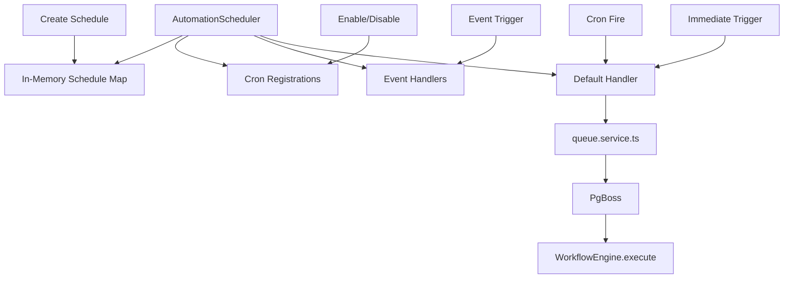
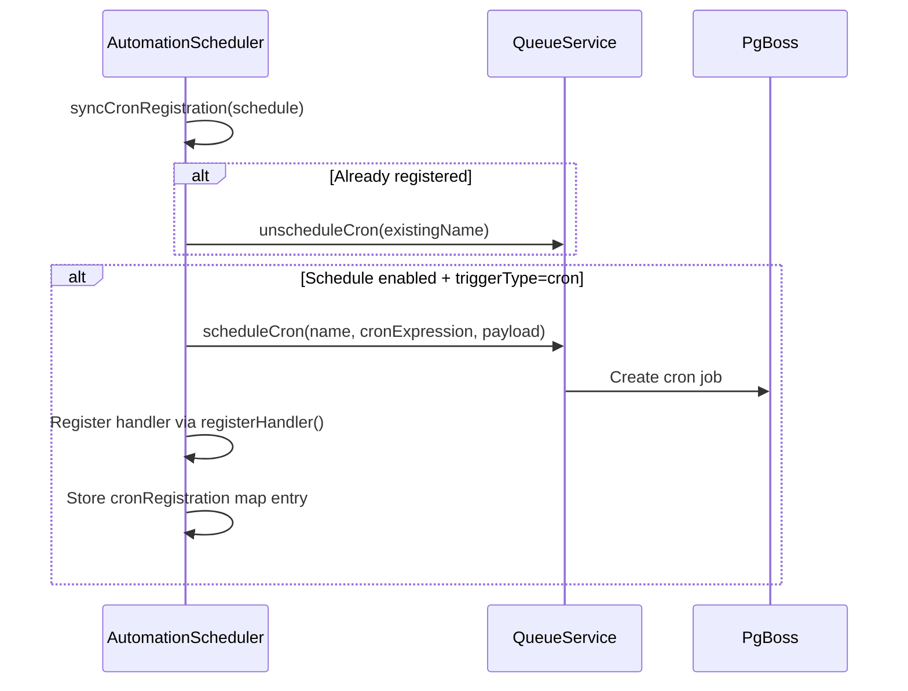
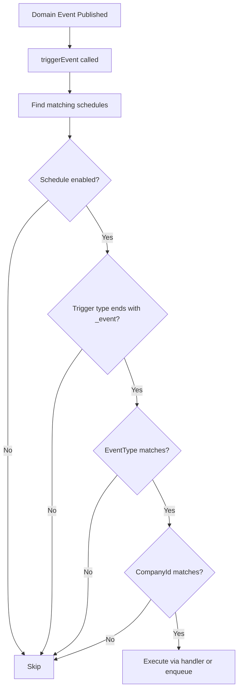
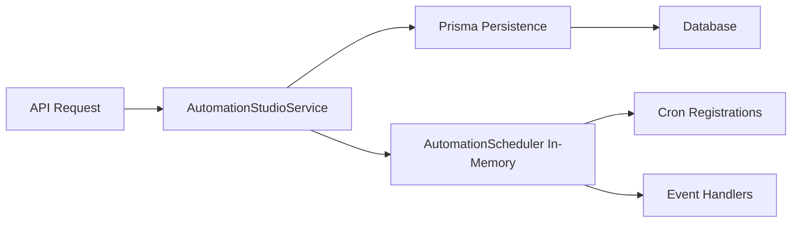

# Scheduling

The Automation Scheduler manages time-based and event-driven workflow triggers. It wraps PgBoss for durable cron scheduling and provides a unified API for creating, updating, enabling, disabling, and executing schedules.

**Location:** `src/modules/automation-studio/automation-scheduler.ts` (318 lines)

---

## Architecture



---

## Trigger Types

The scheduler supports 12 distinct trigger types, grouped into three categories:

### Manual / Time-based

| Trigger Type | Description | `cronExpression` | `eventType` |
|---|---|---|---|
| `immediate` | Execute once, right now | N/A | N/A |
| `scheduled` | Execute once at a future time (`startAt`) | N/A | N/A |
| `cron` | Recurring on a cron schedule | Required | N/A |
| `recurring` | Alias for cron with simpler semantics | Required | N/A |
| `manual` | User-triggered via API/UI | N/A | N/A |
| `webhook` | External HTTP callback triggers execution | N/A | N/A |

### Connector-driven

| Trigger Type | Description | `eventType` |
|---|---|---|
| `connector_event` | Fires when any connector emits an event | Connector event name |
| `bank_event` | Fires on banking data events (balance change, transaction sync, statement received) | Bank event name |
| `erp_event` | Fires on ERP data events (invoice created, PO approved, GL posted) | ERP event name |

### Domain events

| Trigger Type | Description | `eventType` |
|---|---|---|
| `approval_event` | Fires on approval actions (approved, rejected, escalated, timed_out) | Approval event name |
| `governance_event` | Fires on governance events (violation detected, policy changed, health degraded) | Governance event name |
| `decision_event` | Fires on decision engine events (recommendation generated, threshold breached) | Decision event name |

---

## Cron-Based Scheduling

Cron schedules are backed by PgBoss, providing durable, at-least-once execution with timezone support.

### Registration Flow



### Cron Expression Examples

| Expression | Meaning |
|---|---|
| `0 9 * * 1-5` | Weekdays at 9:00 AM |
| `0 0 1 * *` | First day of each month at midnight |
| `0 */4 * * *` | Every 4 hours |
| `30 17 * * 5` | Fridays at 5:30 PM |
| `0 8,12,17 * * 1-5` | Weekdays at 8:00 AM, 12:00 PM, and 5:00 PM |

### Timezone Support

The `AutomationSchedule` type supports timezone-aware scheduling via `cron-parser`'s `CronExpressionParser`. The `nextRunAt` field is computed from the cron expression and the current time, ensuring correct execution across DST transitions.

### Handler Registration

Each cron-registered queue gets a handler via `registerHandler()` that:

1. Receives the `ScheduledExecutionPayload` from PgBoss
2. Updates `lastRunAt` on the schedule
3. Computes the next `nextRunAt` using `CronExpressionParser.parse().next()`
4. Delegates to the `defaultHandler` which executes the workflow

---

## Event-Driven Triggers

Event triggers fire when domain events are published to the `InternalEventBus`. The scheduler listens for matching events and executes the associated workflows.

### Event Matching



The matching logic:

1. Schedule must be `enabled`
2. Trigger type must end with `_event` (connector_event, bank_event, erp_event, approval_event, governance_event, decision_event)
3. `eventType` on the schedule must match the event type, OR be `null` (wildcard — matches all events of any type from this trigger category)
4. `companyId` must match the event's company, OR be empty (system-wide)

### Event Context Merging

When an event triggers a schedule, the schedule's base `input` is merged with the event's `context`:

```typescript
const payload = {
  ...schedule.input,     // base configuration
  ...context,            // event-specific data overrides base
};
```

This allows schedules to carry default parameters while event-specific data (like transaction amount, sender ID, etc.) overrides them.

---

## Schedule Management API

### CRUD Operations

| Method | Description |
|---|---|
| `createSchedule(data)` | Create a new schedule with ID, defaults, and timestamps |
| `registerSchedule(schedule)` | Register an existing schedule and sync its cron |
| `getSchedule(id)` | Retrieve a schedule by ID |
| `listSchedules(companyId, templateId?)` | List all schedules for a company, optionally filtered by template |
| `updateSchedule(id, data)` | Update schedule fields and re-sync cron |
| `deleteSchedule(id)` | Remove schedule and unschedule cron |

### Lifecycle Operations

| Method | Description |
|---|---|
| `enableSchedule(id)` | Enable a disabled schedule and re-register its cron |
| `disableSchedule(id)` | Disable a schedule and remove its cron registration |
| `syncAllSchedules()` | Re-register all schedules (used on startup) |

### Execution Triggers

| Method | Description |
|---|---|
| `triggerImmediate(schedule)` | Enqueue the schedule for immediate execution |
| `triggerScheduled(schedule, scheduledFor)` | Enqueue for execution at a specific future time |
| `triggerDelayed(schedule, delayMinutes)` | Enqueue for execution after a delay |
| `triggerEvent(eventType, context, companyId)` | Fire all matching event-driven schedules |

### Statistics

```typescript
getStats(): { total: number; enabled: number; cron: number; event: number }
```

Returns aggregate counts of all schedules in the scheduler.

---

## Schedule Payload

Every scheduled execution receives a `ScheduledExecutionPayload`:

```typescript
interface ScheduledExecutionPayload {
  scheduleId: string;         // The schedule that triggered this execution
  templateId: string | null;  // Template to execute (if template-based)
  blueprintId: string | null; // Blueprint to execute (if blueprint-based)
  input: Record<string, unknown> | null;  // Runtime input parameters
  companyId: string;          // Tenant scope
  triggeredBy: ScheduleTriggerType;  // What triggered this execution
}
```

The `triggeredBy` field is critical for audit trails — it distinguishes between `cron`, `scheduled`, `immediate`, `connector_event`, `bank_event`, and other trigger types.

---

## Integration with Queue Service

The scheduler wraps four operations from `queue.service.ts`:

| Queue Operation | Scheduler Usage |
|---|---|
| `enqueue(queueName, payload, options?)` | Schedule immediate, scheduled, or delayed execution |
| `scheduleCron(name, cronExpression, payload)` | Register recurring cron jobs with PgBoss |
| `unscheduleCron(name)` | Remove cron jobs on schedule deletion or disable |
| `registerHandler(queueName, handler)` | Register the execution handler for cron-fired jobs |

### Queue Naming Convention

All schedule queues follow the pattern:

```
automation-schedule:{scheduleId}
```

This ensures each schedule has its own dedicated queue, preventing contention between concurrent schedules.

### Default Handler

The `AutomationStudioService` registers a default handler that:

1. Looks up the template (if `templateId` is set) or uses the blueprint (if `blueprintId` is set)
2. Converts the template to a workflow definition input via `TemplateLibrary.toWorkflowDefinitionInput()`
3. Creates a workflow definition in the database (for templates) or uses the existing blueprint
4. Creates a workflow instance
5. Starts the workflow execution

This handler runs for all trigger types — cron, event, immediate, or scheduled.

---

## Persistence Layer

Schedules are persisted in Prisma via the `automationStudioPersistence` service. The scheduler maintains an in-memory `Map` that mirrors the database, enabling fast lookups without queries on every trigger.



On startup, `syncAllSchedules()` re-populates the in-memory map and re-registers all cron jobs, ensuring durability across process restarts.

---

## Event Handler Registration

Custom event handlers can be registered for specific event types:

```typescript
automationScheduler.registerEventHandler("bank_transaction_synced", async (payload) => {
  // Custom handling for bank transaction syncs
  // e.g., trigger reconciliation workflow
});

automationScheduler.registerEventHandler("approval_timeout", async (payload) => {
  // Custom handling for approval timeouts
  // e.g., trigger escalation workflow
});
```

If no specific handler exists for an event type, the `defaultHandler` is used.

---

## Data Model

| Field | Type | Description |
|---|---|---|
| `id` | `string` | UUID |
| `companyId` | `string` | Tenant scope |
| `templateId` | `string \| null` | Template to execute |
| `blueprintId` | `string \| null` | Blueprint to execute |
| `name` | `string` | Human-readable schedule name |
| `triggerType` | `ScheduleTriggerType` | One of 12 trigger types |
| `cronExpression` | `string \| null` | Cron expression (required for `cron`/`recurring`) |
| `startAt` | `string \| null` | ISO timestamp for `scheduled` trigger type |
| `eventSource` | `string \| null` | Source identifier for event triggers |
| `eventType` | `string \| null` | Event type to match (null = wildcard) |
| `input` | `Record<string, unknown> \| null` | Base input parameters |
| `enabled` | `boolean` | Whether the schedule is active |
| `lastRunAt` | `string \| null` | ISO timestamp of last execution |
| `nextRunAt` | `string \| null` | ISO timestamp of next scheduled execution |
| `createdBy` | `string` | User ID who created the schedule |
| `createdAt` | `string` | ISO creation timestamp |
| `updatedAt` | `string` | ISO last update timestamp |

---

## Common Patterns

### Morning Treasury Review

```typescript
automationScheduler.createSchedule({
  name: "Daily Treasury Review",
  triggerType: "cron",
  cronExpression: "0 8 * * 1-5",  // Weekdays at 8 AM
  templateId: "daily-treasury-review",
  enabled: true,
});
```

### React to Bank Transactions

```typescript
automationScheduler.createSchedule({
  name: "Auto-Reconcile Bank Transactions",
  triggerType: "bank_event",
  eventType: "transaction_synced",
  blueprintId: "bank-reconciliation-blueprint-123",
  enabled: true,
});
```

### Monthly Board Pack Generation

```typescript
automationScheduler.createSchedule({
  name: "Monthly Board Pack",
  triggerType: "cron",
  cronExpression: "0 9 1 * *",  // First of each month at 9 AM
  templateId: "board-pack-generation",
  input: { reportPeriod: "previous_month" },
  enabled: true,
});
```

### Delayed Approval Escalation

```typescript
automationScheduler.triggerDelayed(schedule, 60);  // Re-check in 60 minutes
```
