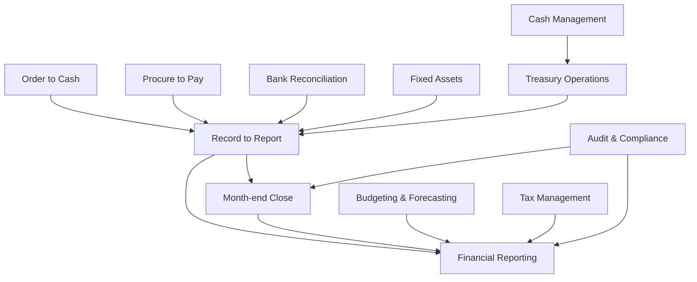

# Enterprise Workflow Intelligence

**Phase:** 8E.3
**Status:** Active knowledge base
**Last Updated:** July 8, 2026

---

## Purpose

This knowledge base documents how finance organizations actually operate — the end-to-end workflows, the personas involved, the systems they touch, the bottlenecks they hit, and the opportunities for automation and AI.

This knowledge base drives:

- **Product design** — workflows inform UI layout, navigation, and default states
- **AI recommendations** — workflow context enables intelligent suggestions
- **Roadmap prioritization** — bottleneck frequency determines feature investment
- **Customer discovery** — workflow templates guide interview questions
- **Competitive positioning** — workflow coverage gaps = differentiation opportunities

---

## Workflow Index

| # | Workflow | Domain | Primary Personas | Complexity |
|---|---|---|---|---|
| 1 | [Month-end Close](month-end-close.md) | Financial Close | Controller, Accountant, CFO | High |
| 2 | [Record to Report](record-to-report.md) | Financial Close | Controller, Accountant | High |
| 3 | [Order to Cash](order-to-cash.md) | Revenue | AR Clerk, Finance Manager | Medium |
| 4 | [Procure to Pay](procure-to-pay.md) | Procurement | AP Clerk, Finance Manager | Medium |
| 5 | [Bank Reconciliation](bank-reconciliation.md) | Reconciliation | Accountant, Controller | Low |
| 6 | [Cash Management](cash-management.md) | Treasury | Treasury Director, CFO | Medium |
| 7 | [Treasury Operations](treasury-operations.md) | Treasury | Treasury Director, CFO | High |
| 8 | [Fixed Assets](fixed-assets.md) | Accounting | Accountant, Controller | Low |
| 9 | [Budgeting & Forecasting](budgeting-forecasting.md) | Planning | CFO, Finance Manager | High |
| 10 | [Financial Reporting](financial-reporting.md) | Reporting | CFO, Controller, Executive | Medium |
| 11 | [Audit & Compliance](audit-compliance.md) | Governance | Auditor, Controller | Medium |
| 12 | [Tax Management](tax-management.md) | Compliance | Tax Accountant, Controller | High |

---

## Cross-Workflow Relationships

### Shared Business Objects

| Object | Workflows | Description |
|---|---|---|
| **Journal Entry** | R2R, MEC, FA, REC | Core accounting record; originates in sub-ledgers, posts to general ledger |
| **Transaction** | O2C, P2P, REC, CM | Financial event; payment, invoice, transfer, settlement |
| **Account Balance** | R2R, MEC, CM, TO, FR | Aggregate of journal entries; drives reporting and analysis |
| **Approval Request** | P2P, O2C, MEC, TO | Workflow step requiring authorization; varies by threshold and role |
| **Reconciliation** | REC, MEC, R2R | Matching process between two data sources (bank, ledger, sub-ledger) |
| **Report** | FR, MEC, AUD, TAX | Structured output for internal or external stakeholders |
| **Policy Rule** | P2P, O2C, AUD, TO | Configuration governing approval thresholds, matching tolerances, compliance checks |

---

## Workflow Document Template

Each workflow document follows this structure:

1. **Workflow Purpose** — one-paragraph summary
2. **Business Objective** — what the organization achieves
3. **Primary Users** — personas and their roles in the workflow
4. **Detailed Process** — step-by-step with Mermaid diagram
5. **Inputs & Outputs** — data required and produced
6. **Systems & Dependencies** — technology stack and prerequisites
7. **Approval Steps & Decision Points** — where human judgment is required
8. **Risks & Bottlenecks** — what can go wrong and where delays occur
9. **KPIs & Common Delays** — how success is measured
10. **Automation & AI Opportunities** — where technology can help
11. **Persona Mapping** — who touches each step
12. **Pain Point Mapping** — links to customer discovery evidence
13. **Competitive Analysis** — how major platforms compare
14. **Perionyx Feature Map** — current and planned support
15. **Future Product Opportunities** — gaps and differentiators

---

## Workflow Taxonomy

### By Domain

| Domain | Workflows |
|---|---|
| Financial Close | MEC, R2R |
| Revenue | O2C |
| Procurement | P2P |
| Reconciliation | REC |
| Treasury | CM, TO |
| Accounting | FA |
| Planning | BF |
| Reporting | FR |
| Governance | AUD, TAX |

### By Frequency

| Frequency | Workflows |
|---|---|
| Daily | CM, TO, REC (high-volume) |
| Weekly | O2C, P2P (processing) |
| Monthly | MEC, R2R, FR, REC (period-end) |
| Quarterly | BF, AUD, TAX |
| Annually | FA (physical verification), audit cycle |

### By Automation Potential

| Potential | Workflows | Primary Barrier |
|---|---|---|
| High | REC, CM, TO | System integration, trust |
| Medium | O2C, P2P, FA | Approval rules, exceptions |
| Low | MEC, AUD, BF | Judgment, complexity |

---

## Persona-to-Workflow Matrix

| Workflow | CFO | Controller | Treasury Dir | Finance Mgr | Accountant | AP Clerk | AR Clerk | Auditor | Exec Viewer |
|---|---|---|---|---|---|---|---|---|---|
| Month-end Close | R | O | — | P | P | — | — | R | — |
| Record to Report | R | O | — | P | P | — | — | R | — |
| Order to Cash | R | R | — | O | — | — | P | — | — |
| Procure to Pay | R | R | — | O | — | P | — | R | — |
| Bank Reconciliation | — | O | — | — | P | — | — | R | — |
| Cash Management | O | — | P | R | — | — | — | — | R |
| Treasury Operations | O | — | P | — | — | — | — | — | R |
| Fixed Assets | — | R | — | — | P | — | — | R | — |
| Budgeting & Forecasting | P | O | I | P | — | — | — | — | — |
| Financial Reporting | P | O | O | P | I | — | — | R | R |
| Audit & Compliance | R | O | I | I | I | — | — | P | — |
| Tax Management | R | O | — | — | P | — | — | R | — |

**Key:** P = Primary performer, O = Overseer/approver, R = Reviewer/consumer, I = Input provider
