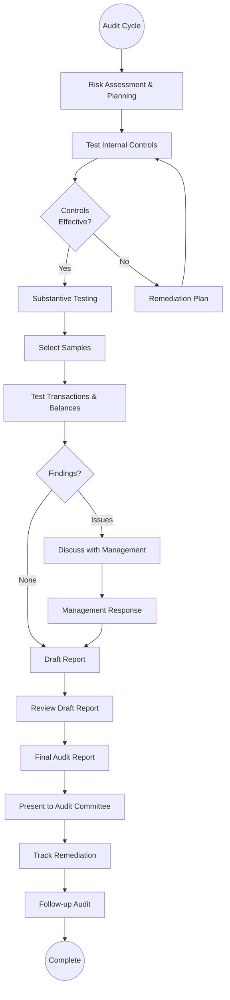

# Audit & Compliance

## Workflow Purpose

Audit and compliance covers the processes of ensuring financial records are accurate, controls are effective, and the organization meets regulatory and policy requirements.

## Business Objective

Provide assurance that financial statements are fairly presented, internal controls are operating effectively, and the organization complies with applicable laws, regulations, and policies.

## Primary Users

- **Auditor** (internal/external) — performs audit procedures and tests
- **Controller** — manages control environment and evidence
- **Compliance Officer** — monitors regulatory compliance
- **CFO** — reviews audit findings and remediation
- **Finance Manager** — implements controls and corrective actions

## Detailed Process

## Inputs & Outputs

| Inputs | Outputs |
|---|---|
| Trial balance and financial statements | Audit report |
| General ledger and sub-ledgers | Management letter |
| Control documentation | Control test results |
| Prior audit findings | Substantive test workpapers |
| Regulatory requirements | Compliance assessment |
| Policy documentation | Remediation tracking report |
| Board minutes | Audit committee presentation |

## Systems & Dependencies

| System | Role |
|---|---|
| ERP | Transaction data, GL access |
| Audit management tool | Planning, workpapers, findings |
| Compliance monitoring tool | Continuous monitoring |
| Document management | Evidence storage |
| Regulatory filing system | Filing and reporting |
| Risk management system | Risk assessment |

## Approval Steps & Decision Points

| Step | Approver |
|---|---|
| Audit plan | Audit Committee |
| Control deficiency rating | Audit Manager |
| Financial statement misstatement | CFO / Audit Committee |
| Audit report issuance | Audit Partner / Chief Auditor |
| Remediation acceptance | Controller |

## Risks & Bottlenecks

| Risk | Impact |
|---|---|
| Incomplete audit evidence | Qualified opinion |
| Control deficiency not identified | Increased substantive testing |
| Late workpaper preparation | Extended audit timeline |
| Management not responsive | Delayed remediation |
| Regulatory change not tracked | Non-compliance penalty |

## KPIs

| KPI | Target |
|---|---|
| Audit cycle time | < 90 days |
| Control deficiency count | Decreasing trend |
| Remediation on-time % | > 90% |
| Audit findings (repeat) | Zero |
| Financial close-to-audit-ready | < 10 days |
| Regulatory filing on-time | 100% |

## Automation & AI Opportunities

| Opportunity | Impact | Effort |
|---|---|---|
| Continuous control monitoring | Real-time vs periodic testing | High |
| AI-powered anomaly detection | Flags unusual transactions automatically | Medium |
| Automated workpaper population | Eliminates manual evidence collection | Medium |
| NLP contract review | Automates key terms extraction | High |
| Risk scoring automation | Data-driven risk assessment | Medium |
| Automated compliance checks | Reduces manual testing | Medium |
| Audit analytics dashboards | Real-time audit progress visibility | Low |
| Continuous auditing | 100% population testing vs sampling | High |

## Persona Mapping

| Persona | Involvement |
|---|---|
| Auditor | Primary performer |
| Controller | Evidence provider, remediator |
| Compliance Officer | Regulatory monitor |
| CFO | Report reviewer, remediation sponsor |
| Finance Manager | Control implementer |

## Pain Point Mapping

| Pain Point | Severity |
|---|---|
| Manual evidence collection | Major |
| No continuous monitoring | Major |
| Audit log limited to 200 entries | Major |
| Spreadsheet-based audit tracking | Major |
| Remediation tracking is manual | Minor |

## Competitive Analysis

| Capability | SAP | Oracle | Dynamics | NetSuite | Odoo | Perionyx |
|---|---|---|---|---|---|---|
| Audit trail / log | ✅ | ✅ | ✅ | ✅ | ✅ | ✅ |
| Continuous monitoring | ✅ | ✅ | ⚠️ | ⚠️ | ❌ | ❌ |
| Control documentation | ✅ | ✅ | ✅ | ✅ | ❌ | ❌ |
| Audit workpaper management | ✅ | ✅ | ⚠️ | ❌ | ❌ | ❌ |
| Compliance framework mapping | ✅ | ✅ | ⚠️ | ⚠️ | ❌ | ❌ |
| Remediation tracking | ✅ | ✅ | ⚠️ | ⚠️ | ❌ | ❌ |
| Risk assessment automation | ✅ | ✅ | ⚠️ | ❌ | ❌ | ❌ |

## Perionyx Features Supporting Workflow

| Feature | Status |
|---|---|
| Audit log (with inspector panel) | ✅ Shipped |
| Investigation workspace | ✅ Shipped |
| Transaction timeline | ✅ Shipped |
| Graph view | ✅ Shipped |
| Export center | ✅ Shipped |

## Future Product Opportunities

| Opportunity | Priority |
|---|---|
| Audit log pagination and date-range filtering | P1 (from workflow validation) |
| Continuous control monitoring (rule-based) | P1 |
| Compliance framework mapping (SOX, IFRS) | P2 |
| Remediation tracking workflow | P2 |
| Audit analytics with anomaly detection | P1 |
| Workpaper evidence collection | P2 |
