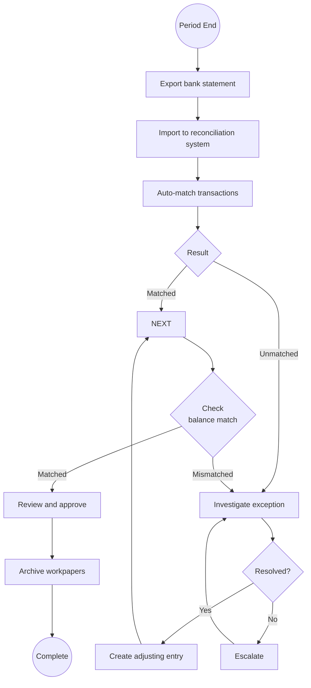

# Bank Reconciliation

## Workflow Purpose

Bank reconciliation is the process of comparing an organization's internal financial records against bank statement transactions to identify and resolve discrepancies.

## Business Objective

Ensure the cash balance in the general ledger matches the bank statement balance, detect errors or fraud, and maintain accurate financial records.

## Primary Users

- **Accountant** — performs reconciliations and resolves exceptions
- **Controller** — reviews completed reconciliations and approves
- **Auditor** — tests reconciliation completeness and accuracy

## Detailed Process

## Inputs & Outputs

| Inputs | Outputs |
|---|---|
| Bank statement (CSV, MT940, OFX) | Completed reconciliation report |
| GL cash sub-ledger | Exception list |
| Prior period reconciliation | Adjusting journal entries |
| Outstanding check list | Audit-ready workpaper |

## Systems & Dependencies

| System | Role |
|---|---|
| Bank portal / file transfer | Statement download |
| ERP / GL | Cash account records |
| Reconciliation tool | Match engine, exception tracking |
| Document management | Evidence retention |

## Approval Steps & Decision Points

| Step | Approver | Notes |
|---|---|---|
| Exception resolution | Accountant | Decision on unmatched items |
| Reconciliation sign-off | Controller | All accounts reconciled |
| Material adjustment approval | Controller | Journal entry for correction |

## Risks & Bottlenecks

| Risk | Impact |
|---|---|
| Stale outstanding items | Potential fraud |
| Manual match of high-volume accounts | Time-consuming |
| Missing statement data | Delayed reconciliation |
| Incorrect GL coding | Misstated cash balance |
| Late reconciliation | Month-end close delay |

## KPIs

| KPI | Target |
|---|---|
| Reconciliation completion rate | 100% of accounts |
| Exception rate | < 5% of transactions |
| Manual match rate | < 10% of transactions |
| Average account reconciliation time | < 30 min |
| Outstanding items aging | < 30 days |
| Reconciliation-to-close lag | < 2 days |

## Automation & AI Opportunities

| Opportunity | Impact | Effort |
|---|---|---|
| Auto-match engine (rule-based) | Matches 70%+ of transactions | Low |
| AI match suggestions | Matches 90%+ with confidence scoring | Medium |
| Anomaly detection on outstanding items | Flags aging exceptions | Low |
| Auto-import from bank portals | Eliminates manual downloads | Medium |
| Reconciliation status dashboard | Real-time close visibility | Low |
| Self-learning match rules | Reduces exception rate over time | High |

## Persona Mapping

| Persona | Involvement | Tasks |
|---|---|---|
| Accountant | Primary | Performs reconciliation, investigates exceptions |
| Controller | Approver | Reviews and signs off |
| Auditor | Consumer | Tests reconciliation completeness |

## Pain Point Mapping

| Pain Point | Severity |
|---|---|
| Manual matching of high-volume bank transactions | Critical |
| No auto-import from bank portals | Major |
| Exception investigation takes too long | Major |
| No visibility into reconciliation progress | Minor |
| Stale outstanding items accumulate | Minor |

## Competitive Analysis

| Capability | SAP | Oracle | Dynamics | NetSuite | Odoo | Perionyx |
|---|---|---|---|---|---|---|
| Auto-match engine | ✅ | ✅ | ✅ | ✅ | ✅ | ✅ |
| Bank feed integration | ✅ | ✅ | ✅ | ✅ | ⚠️ | ❌ |
| Exception management | ✅ | ✅ | ✅ | ✅ | ⚠️ | ✅ |
| AI-powered match suggestions | ✅ | ✅ | ⚠️ | ⚠️ | ❌ | ❌ |
| Reconciliation dashboard | ✅ | ✅ | ❌ | ⚠️ | ❌ | ❌ |
| Bulk match/accept | ✅ | ✅ | ✅ | ✅ | ✅ | ✅ |

## Perionyx Features Supporting Workflow

| Feature | Status |
|---|---|
| Bank reconciliation | ✅ Shipped |
| Exception management | ✅ Shipped |
| EnterpriseTable with filtering | ✅ Shipped |
| Export center | ✅ Shipped |
| Audit log | ✅ Shipped |

## Future Product Opportunities

| Opportunity | Priority |
|---|---|
| Bank feed integration (Plaid, open banking) | P1 |
| AI-powered match suggestions with confidence scoring | P1 |
| Reconciliation progress dashboard | P2 |
| Self-learning match rules | P2 |
| Automated statement import from bank portals | P1 |
